# QA Evidence — NEARS-3651

**Delta re-QA cycle 1 PASS — OD1 + AC-ANALYTICS fixed, OD2 regression clean**

**14 screenshot(s).** Click any thumbnail for full resolution.

<table>
<tr>
<td align="center" width="33%"><a href="delta-od1-91131-rating-readback.png">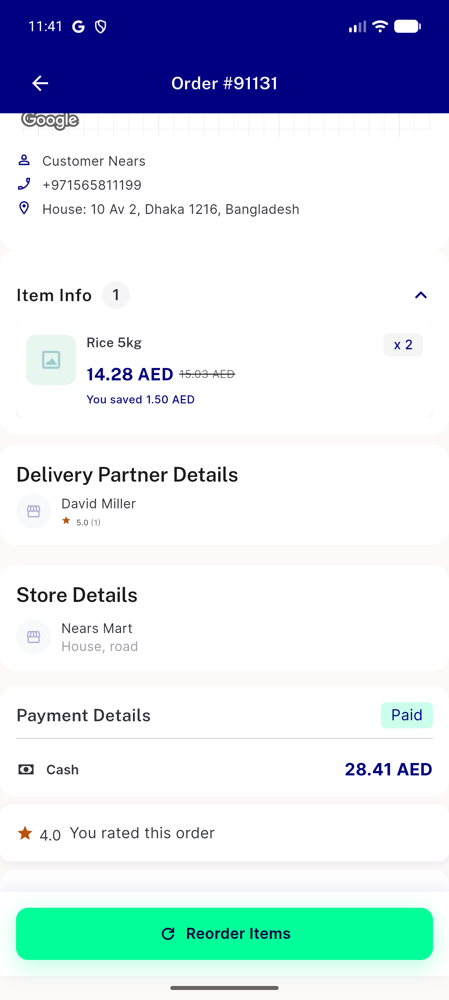</a> delta od1 91131 rating readback</td>
<td align="center" width="33%"><a href="delta-od2-91132-refund-regression.png">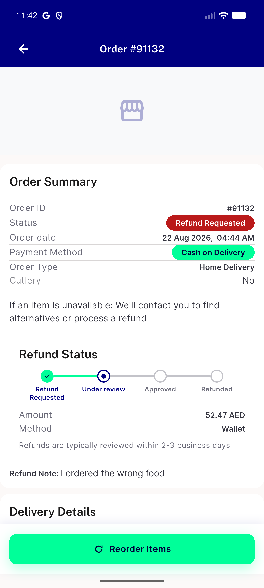</a> delta od2 91132 refund regression</td>
<td align="center" width="33%"><a href="p30-01-cancelled-details.png">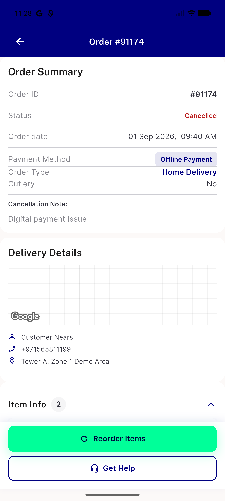</a> p30 01 cancelled details</td>
</tr>
<tr>
<td align="center" width="33%"><a href="p30-02-cancelled-scrolled.png">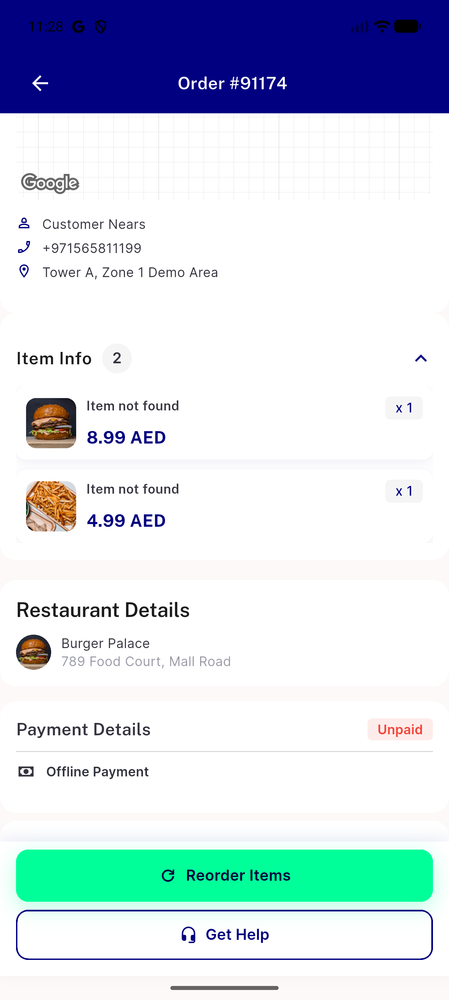</a> p30 02 cancelled scrolled</td>
<td align="center" width="33%"><a href="p30-03-cancelled-scrolled.png">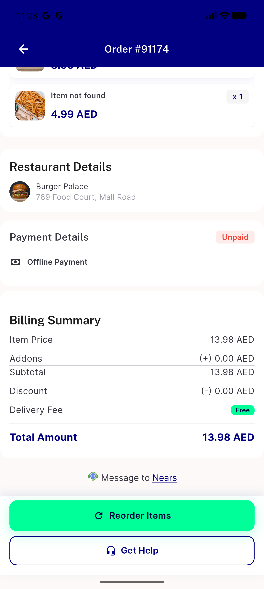</a> p30 03 cancelled scrolled</td>
<td align="center" width="33%"><a href="p30-10-hub-delivered-row.png">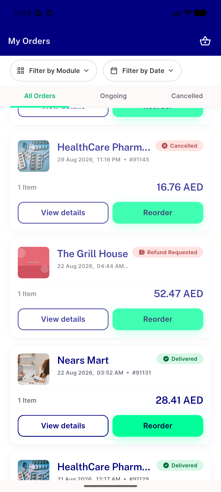</a> p30 10 hub delivered row</td>
</tr>
<tr>
<td align="center" width="33%"><a href="p30-11-delivered-details.png">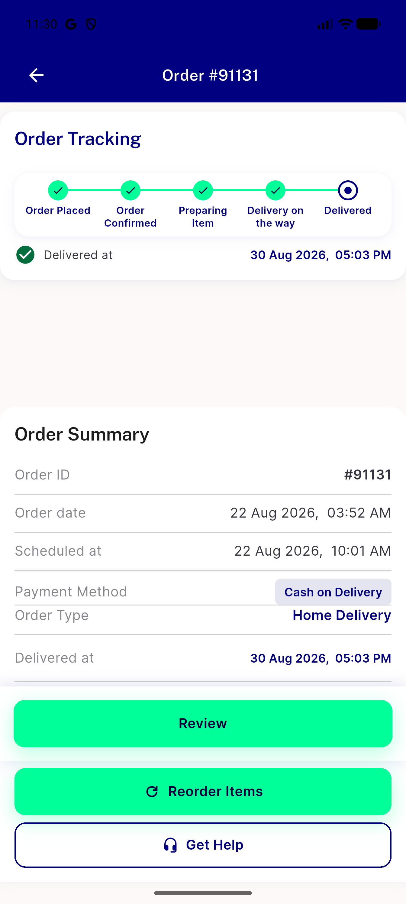</a> p30 11 delivered details</td>
<td align="center" width="33%"><a href="p30-12-delivered-scrolled.png">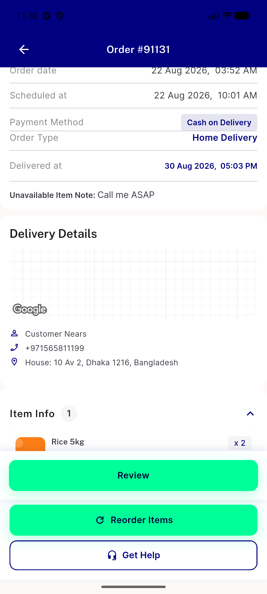</a> p30 12 delivered scrolled</td>
<td align="center" width="33%"><a href="p30-13-delivered-scrolled.png">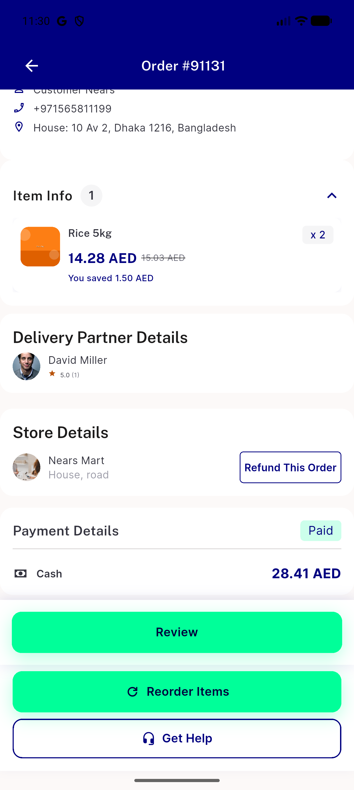</a> p30 13 delivered scrolled</td>
</tr>
<tr>
<td align="center" width="33%"><a href="p30-20-review.png">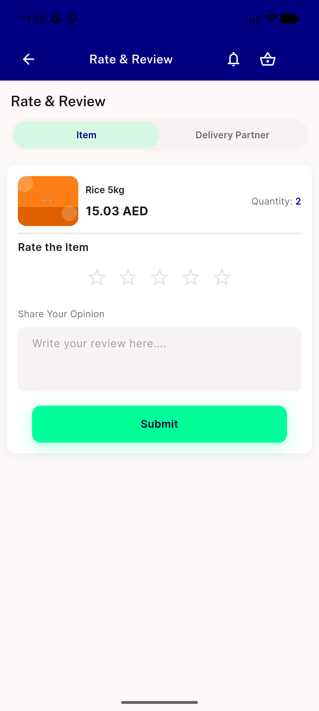</a> p30 20 review</td>
<td align="center" width="33%"><a href="p30-21-refund.png">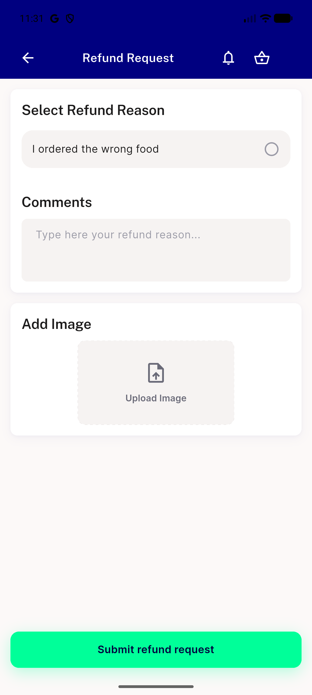</a> p30 21 refund</td>
<td align="center" width="33%"><a href="p30-30-refund-requested.png">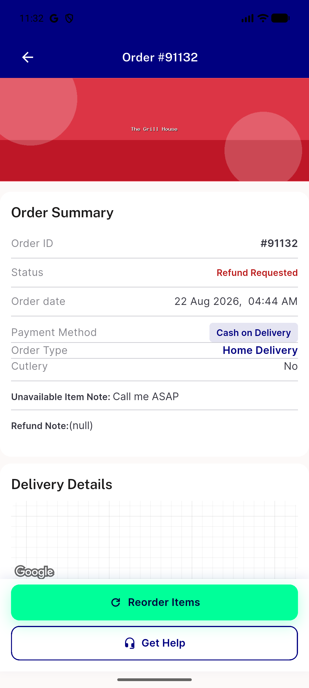</a> p30 30 refund requested</td>
</tr>
<tr>
<td align="center" width="33%"><a href="p30-31-refund-scrolled.png">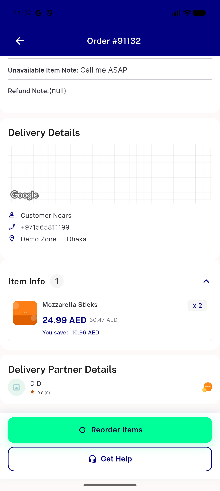</a> p30 31 refund scrolled</td>
<td align="center" width="33%"><a href="p30-32-refund-scrolled.png">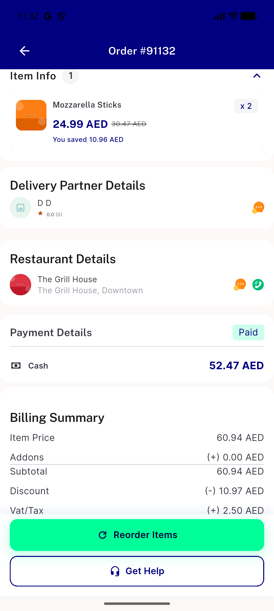</a> p30 32 refund scrolled</td>
</tr>
</table>

### Other artifacts
- [`delta-ac-analytics-events.log`](delta-ac-analytics-events.log)

---
*From `nears/docs/qa-evidence/NEARS-3651/` · public-repo scrub policy (no live secrets; verified clean).*
