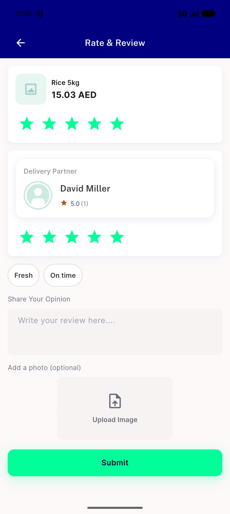
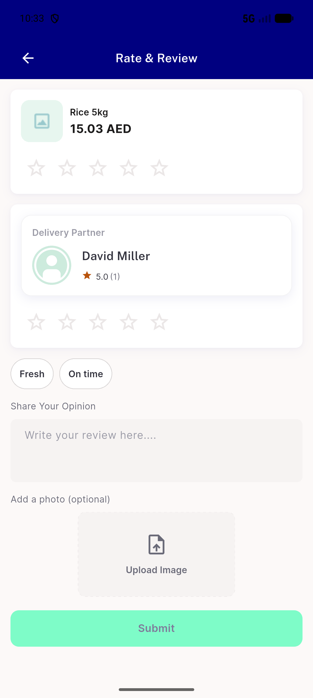
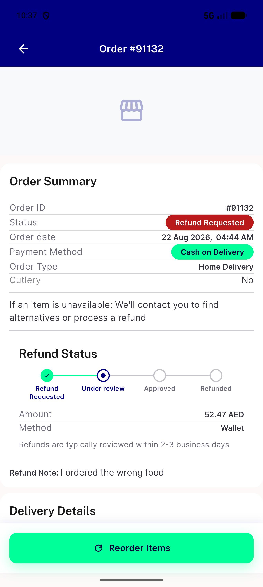
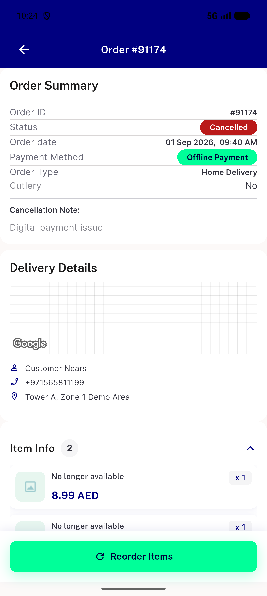
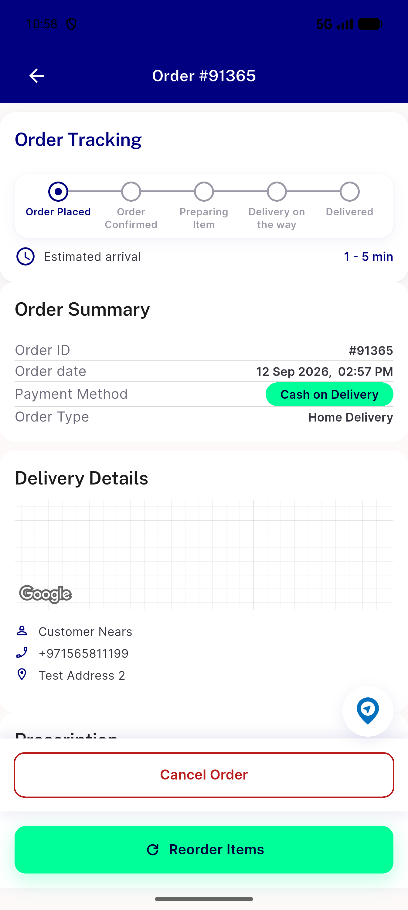
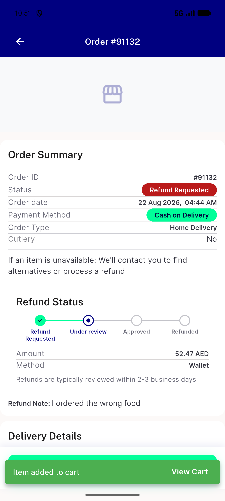
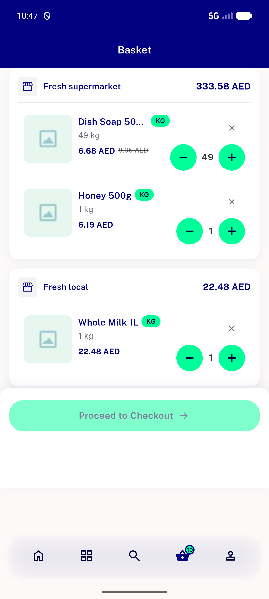
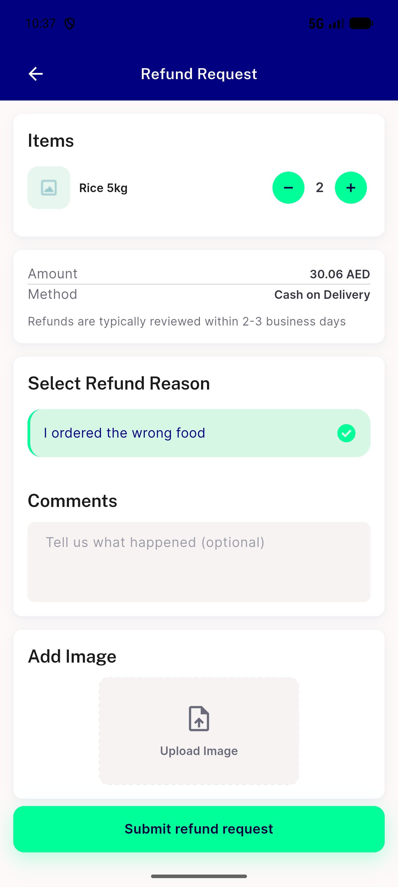

# QA Evidence — NEARS-3651

**FAIL - OD1 review-status regression live-reproduced; OD7 cancellation-reason gap; AC-ANALYTICS property deviations. OD2/OD3/OD4/OD5/OD8/OS/RR1/RR2/RF2/RF3/AC-DLS/AC-SHARED confirmed PASS live. RF1 UNVERIFIABLE (owner-gated seed).**

**8 screenshot(s).** Click any thumbnail for full resolution.

<table>
<tr>
<td align="center" width="33%"> bug od1 403 already submitted 91131</td>
<td align="center" width="33%"> bug od1 review form opens empty 91131</td>
<td align="center" width="33%"> od2 refund stepper no null 91132</td>
</tr>
<tr>
<td align="center" width="33%"> od3 od4 od6 od7 cancelled 91174</td>
<td align="center" width="33%"> od4 cancel and reorder stacked 91365</td>
<td align="center" width="33%"> od8 keep replace prompt 91132</td>
</tr>
<tr>
<td align="center" width="33%"> os cart summary rows</td>
<td align="center" width="33%"> rf1 rf2 rf3 refund form 91131</td>
</tr>
</table>

### Other artifacts
- [`bug-analytics-property-deviation.log`](bug-analytics-property-deviation.log)
- [`bug-od1-review-status-never-reaches-order-details.log`](bug-od1-review-status-never-reaches-order-details.log)
- [`bug-od7-cancellation-reason-still-contradictory.log`](bug-od7-cancellation-reason-still-contradictory.log)
- [`followup-od6-courier-call-chat-refund-requested.log`](followup-od6-courier-call-chat-refund-requested.log)

---
*From `nears/docs/qa-evidence/NEARS-3651/` · public-repo scrub policy (no live secrets; verified clean).*
