# QA Evidence — NEARS-3654

**QA pass NEARS-3654 - see evidence**

**26 screenshot(s).** Click any thumbnail for full resolution.

<table>
<tr>
<td align="center" width="33%"><a href="00-pick-location.png">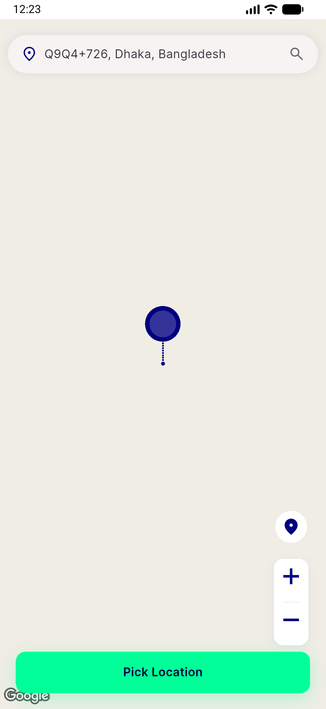</a> pick location</td>
<td align="center" width="33%"> pick location after tap</td>
<td align="center" width="33%"><a href="02-service-not-available.png">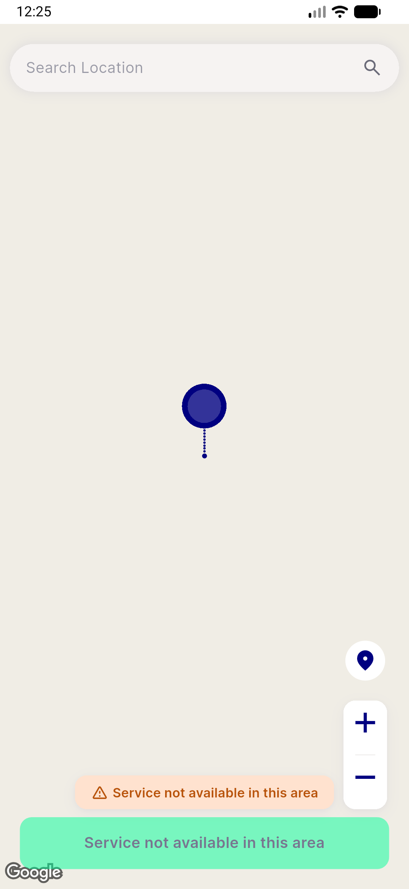</a> service not available</td>
</tr>
<tr>
<td align="center" width="33%"><a href="03-search-location.png">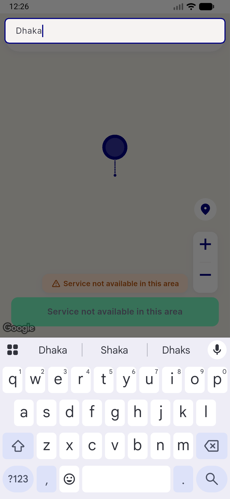</a> search location</td>
<td align="center" width="33%"><a href="04-pick-location2.png">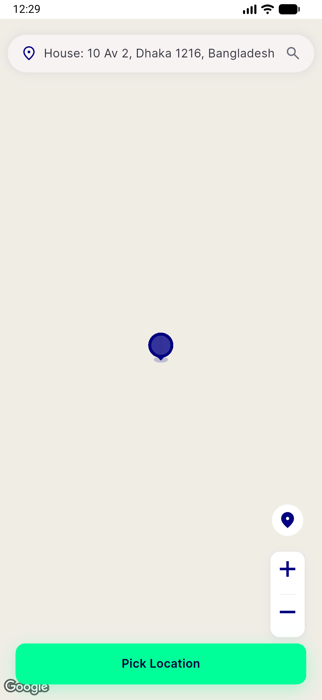</a> pick location2</td>
<td align="center" width="33%"><a href="05-immediately-after-tap.png">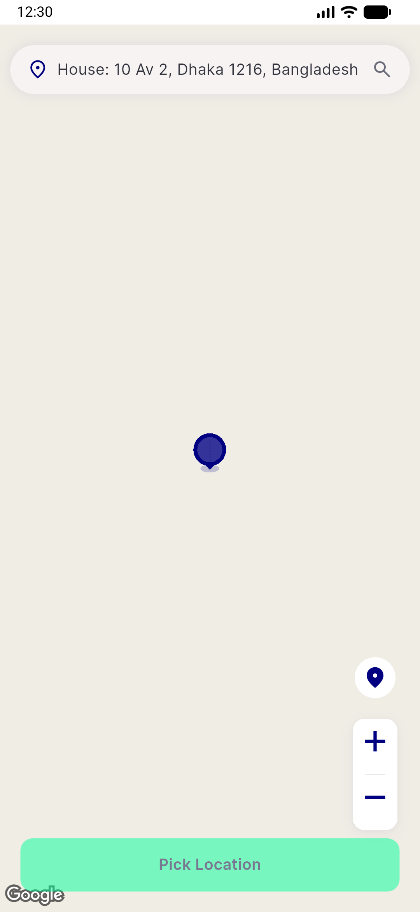</a> immediately after tap</td>
</tr>
<tr>
<td align="center" width="33%"><a href="06-after-navigate-wait.png">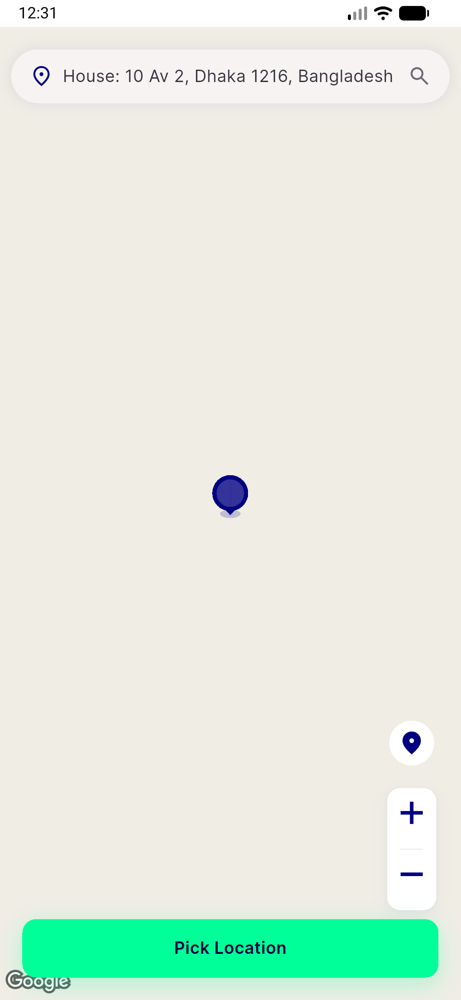</a> after navigate wait</td>
<td align="center" width="33%"><a href="07-grocery-stores-list.png">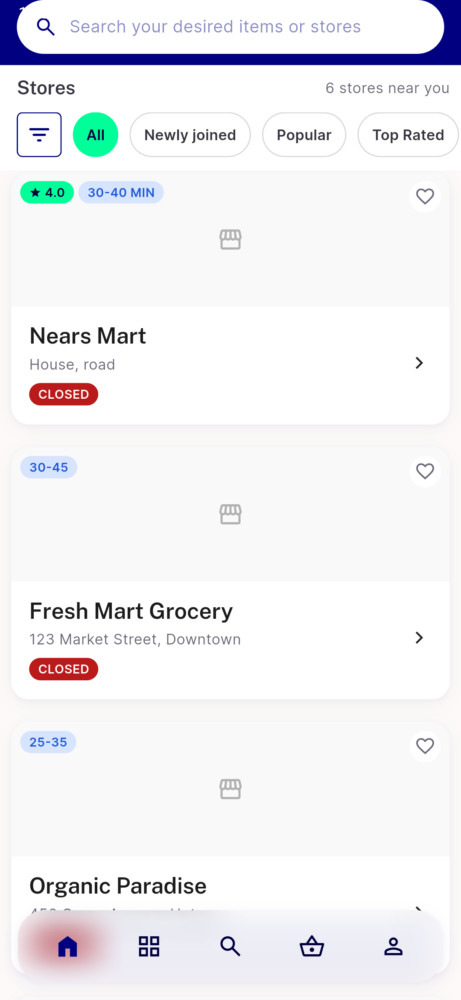</a> grocery stores list</td>
<td align="center" width="33%"><a href="08-food-home-flashsale.png">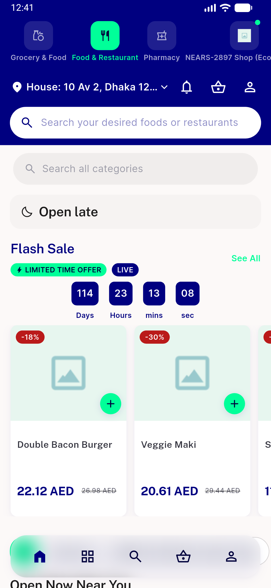</a> food home flashsale</td>
</tr>
<tr>
<td align="center" width="33%"><a href="09-flashsale-details.png">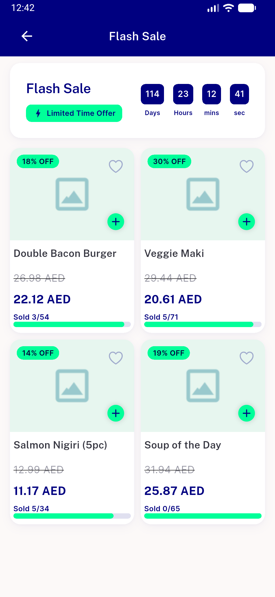</a> flashsale details</td>
<td align="center" width="33%"><a href="10-item-view-all.png">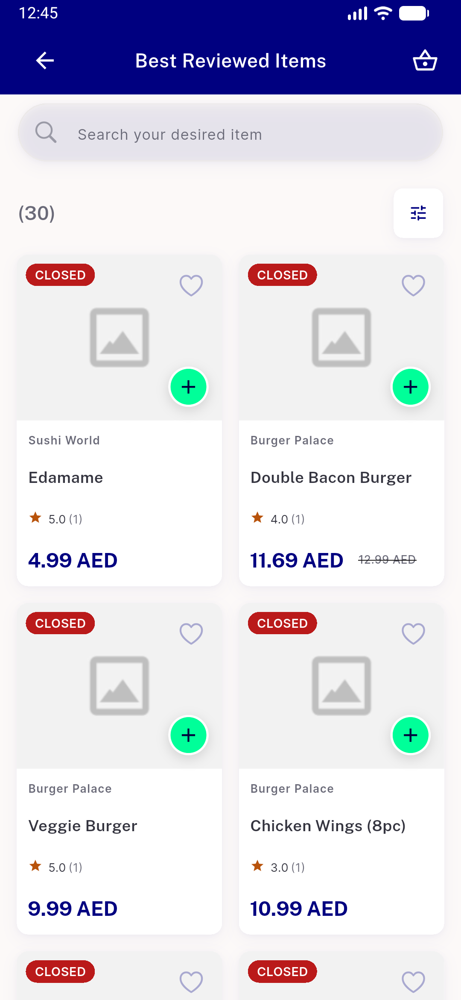</a> item view all</td>
<td align="center" width="33%"><a href="11-sort-filter-sheet.png">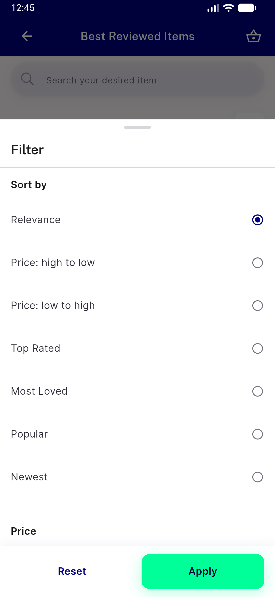</a> sort filter sheet</td>
</tr>
<tr>
<td align="center" width="33%"><a href="12-filter-sheet-scrolled.png">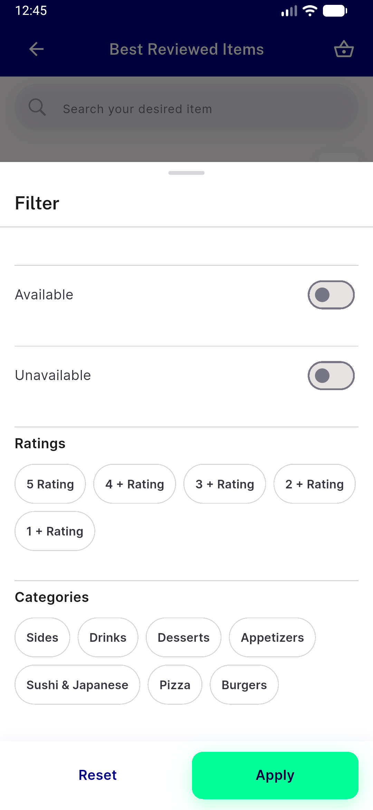</a> filter sheet scrolled</td>
<td align="center" width="33%"><a href="13-food-stores-tab.png">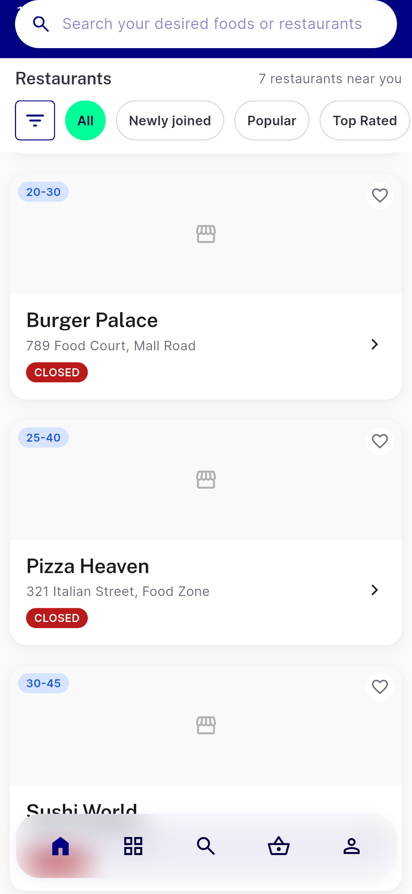</a> food stores tab</td>
<td align="center" width="33%"><a href="14-new-on-nears-allstore.png">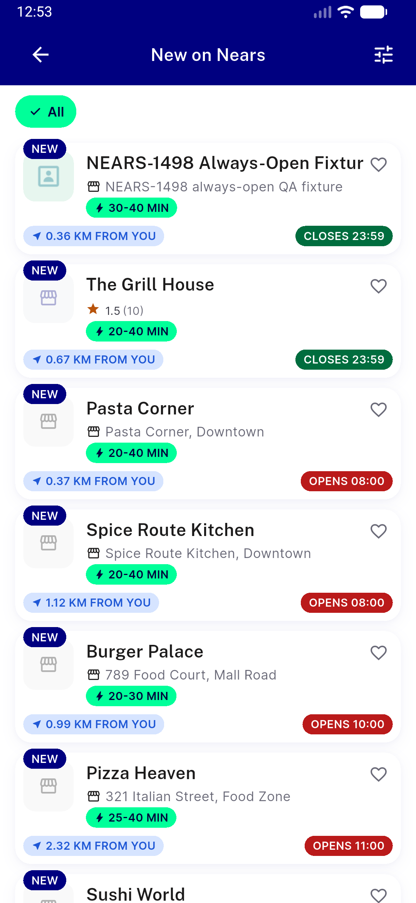</a> new on nears allstore</td>
</tr>
<tr>
<td align="center" width="33%"><a href="15-store-sort-filter-sheet.png">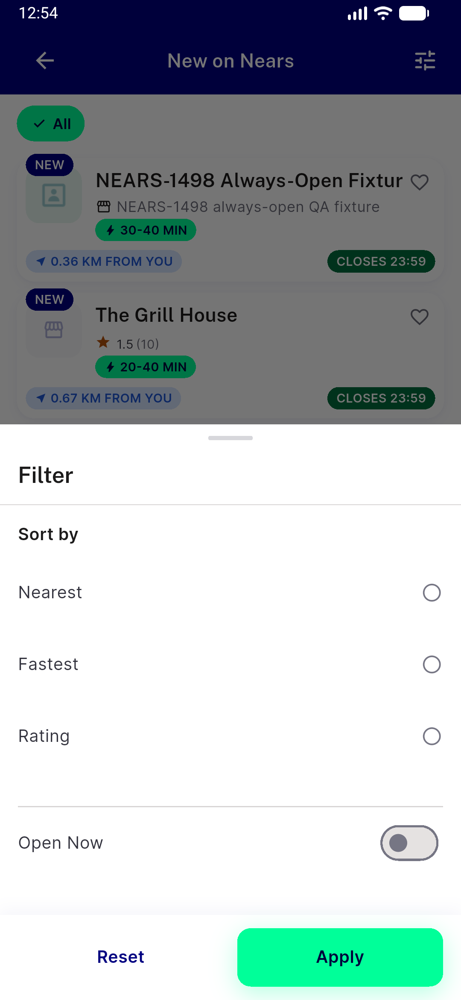</a> store sort filter sheet</td>
<td align="center" width="33%"><a href="16-sort-applied-mintdot.png">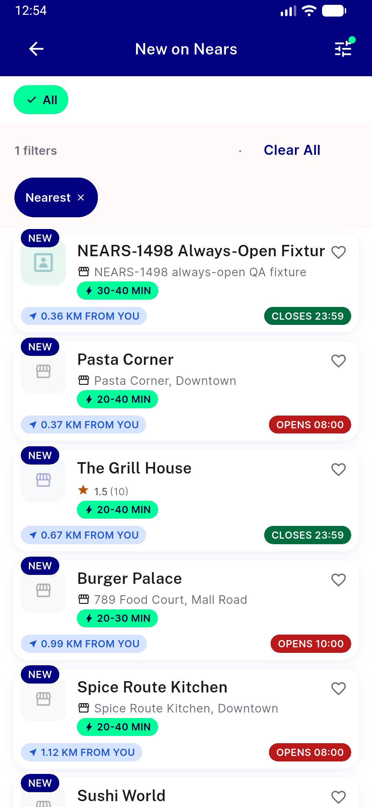</a> sort applied mintdot</td>
<td align="center" width="33%"> bug sa2 duplicate flashsale title</td>
</tr>
<tr>
<td align="center" width="33%"> bug sa5 missing availability header</td>
<td align="center" width="33%"> bug sl4 bare eta home store list</td>
<td align="center" width="33%"> p31 01 flash see all</td>
</tr>
<tr>
<td align="center" width="33%"> p31 20 popular all</td>
<td align="center" width="33%"> p31 21 sort sheet</td>
<td align="center" width="33%"> p31 22 filter sheet</td>
</tr>
<tr>
<td align="center" width="33%"> p31 30 new stores all</td>
<td align="center" width="33%"> p31 31 nonveg</td>
</tr>
</table>

### Other artifacts
- [`bug-analytics-missing-moduleid-best-reviewed.log`](bug-analytics-missing-moduleid-best-reviewed.log)
- [`bug-sa5-missing-availability-header.xml`](bug-sa5-missing-availability-header.xml)
- [`bug-sl4-bare-eta-home-store-list.xml`](bug-sl4-bare-eta-home-store-list.xml)

---
*From `nears/docs/qa-evidence/NEARS-3654/` · public-repo scrub policy (no live secrets; verified clean).*
