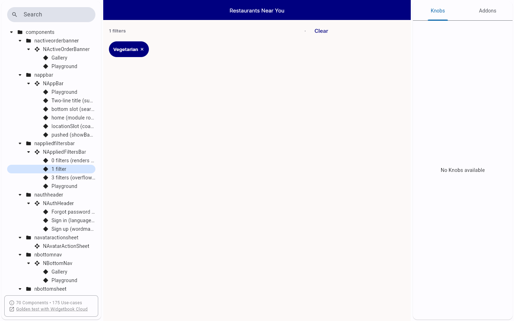
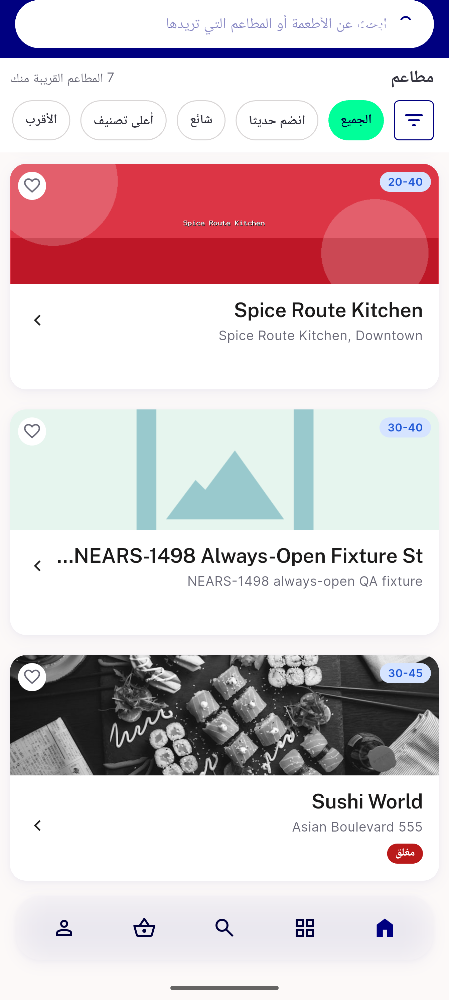
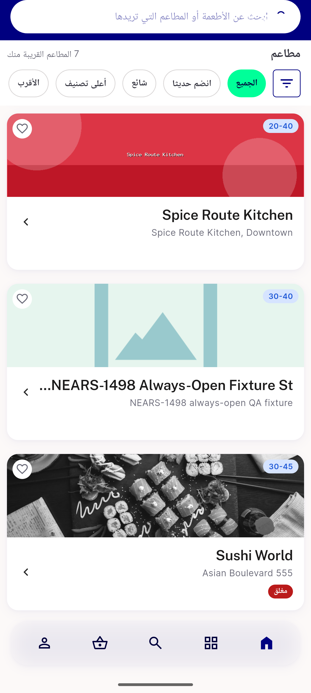

# QA Evidence — NEARS-3655

**Delta re-QA PASS: F1/F3 (widgetbook), F5/F6/AC-ANALYTICS/AC-LOG (My Orders live) + RTL date-range fix**

**5 screenshot(s).** Click any thumbnail for full resolution.

<table>
<tr>
<td align="center" width="33%"> ac f1 widgetbook all six sections</td>
<td align="center" width="33%"> ac f3 widgetbook 1 filter</td>
<td align="center" width="33%"> ac f6 toggle off no chips</td>
</tr>
<tr>
<td align="center" width="33%"> ac rtl date range chip</td>
<td align="center" width="33%"> bug f6 modulconfig index0 toggle on still no chips</td>
</tr>
</table>

---
*From `nears/docs/qa-evidence/NEARS-3655/` · public-repo scrub policy (no live secrets; verified clean).*
