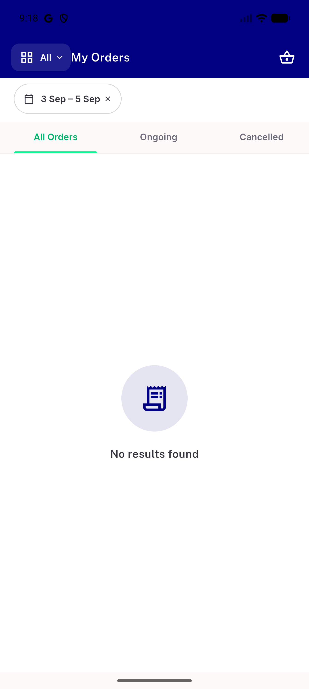
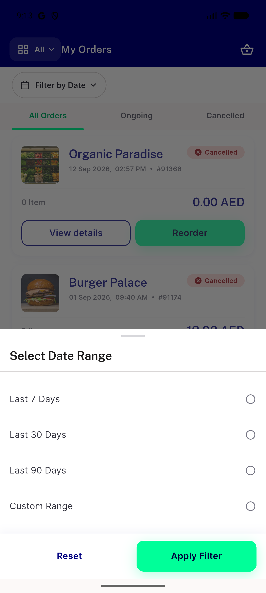
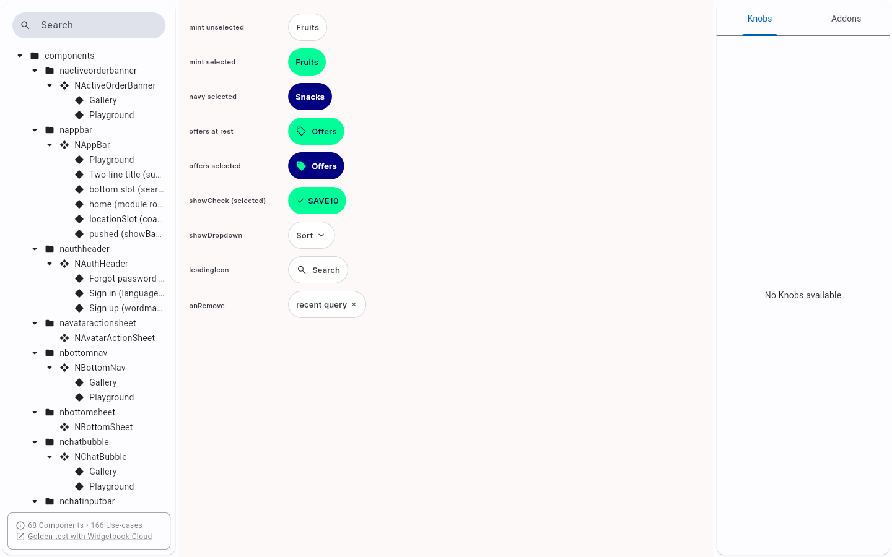
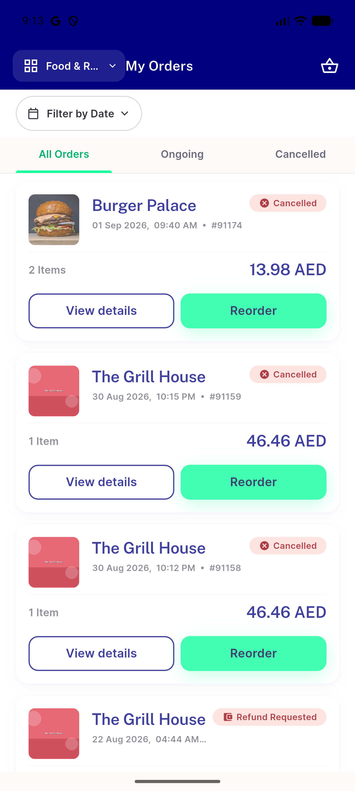

# QA Evidence — NEARS-3655

**QA FAIL — F1/F2/F3 unadopted, Composite AC false, F5 dead-end, F6 partial**

**6 screenshot(s).** Click any thumbnail for full resolution.

<table>
<tr>
<td align="center" width="33%"> bug composite stock rangeslider store filter</td>
<td align="center" width="33%"> bug f5 empty result no clear affordance</td>
<td align="center" width="33%"> bug rtl date chip not localized</td>
</tr>
<tr>
<td align="center" width="33%"> f1 datesheet single handle</td>
<td align="center" width="33%"> f2 simplified chip gallery</td>
<td align="center" width="33%"> f4 module switcher food filtered</td>
</tr>
</table>

---
*From `nears/docs/qa-evidence/NEARS-3655/` · public-repo scrub policy (no live secrets; verified clean).*
