# QA Evidence — NEARS-3656

**Delta re-QA cycle 2: PASS — login_viewed source correct, auth_error_shown error_code correct on real 401 (invalid_credentials) and real 403 (request_failed, sensible)**

**14 screenshot(s).** Click any thumbnail for full resolution.

<table>
<tr>
<td align="center" width="33%"><a href="au2-sign-in-ar-rtl.png">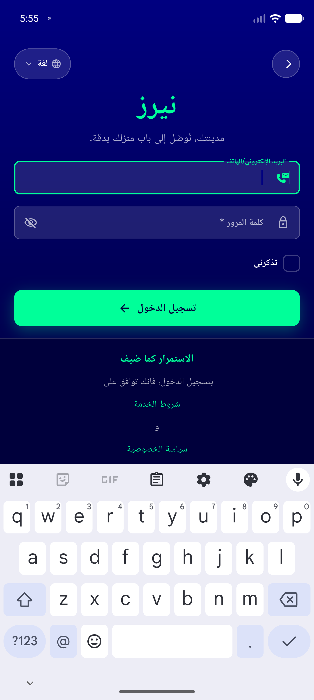</a> au2 sign in ar rtl</td>
<td align="center" width="33%"> au2 sign in en</td>
<td align="center" width="33%"><a href="au2-sign-up-en.png">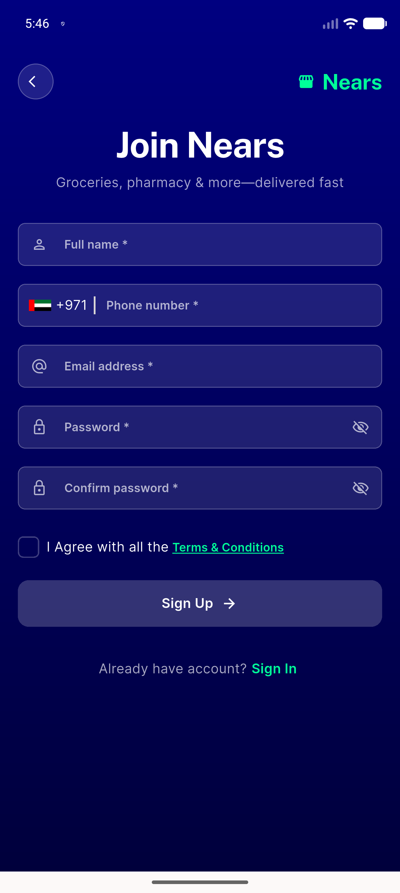</a> au2 sign up en</td>
</tr>
<tr>
<td align="center" width="33%"><a href="au4-sign-up-disabled-button.png">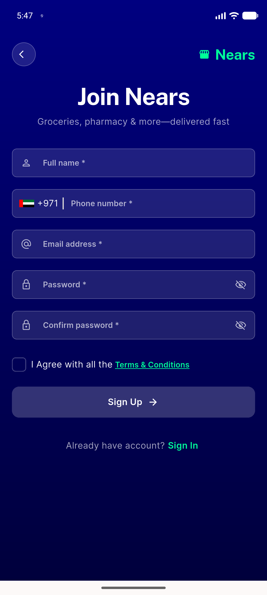</a> au4 sign up disabled button</td>
<td align="center" width="33%"><a href="au5-forgot-pass-phone.png">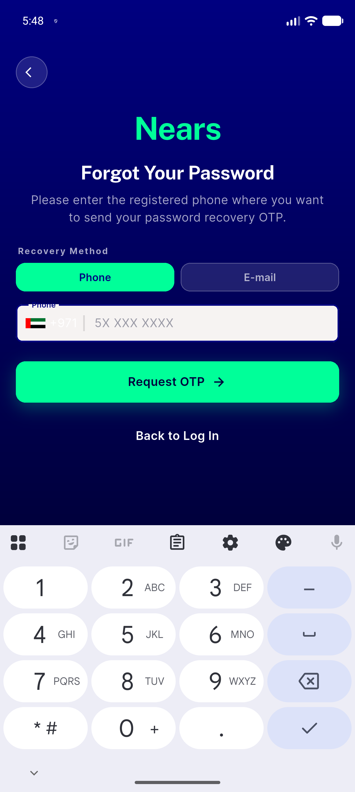</a> au5 forgot pass phone</td>
<td align="center" width="33%"><a href="bug-auth-error-shown-not-fired.png">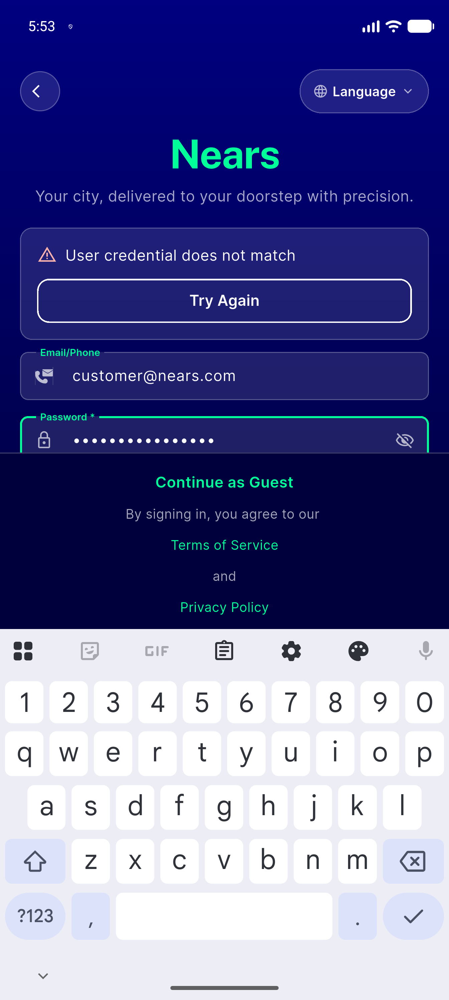</a> bug auth error shown not fired</td>
</tr>
<tr>
<td align="center" width="33%"><a href="bug-forgot-createaccount-dead-tap-zone.png">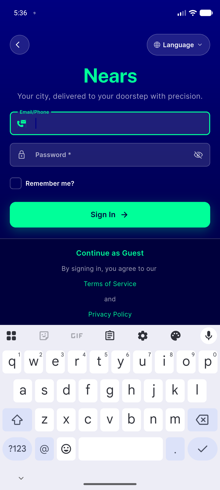</a> bug forgot createaccount dead tap zone</td>
<td align="center" width="33%"><a href="cycle1-auth-error-shown-wrong-code-signup.png">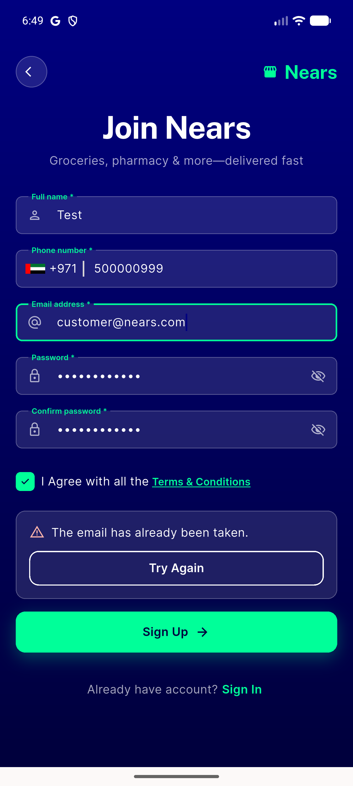</a> cycle1 auth error shown wrong code signup</td>
<td align="center" width="33%"> cycle2 signup 403 request failed</td>
</tr>
<tr>
<td align="center" width="33%"><a href="followup-1p3x-sign-in-dip.png">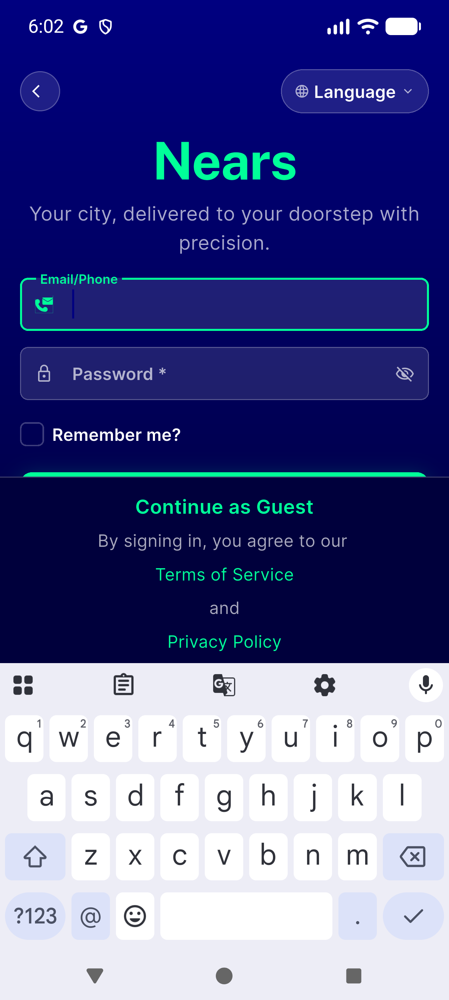</a> followup 1p3x sign in dip</td>
<td align="center" width="33%"><a href="spl1-spl2-checking-state.png">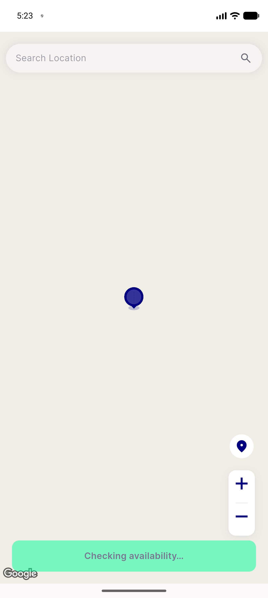</a> spl1 spl2 checking state</td>
<td align="center" width="33%"><a href="spl1-spl2-resolved-pick-location.png">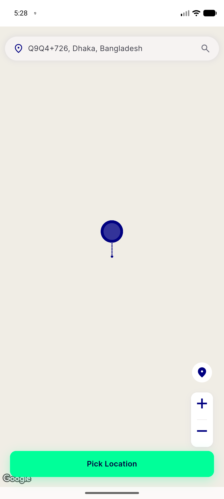</a> spl1 spl2 resolved pick location</td>
</tr>
<tr>
<td align="center" width="33%"><a href="spl4-flutter-splash-2.png">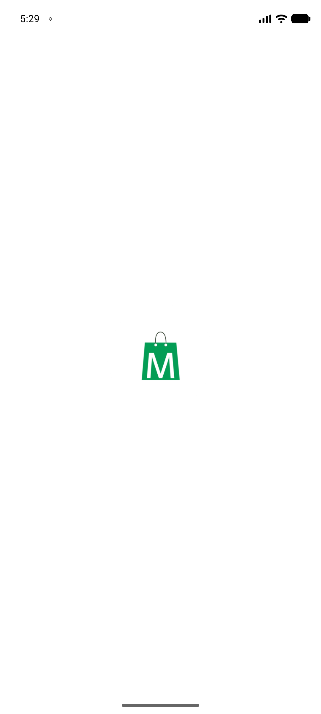</a> spl4 flutter splash 2</td>
<td align="center" width="33%"><a href="spl4-flutter-splash.png">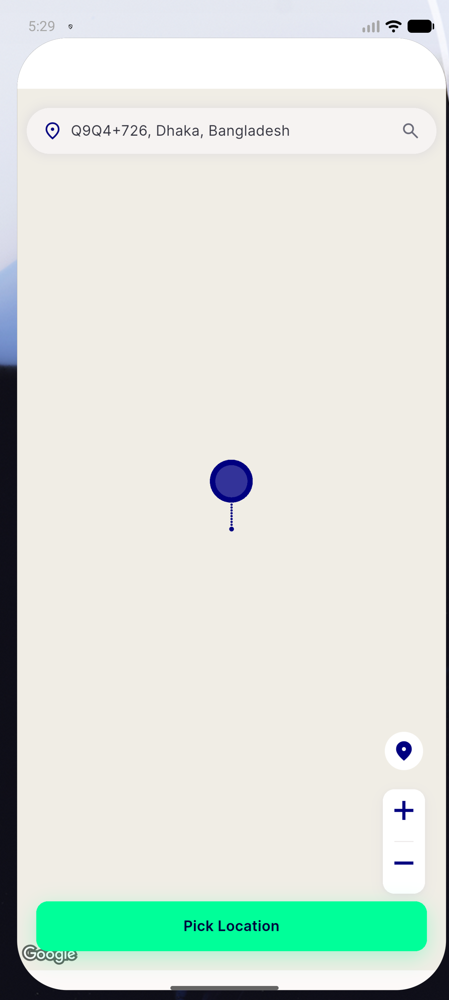</a> spl4 flutter splash</td>
</tr>
</table>

### Other artifacts
- [`au3-sign-in-dump.xml`](au3-sign-in-dump.xml)
- [`au4-sign-up-dump.xml`](au4-sign-up-dump.xml)
- [`au5-forgot-pass-dump.xml`](au5-forgot-pass-dump.xml)
- [`bug-auth-error-shown-not-fired.log`](bug-auth-error-shown-not-fired.log)
- [`bug-forgot-createaccount-dead-tap-zone.log`](bug-forgot-createaccount-dead-tap-zone.log)
- [`bug-forgot-createaccount-dead-tap-zone.xml`](bug-forgot-createaccount-dead-tap-zone.xml)
- [`bug-login-viewed-auth-error-shown-unwired.log`](bug-login-viewed-auth-error-shown-unwired.log)
- [`cycle1-auth-error-shown-wrong-code-signup.log`](cycle1-auth-error-shown-wrong-code-signup.log)
- [`cycle1-auth-error-shown-wrong-code.log`](cycle1-auth-error-shown-wrong-code.log)
- [`cycle2-analytics-error-codes-fixed.log`](cycle2-analytics-error-codes-fixed.log)
- [`followup-1p3x-and-3button-nav-confirmation.log`](followup-1p3x-and-3button-nav-confirmation.log)
- [`followup-1p3x-sign-in-dump.xml`](followup-1p3x-sign-in-dump.xml)
- [`fresh-signin-dump.xml`](fresh-signin-dump.xml)

---
*From `nears/docs/qa-evidence/NEARS-3656/` · public-repo scrub policy (no live secrets; verified clean).*
