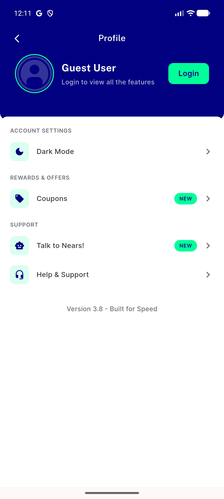
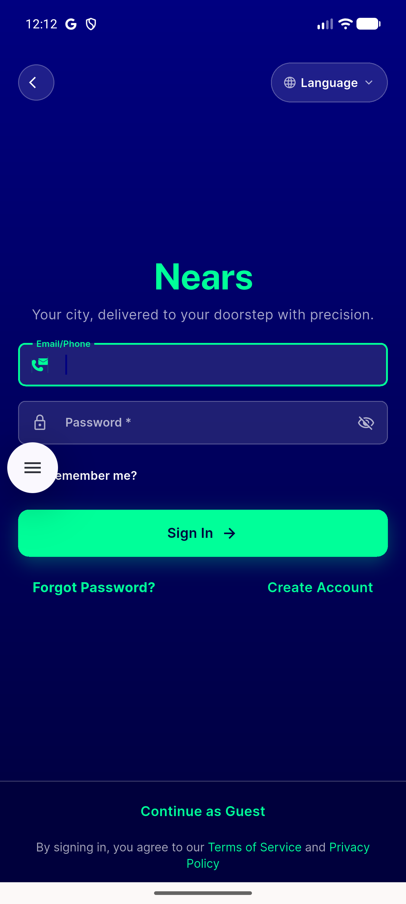
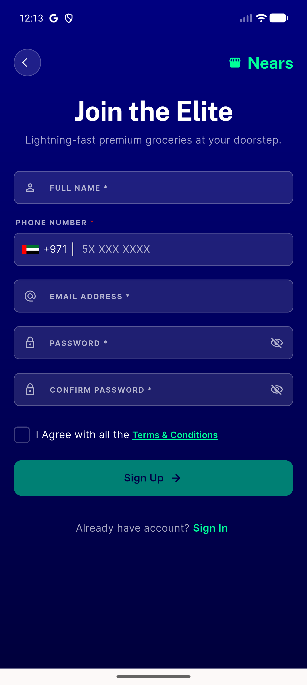
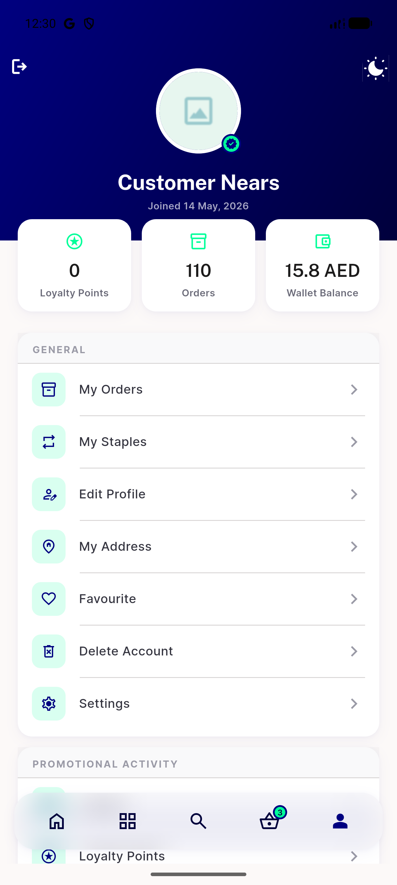
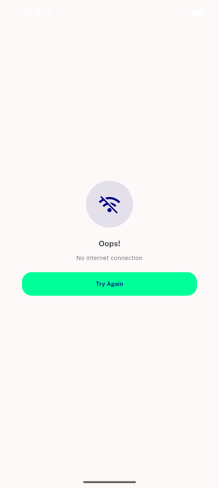
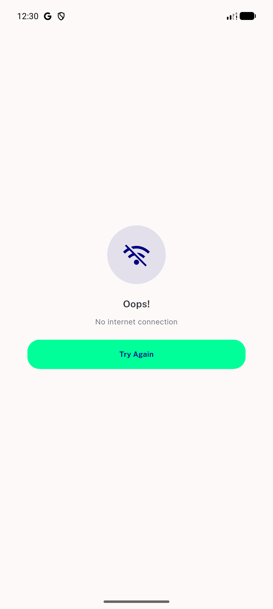
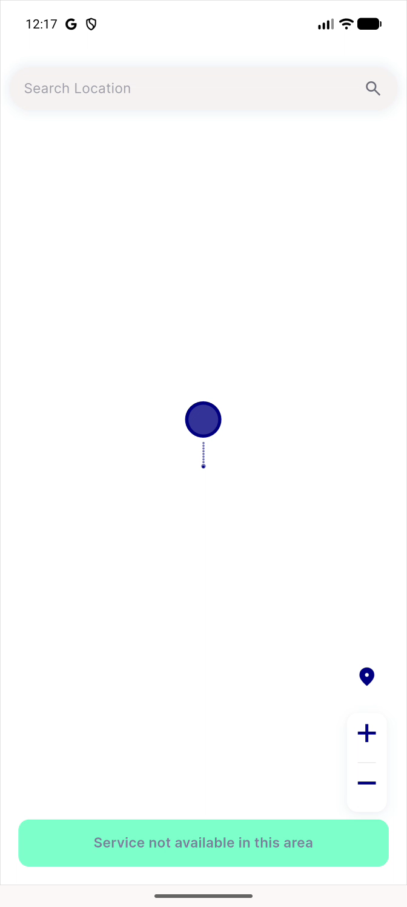
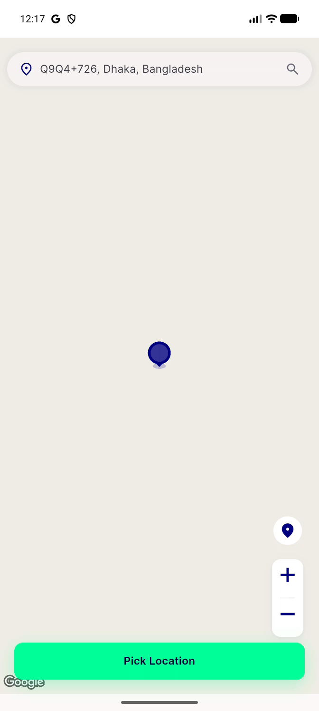

# QA Evidence — NEARS-3656

**Human QA — Auth & first launch: 9.5s cold start, blocking GPS spinner, inconsistent auth screens**

**17 screenshot(s).** Click any thumbnail for full resolution.

<table>
<tr>
<td align="center" width="33%"> p36 01 after logout</td>
<td align="center" width="33%"> p36 10 sign in</td>
<td align="center" width="33%"> p36 11 forgot</td>
</tr>
<tr>
<td align="center" width="33%"> p36 12 signup</td>
<td align="center" width="33%"> p36 14 language</td>
<td align="center" width="33%"> p36 20 cold 1s</td>
</tr>
<tr>
<td align="center" width="33%"> p39 offline 01 offline toast</td>
<td align="center" width="33%"> p39 offline 02 offline home</td>
<td align="center" width="33%"> p39 offline 03 offline coldstart</td>
</tr>
<tr>
<td align="center" width="33%"> splash contact</td>
<td align="center" width="33%"> splash f 01</td>
<td align="center" width="33%"> splash f 03</td>
</tr>
<tr>
<td align="center" width="33%"> splash f 07</td>
<td align="center" width="33%"> splash f 08</td>
<td align="center" width="33%"> splash f 12</td>
</tr>
<tr>
<td align="center" width="33%"> splash f 20</td>
<td align="center" width="33%"> splash f 21</td>
</tr>
</table>

---
*From `nears/docs/qa-evidence/NEARS-3656/` · public-repo scrub policy (no live secrets; verified clean).*
