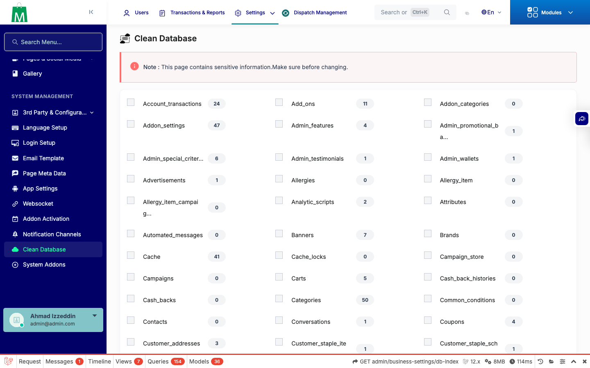
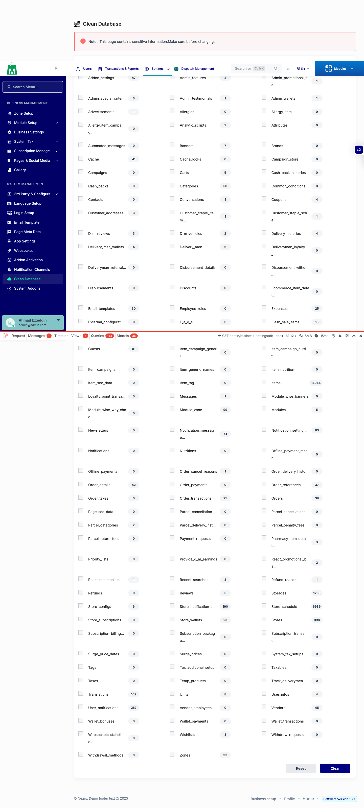

# QA Evidence — NEARS-366

**PASS — db-index excludes all protected tables (134 clearable, 0 leaked); whitelist+role gate green (phpunit 7/7, full suite 214/214)**

**2 screenshot(s).** Click any thumbnail for full resolution.

<table>
<tr>
<td align="center" width="33%"> db index clearable list</td>
<td align="center" width="33%"> clearable checkboxes no protected</td>
</tr>
</table>

### Other artifacts
- [`progress.md`](progress.md)

---
*From `nears/docs/qa-evidence/NEARS-366/` · public-repo scrub policy (no live secrets; verified clean).*
