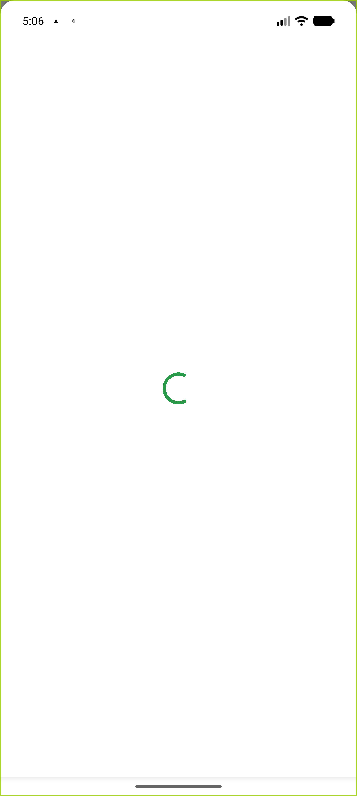
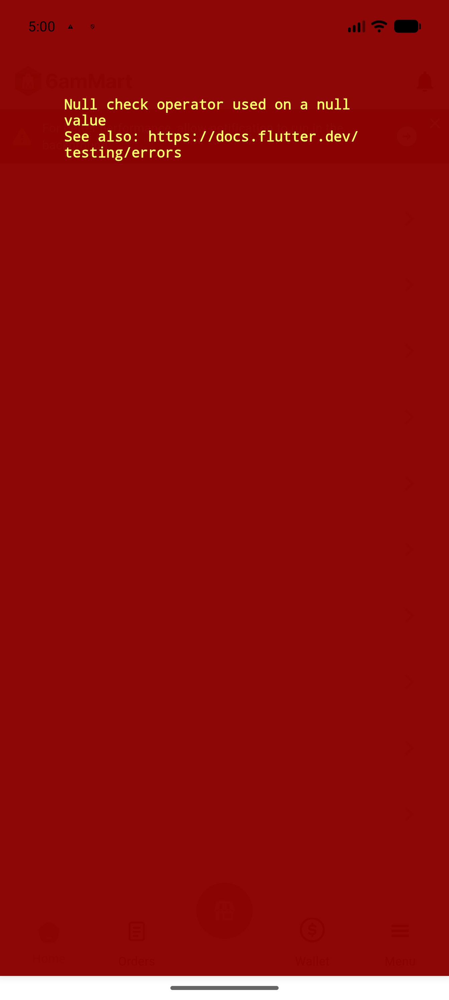
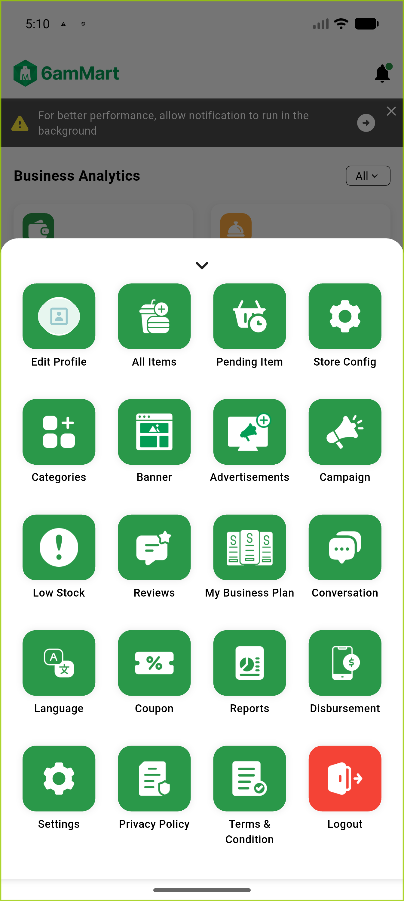

# QA Evidence — NEARS-3666

**PASS — VendorApp Menu null-modulePermission guard verified (RED->GREEN); pre-existing out-of-scope store_screen.dart crash independently reproduced and logged for traceability**

**3 screenshot(s).** Click any thumbnail for full resolution.

<table>
<tr>
<td align="center" width="33%"> ac1 GREEN loading placeholder</td>
<td align="center" width="33%"> ac1 RED crash prefix</td>
<td align="center" width="33%"> ac2 GREEN happy path menu</td>
</tr>
</table>

### Other artifacts
- [`ac1-GREEN-loading-placeholder-dump.xml`](ac1-GREEN-loading-placeholder-dump.xml)
- [`ac1-RED-crash.log`](ac1-RED-crash.log)
- [`ac3-GREEN-single-failure-log.log`](ac3-GREEN-single-failure-log.log)
- [`bug-store-screen-preexisting-nullcheck.log`](bug-store-screen-preexisting-nullcheck.log)

---
*From `nears/docs/qa-evidence/NEARS-3666/` · public-repo scrub policy (no live secrets; verified clean).*
