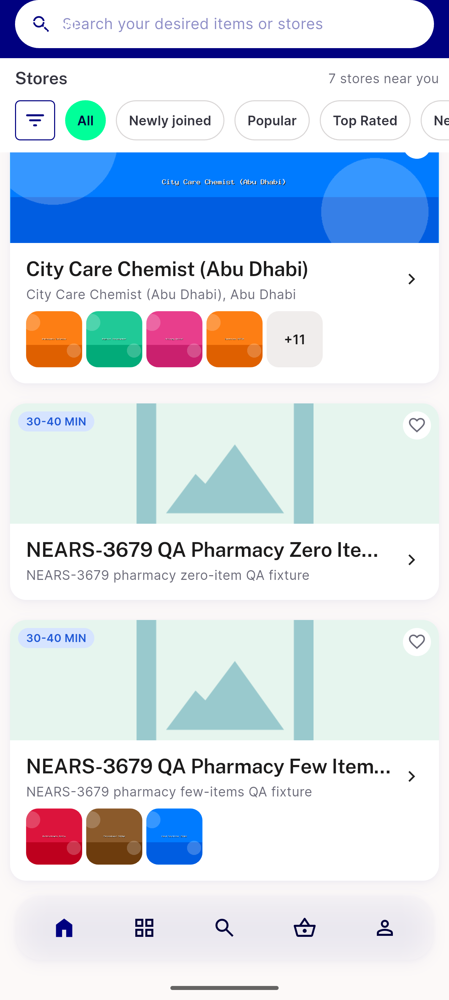
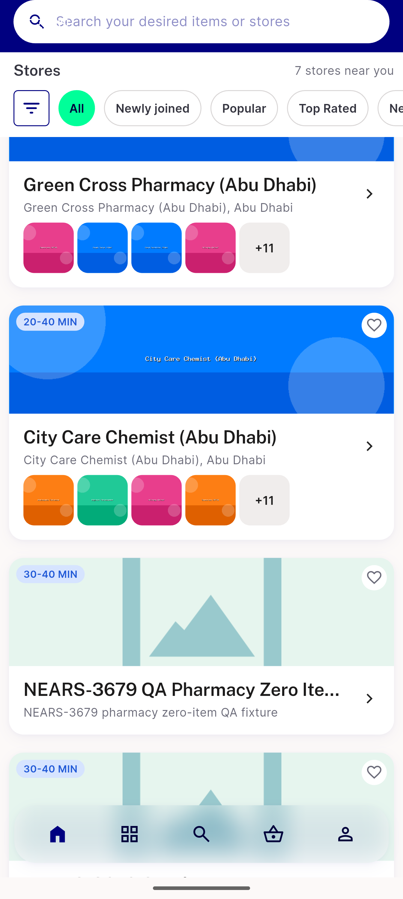
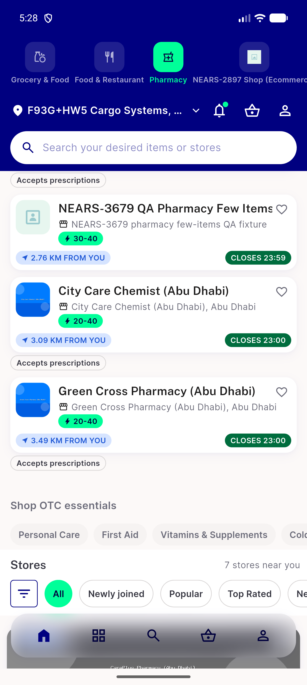
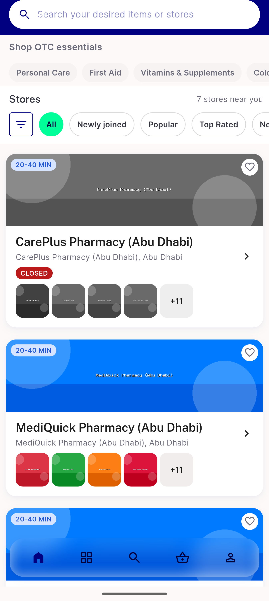
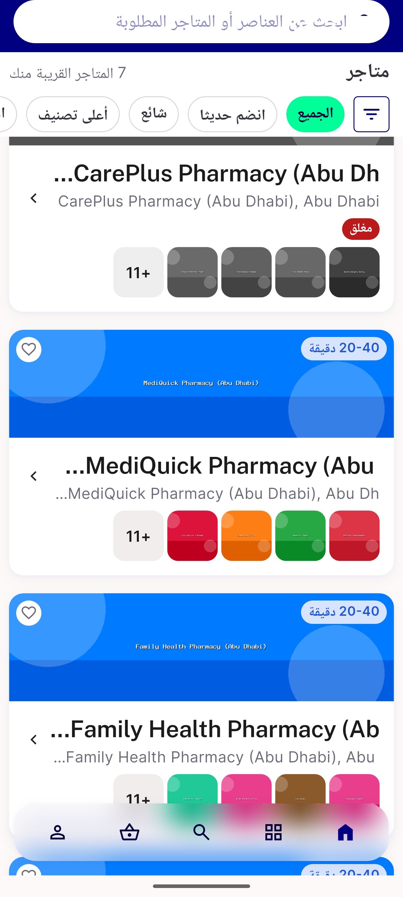
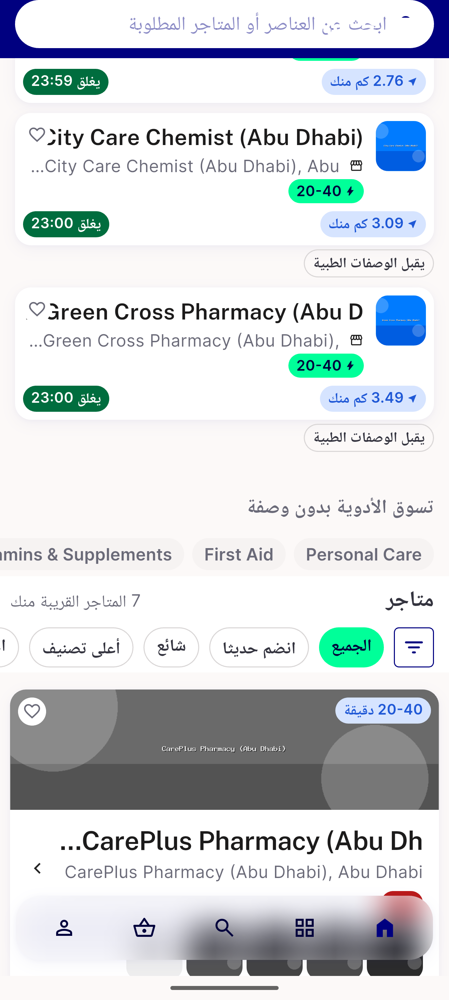
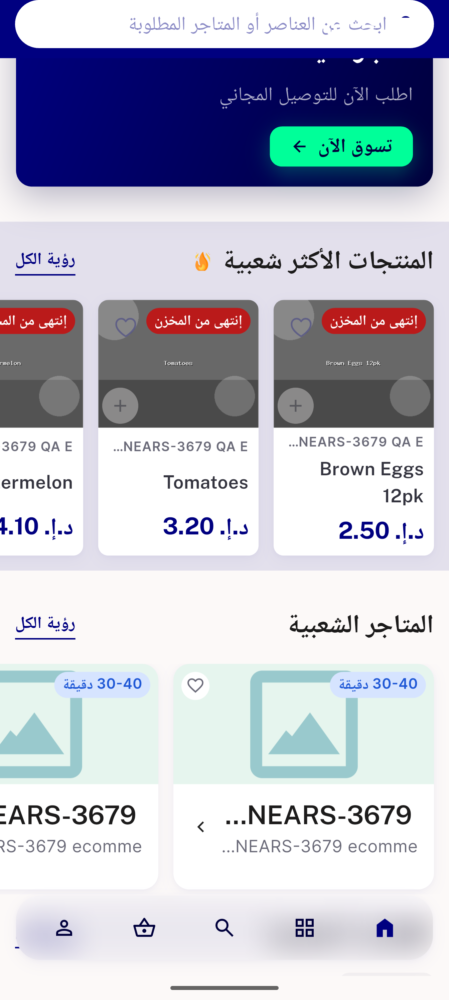
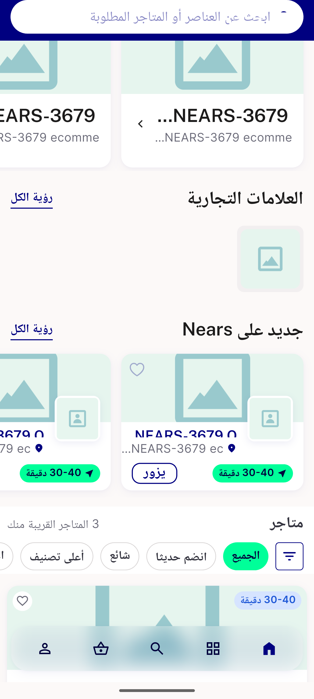
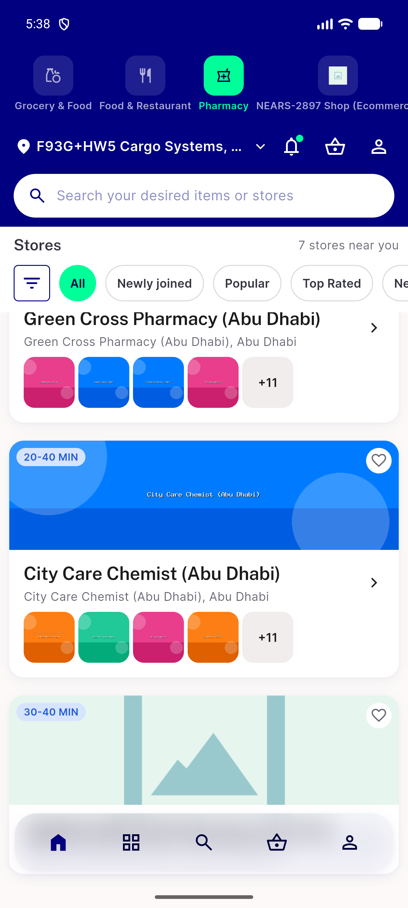

# QA Evidence — NEARS-3679

**PASS - pharmacy/shop popular-items preview parity (AC1-AC6) live-verified, 8/8 flutter + 10/10 phpunit**

**9 screenshot(s).** Click any thumbnail for full resolution.

<table>
<tr>
<td align="center" width="33%"> ac1 pharmacy fewitems</td>
<td align="center" width="33%"> ac1 pharmacy fixtures row</td>
<td align="center" width="33%"> ac2 careplus closed grayscale</td>
</tr>
<tr>
<td align="center" width="33%"> ac2 careplus closed grayscale2</td>
<td align="center" width="33%"> ac5 arabic rtl popularrow</td>
<td align="center" width="33%"> ac5 arabic rtl scale13</td>
</tr>
<tr>
<td align="center" width="33%"> regression newonmart shop</td>
<td align="center" width="33%"> regression newonmart shop2</td>
<td align="center" width="33%"> ux f1 shimmer attempt</td>
</tr>
</table>

### Other artifacts
- [`ac4-a11y-dump.xml`](ac4-a11y-dump.xml)

---
*From `nears/docs/qa-evidence/NEARS-3679/` · public-repo scrub policy (no live secrets; verified clean).*
