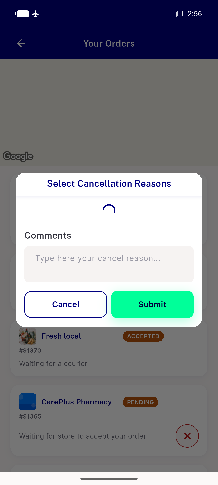
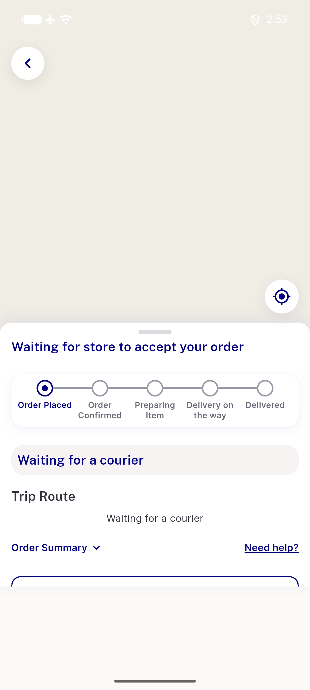
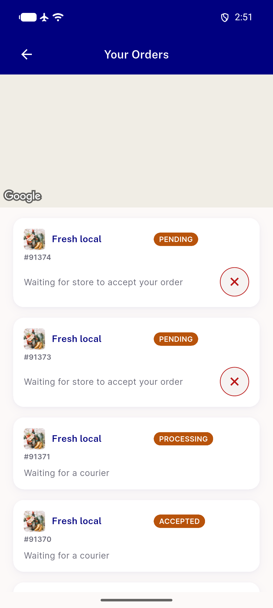
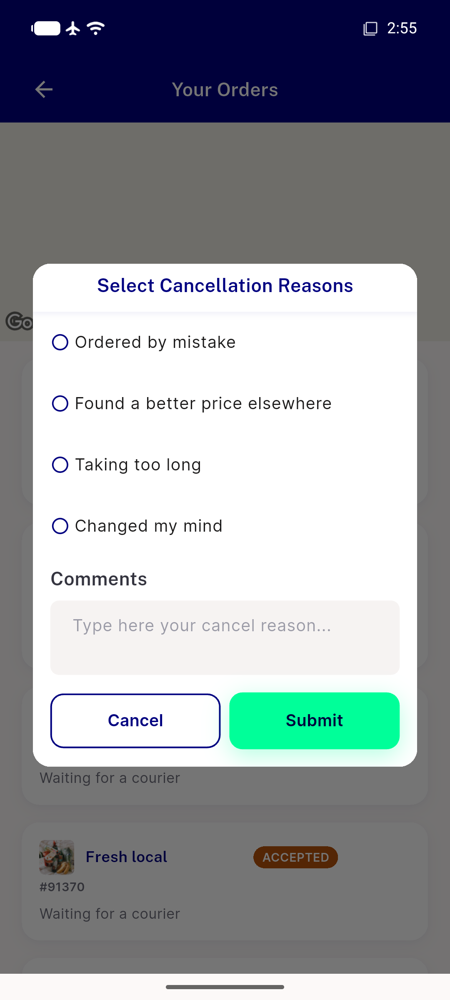
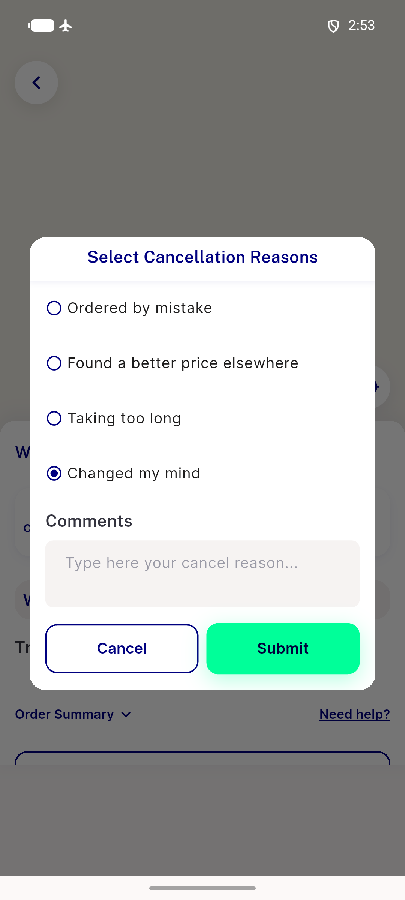

# QA Evidence — NEARS-3696

**PASS — cancel entrypoints (tracking sheet + hub card) verified live, emulator-5566**

**7 screenshot(s).** Click any thumbnail for full resolution.

<table>
<tr>
<td align="center" width="33%"> ac visual nspinner loading</td>
<td align="center" width="33%"> ac1 tracking sheet cancel</td>
<td align="center" width="33%"> ac2 dialog opened tracking sheet</td>
</tr>
<tr>
<td align="center" width="33%"> ac4 hub cancel icons</td>
<td align="center" width="33%"> ac5 hubcard dialog opened</td>
<td align="center" width="33%"> ac8 cancel api failure toast</td>
</tr>
<tr>
<td align="center" width="33%"> ac8 cancel api failure</td>
</tr>
</table>

### Other artifacts
- [`dismiss_dump.xml`](dismiss_dump.xml)
- [`hub_dump2.xml`](hub_dump2.xml)
- [`hub_dump3.xml`](hub_dump3.xml)
- [`hub_dump4.xml`](hub_dump4.xml)
- [`hub_dump5.xml`](hub_dump5.xml)
- [`hub_dump6.xml`](hub_dump6.xml)
- [`hub_dump_ac1_ac4.xml`](hub_dump_ac1_ac4.xml)
- [`track_accepted_dump.xml`](track_accepted_dump.xml)
- [`track_dump_91374.xml`](track_dump_91374.xml)

---
*From `nears/docs/qa-evidence/NEARS-3696/` · public-repo scrub policy (no live secrets; verified clean).*
