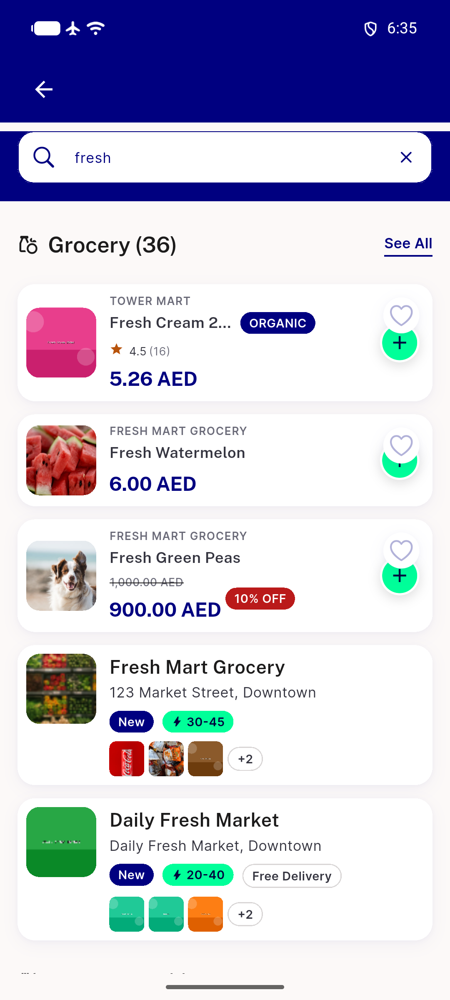
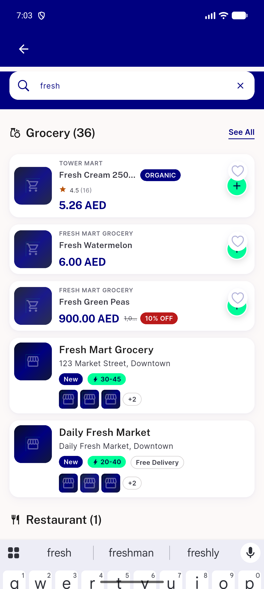
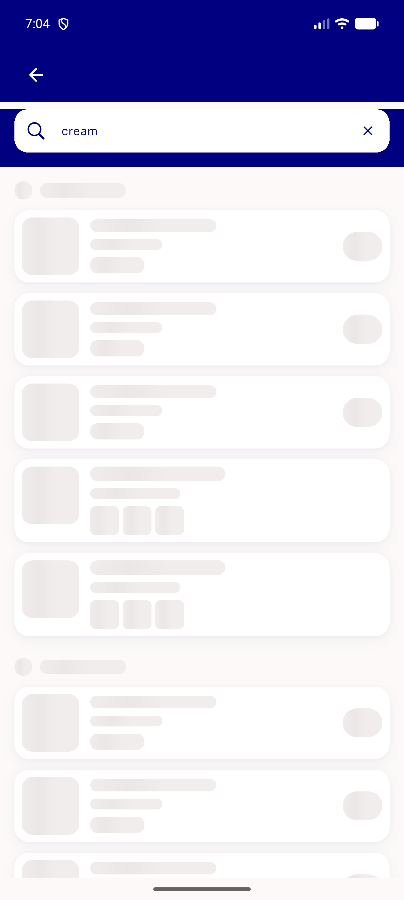
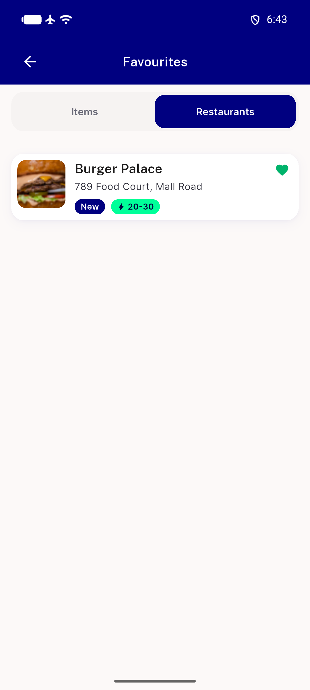

# QA Evidence — NEARS-3697

**Delta re-QA cycle 1 PASS — NEARS-3697-B1 fix confirmed live: both page-level loading skeletons now measure 96px=32dp (was 74px=28dp), pixel-verified on a fresh device+backend at HEAD 5f1849bcc**

**10 screenshot(s).** Click any thumbnail for full resolution.

<table>
<tr>
<td align="center" width="33%"> ac rtl search stores thumbnails</td>
<td align="center" width="33%"> ac1 search stores thumbnails</td>
<td align="center" width="33%"> ac1 search stores zero items</td>
</tr>
<tr>
<td align="center" width="33%"> ac2 global search stores thumbnails</td>
<td align="center" width="33%"> delta global loading skeleton check</td>
<td align="center" width="33%"> delta global loading skeleton check2</td>
</tr>
<tr>
<td align="center" width="33%"> delta global loading skeleton check3</td>
<td align="center" width="33%"> delta loading skeleton check</td>
<td align="center" width="33%"> regression favourites no thumbnails</td>
</tr>
<tr>
<td align="center" width="33%"> regression loading skeleton 32dp</td>
</tr>
</table>

### Other artifacts
- [`bug-skeleton-size-mismatch.log`](bug-skeleton-size-mismatch.log)

---
*From `nears/docs/qa-evidence/NEARS-3697/` · public-repo scrub policy (no live secrets; verified clean).*
