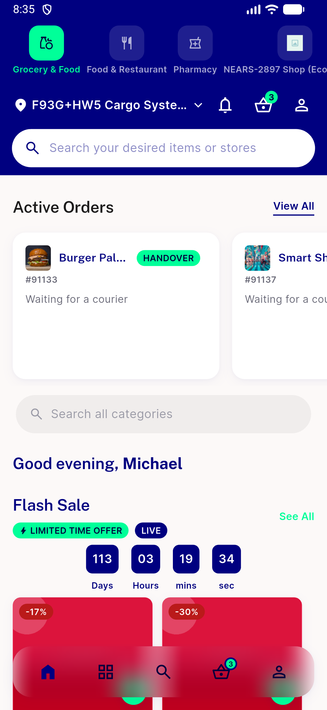
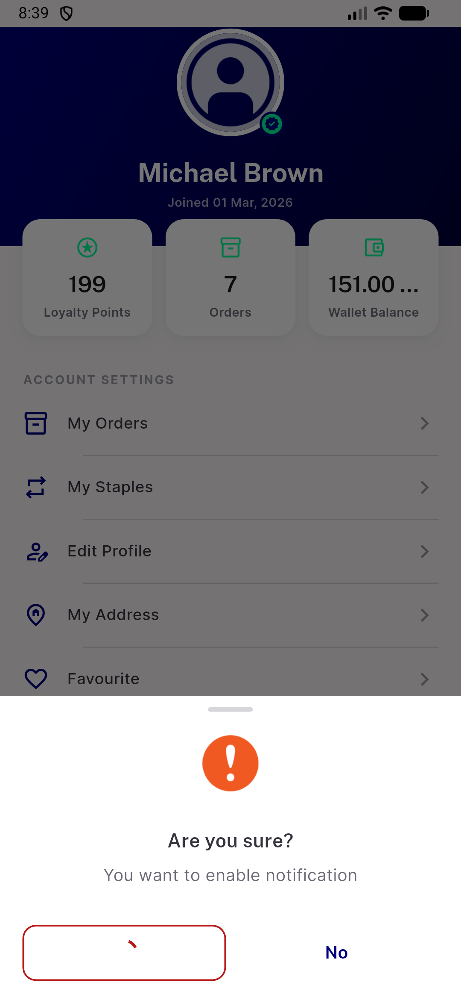

# QA Evidence — NEARS-3698

**PASS — NEARS-3698 Firebase auth guard: AC1-4 verified live, regression_bugs: setNotificationActive() hard-block confirmed**

**2 screenshot(s).** Click any thumbnail for full resolution.

<table>
<tr>
<td align="center" width="33%"> ac1 login success home</td>
<td align="center" width="33%"> bug setnotificationactive unguarded firebase hang</td>
</tr>
</table>

### Other artifacts
- [`bug-setnotificationactive-unguarded-firebase-hang.log`](bug-setnotificationactive-unguarded-firebase-hang.log)

---
*From `nears/docs/qa-evidence/NEARS-3698/` · public-repo scrub policy (no live secrets; verified clean).*
