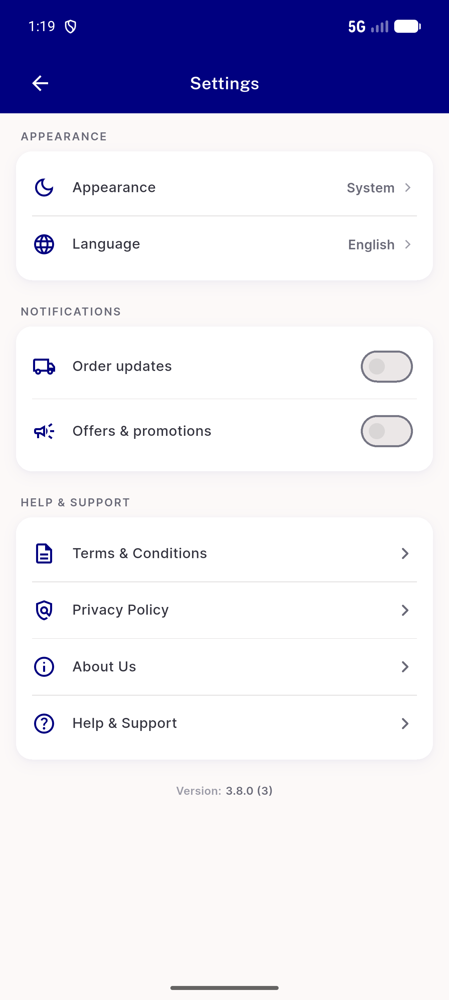
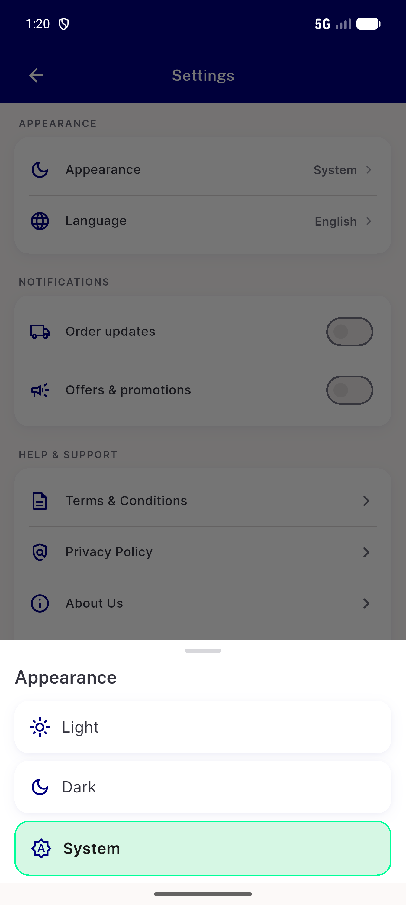
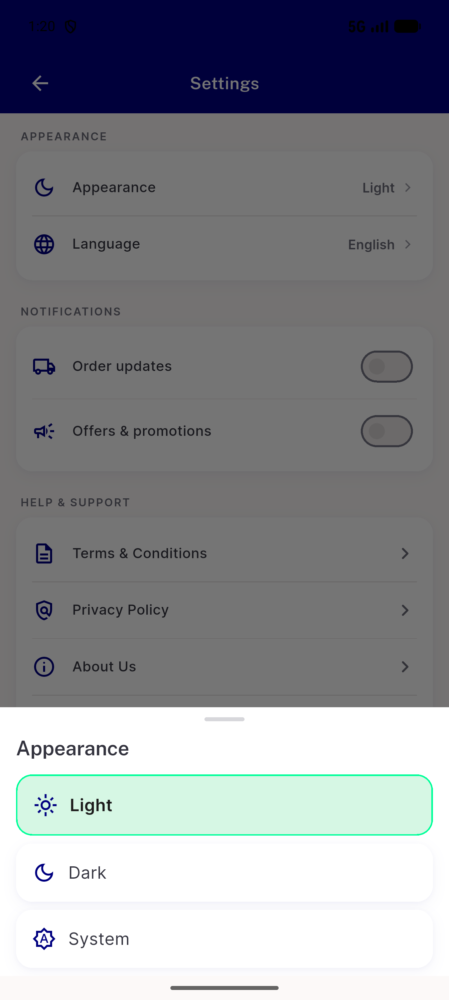
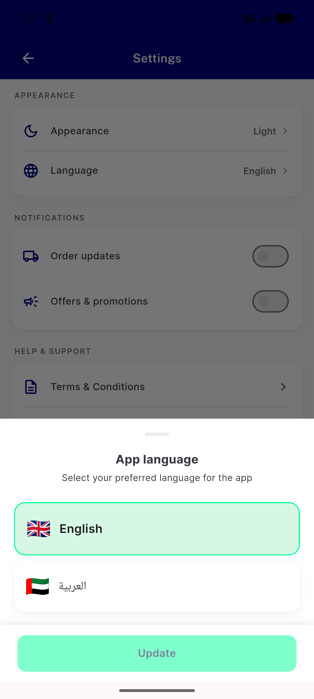
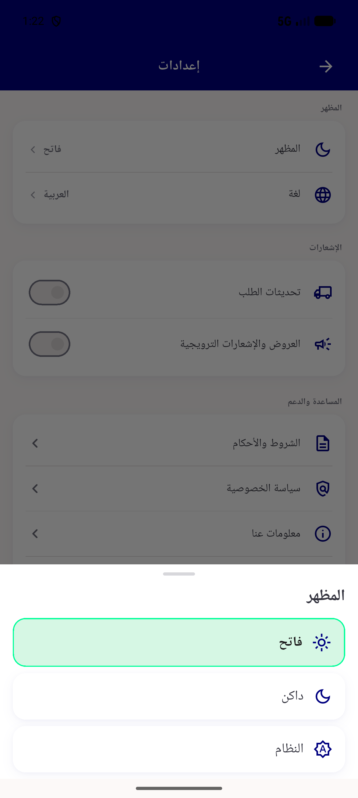
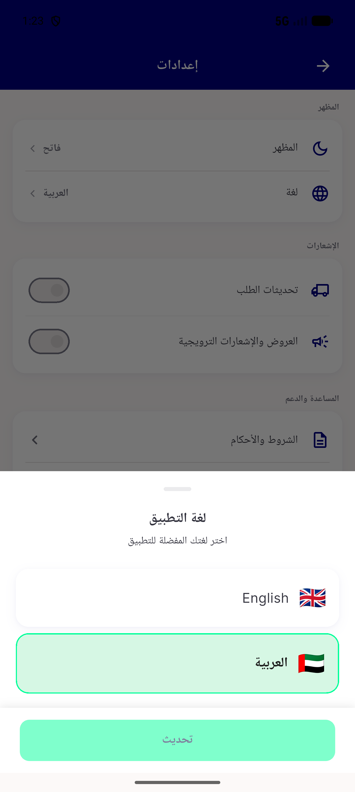
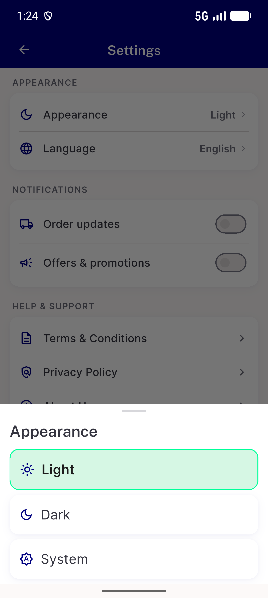
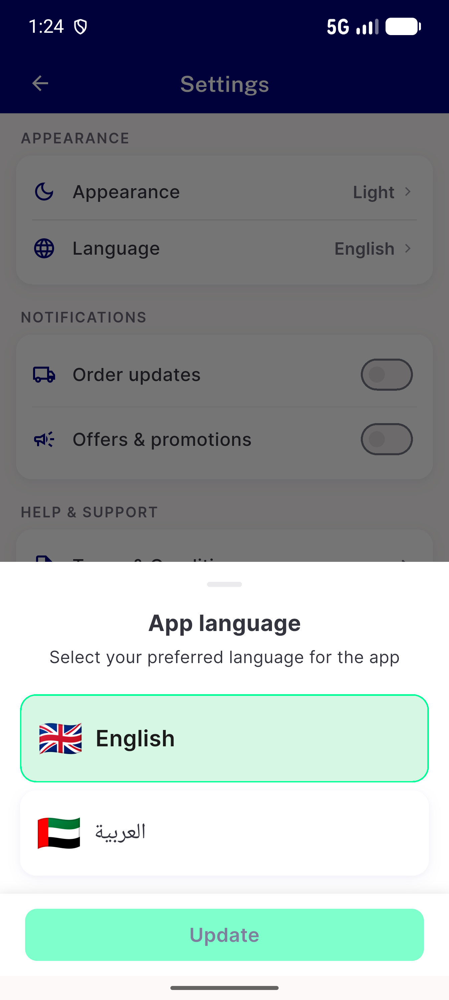

# QA Evidence — NEARS-3703

**PASS — NLanguageOption icon leading-slot generalization, AppearancePickerSheet migration, all 9 ACs demonstrated live**

**8 screenshot(s).** Click any thumbnail for full resolution.

<table>
<tr>
<td align="center" width="33%"> settings page</td>
<td align="center" width="33%"> appearance sheet system selected</td>
<td align="center" width="33%"> appearance sheet light selected ac1</td>
</tr>
<tr>
<td align="center" width="33%"> language sheet ac2 compactness compare</td>
<td align="center" width="33%"> appearance sheet rtl ar</td>
<td align="center" width="33%"> language sheet rtl ar</td>
</tr>
<tr>
<td align="center" width="33%"> appearance sheet textscale13</td>
<td align="center" width="33%"> language sheet textscale13</td>
</tr>
</table>

### Other artifacts
- [`a11y-appearance-sheet.xml`](a11y-appearance-sheet.xml)
- [`a11y-language-sheet.xml`](a11y-language-sheet.xml)

---
*From `nears/docs/qa-evidence/NEARS-3703/` · public-repo scrub policy (no live secrets; verified clean).*
