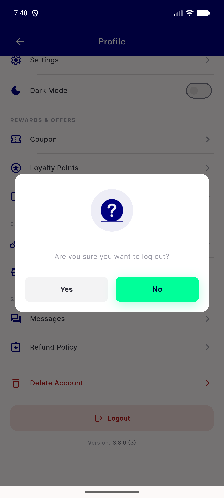

# QA Evidence — NEARS-3705

**PASS — AC2 confirmed (live negative + automated positive), AC3 automated, AC1 n/a superseded**

**1 screenshot(s).** Click any thumbnail for full resolution.

<table>
<tr>
<td align="center" width="33%"> ac2 logout confirm dialog</td>
</tr>
</table>

### Other artifacts
- [`ac2-automated-mechanism-proof.log`](ac2-automated-mechanism-proof.log)
- [`ac2-live-logout-tap.log`](ac2-live-logout-tap.log)

---
*From `nears/docs/qa-evidence/NEARS-3705/` · public-repo scrub policy (no live secrets; verified clean).*
