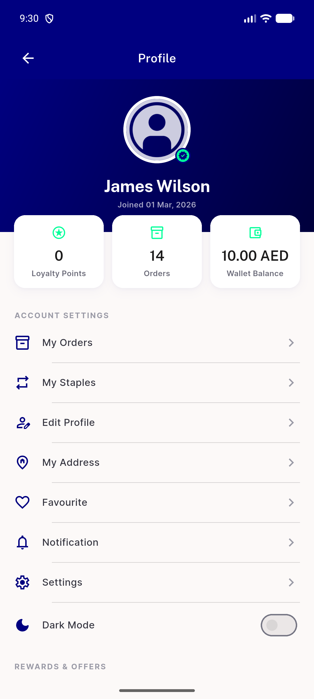
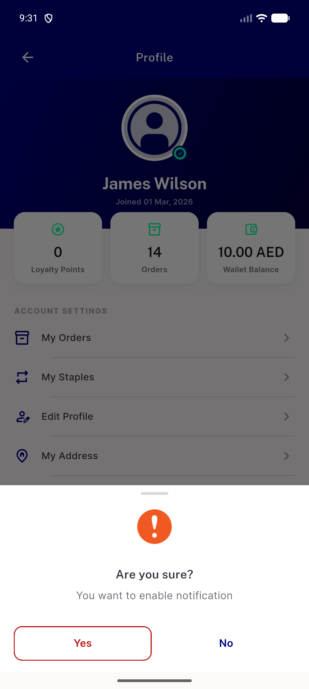
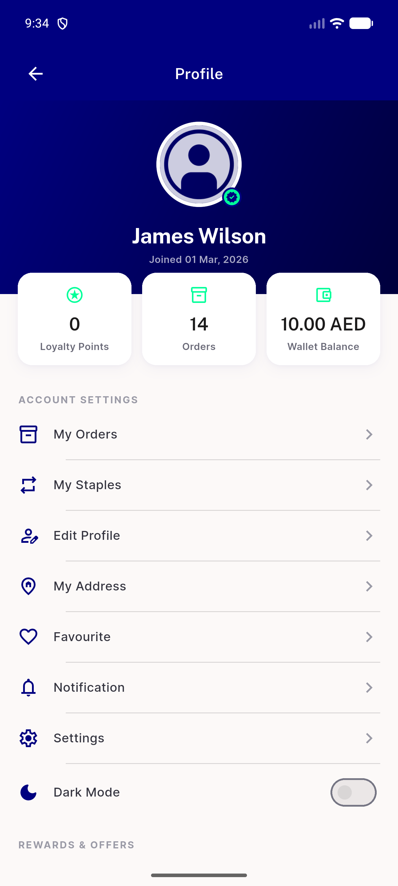

# QA Evidence — NEARS-3706

**PASS — AC1-AC4 verified live on Firebase-init-failure + healthy installs, emulator-5554**

**3 screenshot(s).** Click any thumbnail for full resolution.

<table>
<tr>
<td align="center" width="33%"> ac1 toggle off no hang menu</td>
<td align="center" width="33%"> ac2 restart persisted false enable prompt</td>
<td align="center" width="33%"> ac4 healthy install toggle off clean</td>
</tr>
</table>

---
*From `nears/docs/qa-evidence/NEARS-3706/` · public-repo scrub policy (no live secrets; verified clean).*
