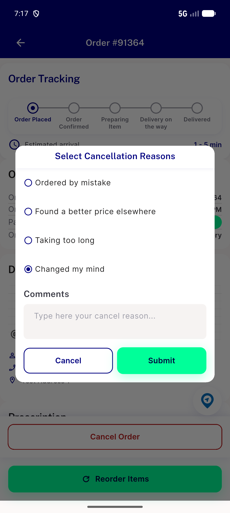
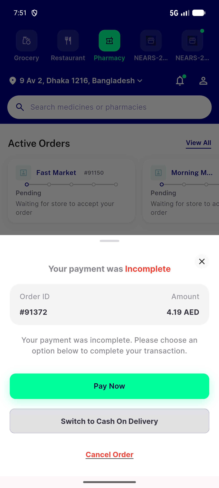

# QA Evidence — NEARS-3707

**PASS -- modal-cancel (order 91364) + payment-incomplete-sheet (order 91372) both verified: dialog/sheet stays mounted on failure, one toast, one [FAIL] log, re-submittable; success path unaffected**

**2 screenshot(s).** Click any thumbnail for full resolution.

<table>
<tr>
<td align="center" width="33%"> ac1 modal cancel failure toast</td>
<td align="center" width="33%"> ac1 payment site incomplete sheet failure toast</td>
</tr>
</table>

### Other artifacts
- [`progress.md`](progress.md)

---
*From `nears/docs/qa-evidence/NEARS-3707/` · public-repo scrub policy (no live secrets; verified clean).*
