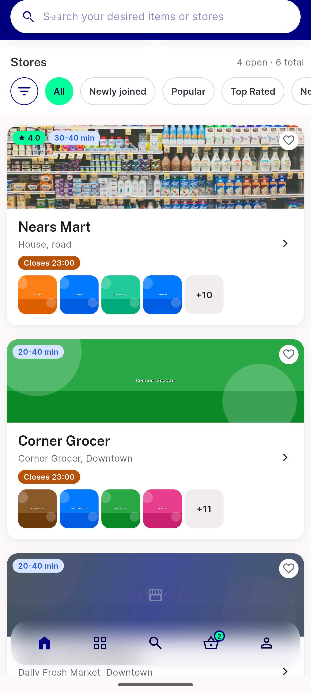
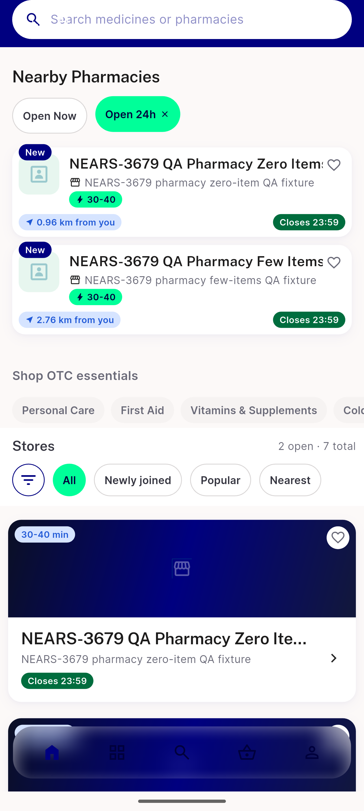
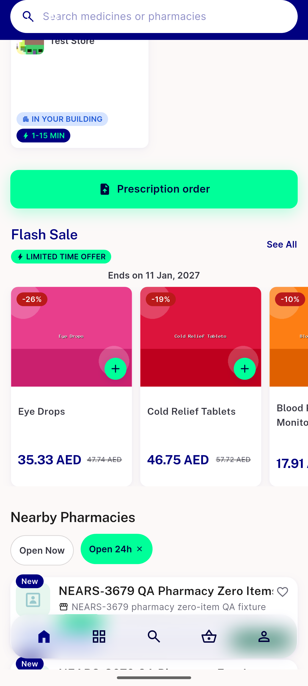
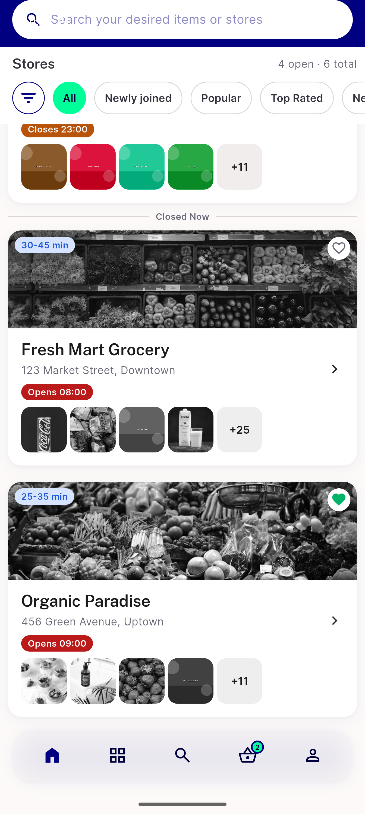
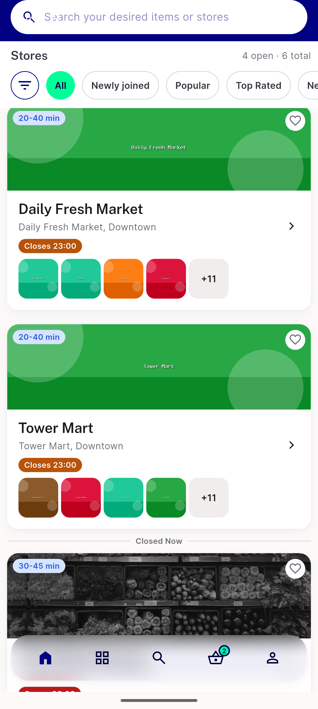
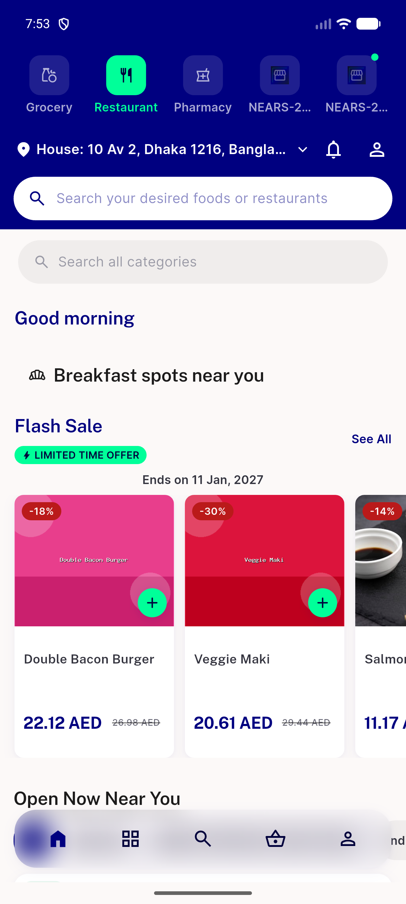
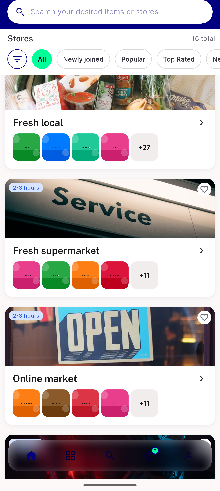
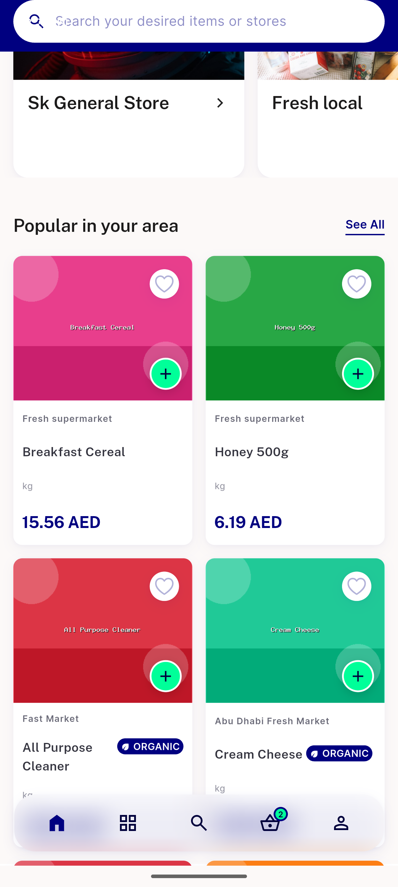
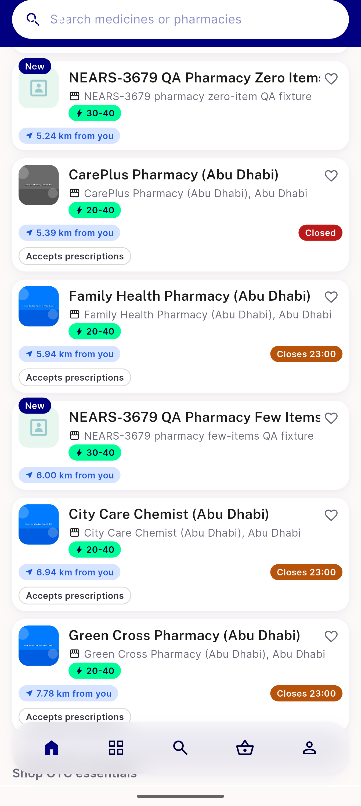
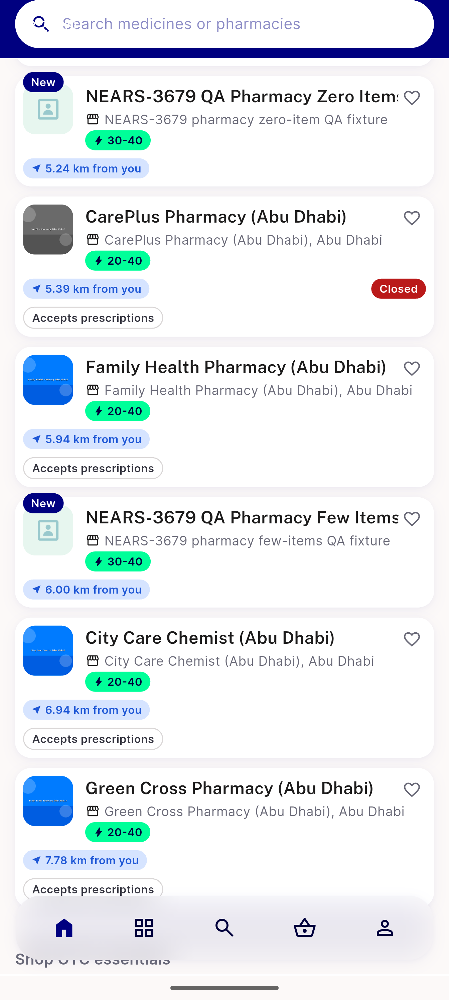

# QA Evidence — NEARS-3708

**PASS (delta re-QA) — AC3/4/5 fixed, closed/closing-soon behavior intact, HEAD 81397ebec**

**12 screenshot(s).** Click any thumbnail for full resolution.

<table>
<tr>
<td align="center" width="33%"> ac prescription cta single chip</td>
<td align="center" width="33%"> ac search results closing soon</td>
<td align="center" width="33%"> ac1 ac2 closing soon nearsmart</td>
</tr>
<tr>
<td align="center" width="33%"> ac2c open24h near midnight 2</td>
<td align="center" width="33%"> ac2c open24h near midnight</td>
<td align="center" width="33%"> ac3 ac4 closed stores 2</td>
</tr>
<tr>
<td align="center" width="33%"> ac3 ac4 closed stores</td>
<td align="center" width="33%"> bug ac3 open store shows status chip</td>
<td align="center" width="33%"> rerun ac3 allstores openstore zerochip</td>
</tr>
<tr>
<td align="center" width="33%"> rerun ac3 plainopen zone2 popular</td>
<td align="center" width="33%"> rerun pharmacy 2215 closingsoon intact</td>
<td align="center" width="33%"> rerun pharmacy nearby mixed states</td>
</tr>
</table>

---
*From `nears/docs/qa-evidence/NEARS-3708/` · public-repo scrub policy (no live secrets; verified clean).*
