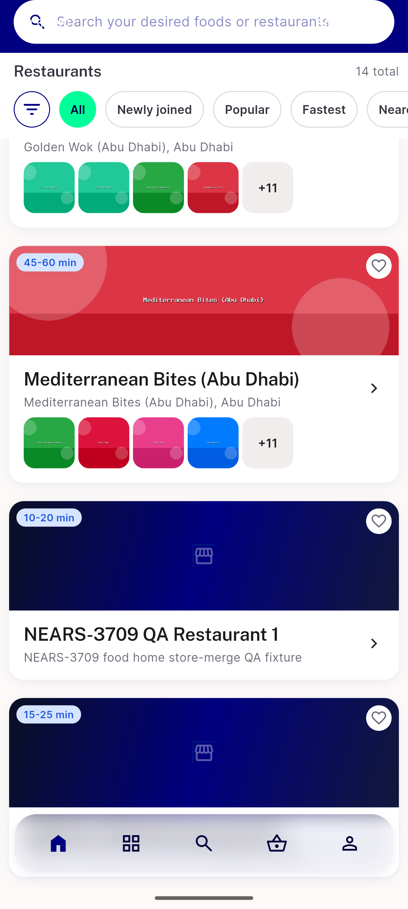
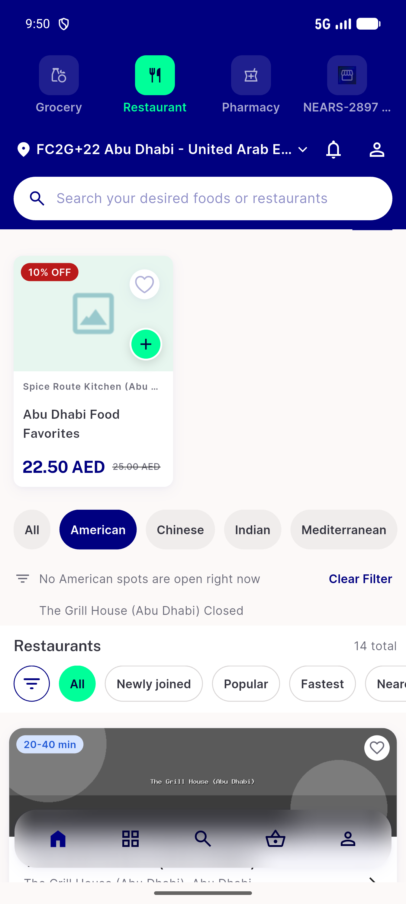

# QA Evidence — NEARS-3709

**FAIL — AC6 undemonstrable live with current zone-2 seed data (Data DoR gap); AC1/2/4/5/7 + analytics PASS live; AC3 confirmed via unchanged code path + passing unit tests**

**2 screenshot(s).** Click any thumbnail for full resolution.

<table>
<tr>
<td align="center" width="33%"> ac1 ac2 merged stores list</td>
<td align="center" width="33%"> ac6 closed match note gap</td>
</tr>
</table>

### Other artifacts
- [`ac7-fastest-page-order.log`](ac7-fastest-page-order.log)

---
*From `nears/docs/qa-evidence/NEARS-3709/` · public-repo scrub policy (no live secrets; verified clean).*
