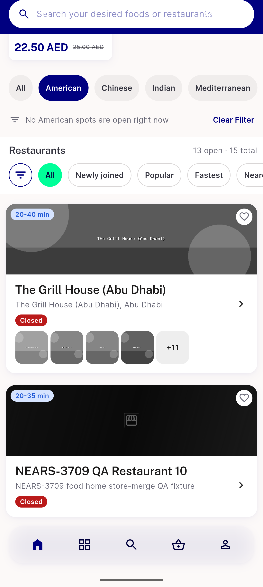
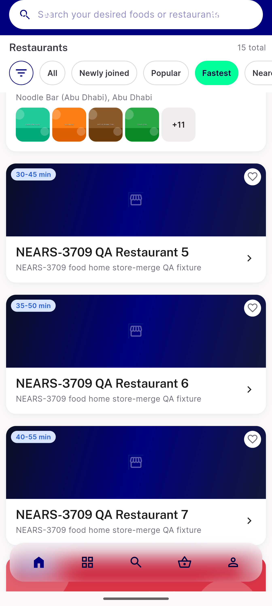

# QA Evidence — NEARS-3709

**FAIL delta re-QA cycle1: AC6 still fails (new cause - cuisine-tag collision nulls closedMatchLabel); AC7/AC2 sanity clean at 15 stores**

**4 screenshot(s).** Click any thumbnail for full resolution.

<table>
<tr>
<td align="center" width="33%"> ac1 ac2 merged stores list</td>
<td align="center" width="33%"> ac6 closed match note gap</td>
<td align="center" width="33%"> ac6 fix1 still no opens at</td>
</tr>
<tr>
<td align="center" width="33%"> ac7 ac2 sanity 15total fastest page2</td>
</tr>
</table>

### Other artifacts
- [`ac6-fix1-a11y-dump.xml`](ac6-fix1-a11y-dump.xml)
- [`ac7-fastest-page-order.log`](ac7-fastest-page-order.log)

---
*From `nears/docs/qa-evidence/NEARS-3709/` · public-repo scrub policy (no live secrets; verified clean).*
