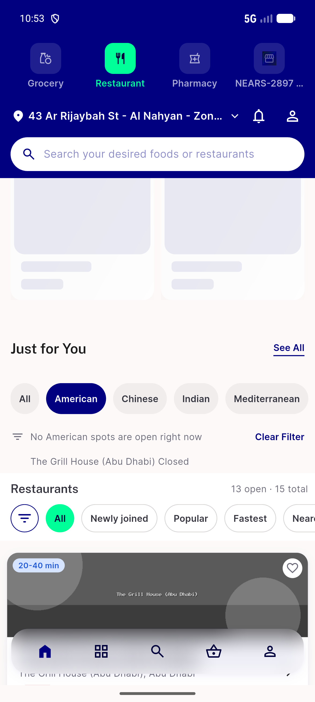
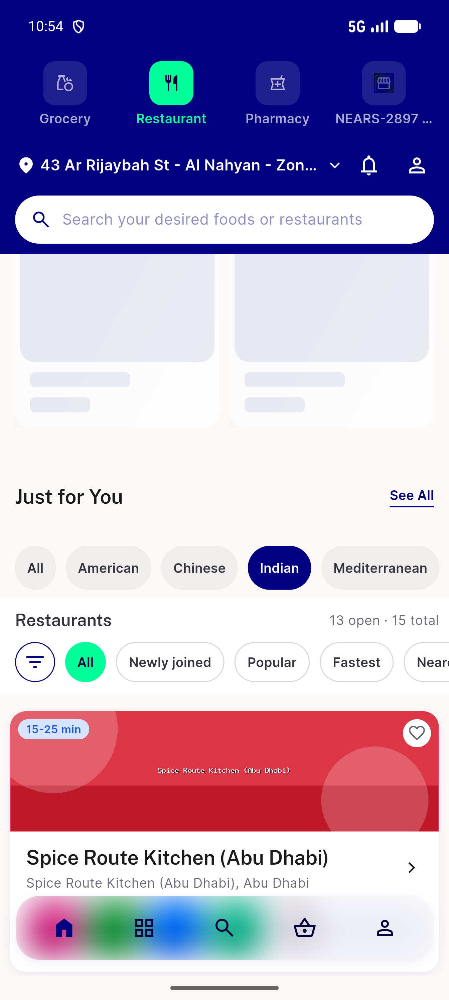
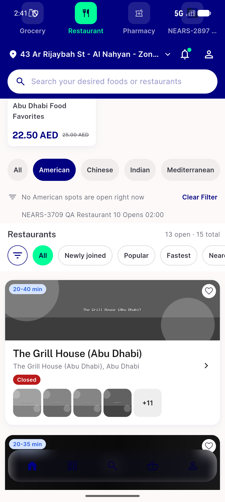

# QA Evidence — NEARS-3709

**Delta re-QA AC6 PASS — commit 0ad7d1375, fixture 91142/47 American cuisine**

**3 screenshot(s).** Click any thumbnail for full resolution.

<table>
<tr>
<td align="center" width="33%"> ac6 fix2 american isolated closed no label</td>
<td align="center" width="33%"> ac6 fix2 indian open match no note</td>
<td align="center" width="33%"> ac6 fix3 american closed match</td>
</tr>
</table>

### Other artifacts
- [`ac6-fix2-american-a11y-dump.xml`](ac6-fix2-american-a11y-dump.xml)
- [`ac6-fix2-indian-a11y-dump.xml`](ac6-fix2-indian-a11y-dump.xml)
- [`ac6-fix3-american-a11y-dump.xml`](ac6-fix3-american-a11y-dump.xml)

---
*From `nears/docs/qa-evidence/NEARS-3709/` · public-repo scrub policy (no live secrets; verified clean).*
