# QA Evidence — NEARS-3711

**PASS — Pharmacy home store-list merge, all 8 ACs demonstrated live**

**11 screenshot(s).** Click any thumbnail for full resolution.

<table>
<tr>
<td align="center" width="33%"><a href="ac1-ac5-otc-rail-above-chips-and-stores-list.png">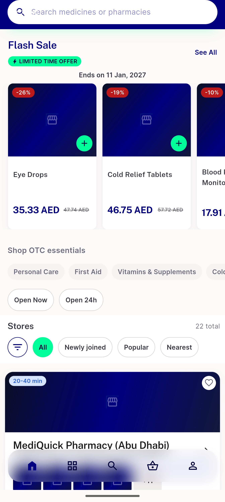</a> ac1 ac5 otc rail above chips and stores list</td>
<td align="center" width="33%"><a href="ac1-ac7-pharmacy-home-shared-list.png">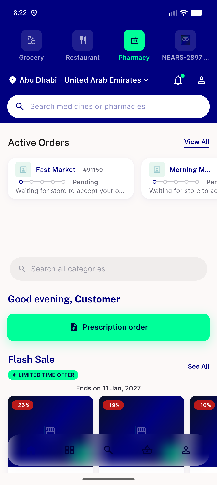</a> ac1 ac7 pharmacy home shared list</td>
<td align="center" width="33%"><a href="ac2-ac3-open-24h-selected.png">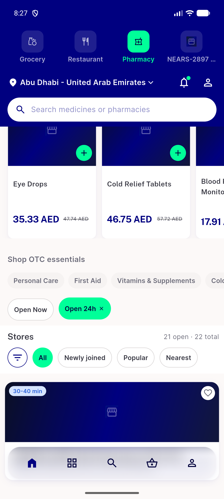</a> ac2 ac3 open 24h selected</td>
</tr>
<tr>
<td align="center" width="33%"><a href="ac2-ac3-open-now-selected.png">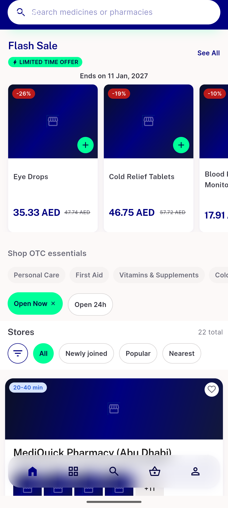</a> ac2 ac3 open now selected</td>
<td align="center" width="33%"><a href="ac2-ac5-zero-badge-and-empty-row.png">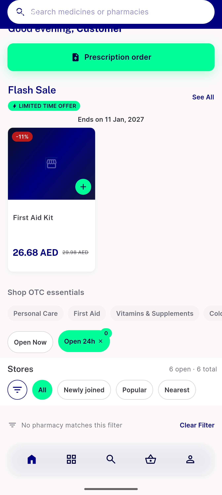</a> ac2 ac5 zero badge and empty row</td>
<td align="center" width="33%"><a href="ac4-closed-now-divider.png">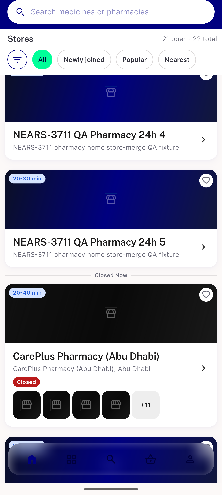</a> ac4 closed now divider</td>
</tr>
<tr>
<td align="center" width="33%"><a href="ac6-nothing-open-fallback.png">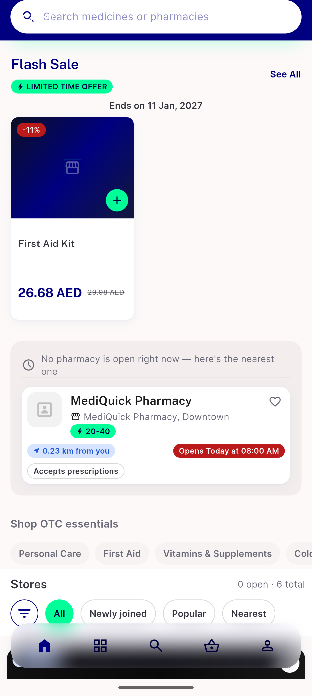</a> ac6 nothing open fallback</td>
<td align="center" width="33%"><a href="ac6-shared-list-default-unfiltered.png">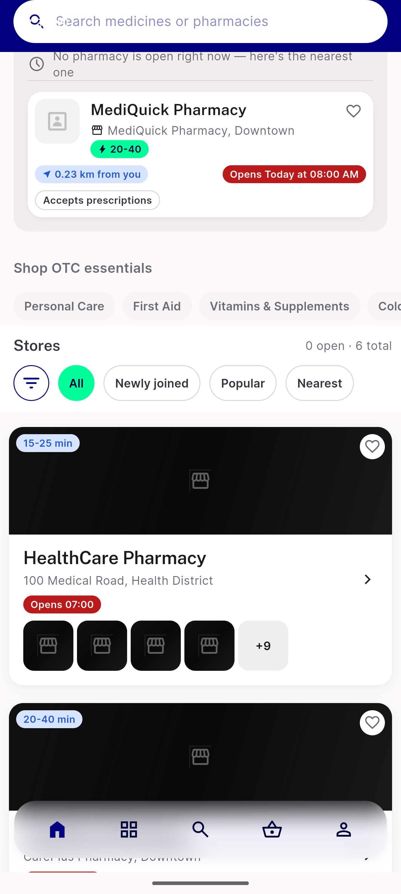</a> ac6 shared list default unfiltered</td>
<td align="center" width="33%"><a href="regression-1.3x-textscale-no-overflow.png">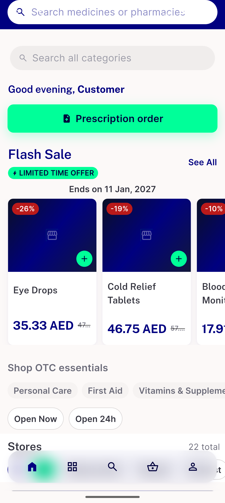</a> regression 1.3x textscale no overflow</td>
</tr>
<tr>
<td align="center" width="33%"><a href="regression-food-cuisine-filter-unaffected.png">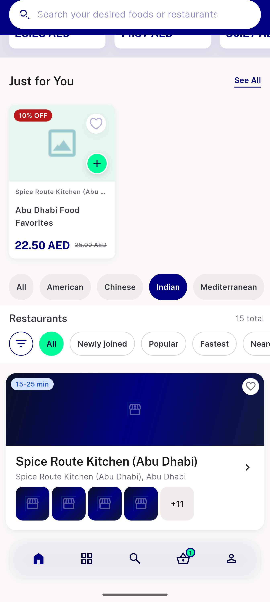</a> regression food cuisine filter unaffected</td>
<td align="center" width="33%"><a href="regression-rtl-no-overflow.png">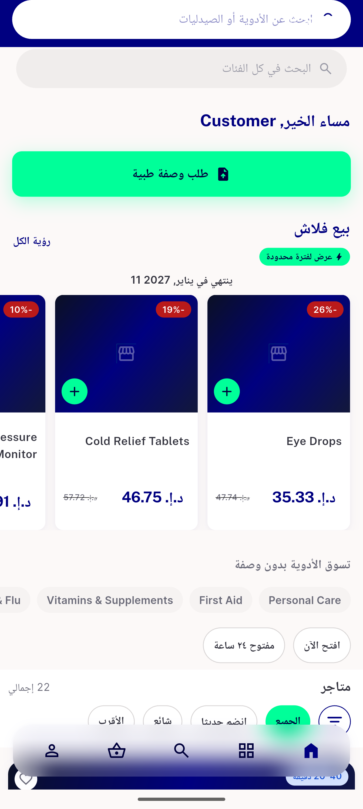</a> regression rtl no overflow</td>
</tr>
</table>

---
*From `nears/docs/qa-evidence/NEARS-3711/` · public-repo scrub policy (no live secrets; verified clean).*
