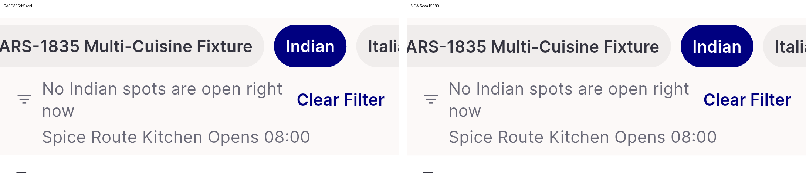
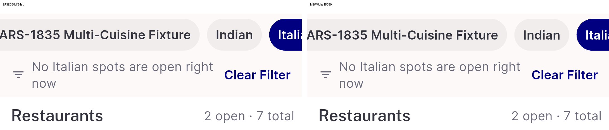
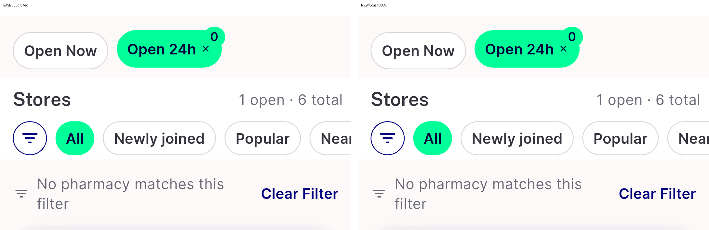
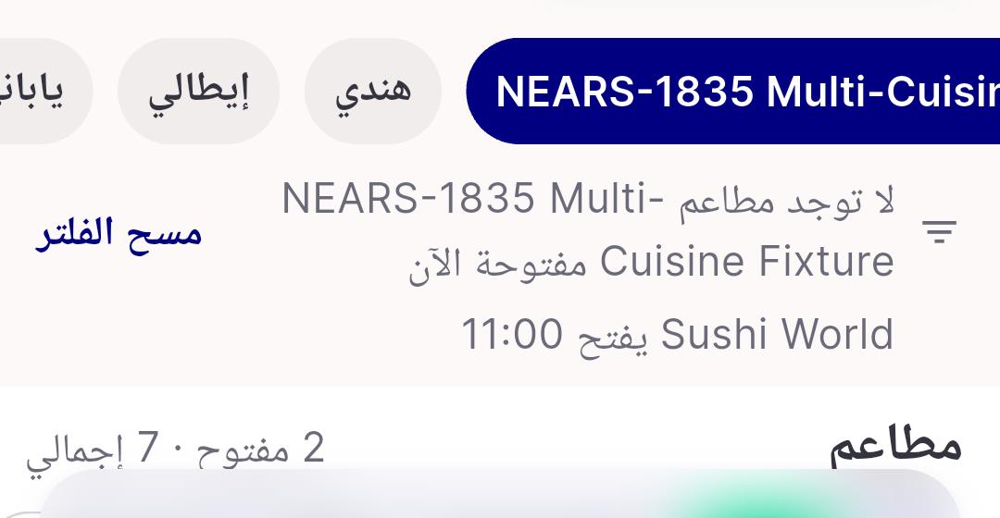

# QA Evidence — NEARS-3714

**NEARS-3714 QA PASS — NFilterEmptyRow: 3 sites no visible change, Clear filter + TalkBack activation live**

**5 screenshot(s).** Click any thumbnail for full resolution.

<table>
<tr>
<td align="center" width="33%"> ac1 food 1closed base vs new</td>
<td align="center" width="33%"> ac1 food 2closed base vs new</td>
<td align="center" width="33%"> ac1 pharmacy base vs new</td>
</tr>
<tr>
<td align="center" width="33%"> rtl ar food long</td>
<td align="center" width="33%"> rtl ar pharm</td>
</tr>
</table>

### Other artifacts
- [`a11y-base-food-indian.xml`](a11y-base-food-indian.xml)
- [`a11y-new-food-indian.xml`](a11y-new-food-indian.xml)
- [`a11y-new-pharmacy.xml`](a11y-new-pharmacy.xml)

---
*From `nears/docs/qa-evidence/NEARS-3714/` · public-repo scrub policy (no live secrets; verified clean).*
