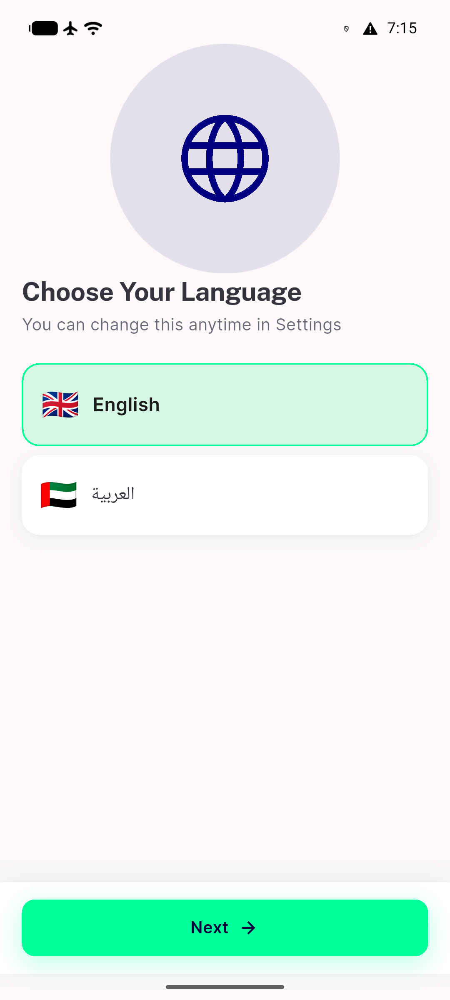
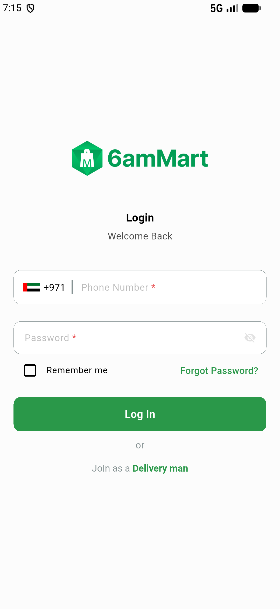

# QA Evidence — NEARS-3721

**2 screenshot(s).** Click any thumbnail for full resolution.

<table>
<tr>
<td align="center" width="33%"> app emulator 5560</td>
<td align="center" width="33%"> app emulator 5564</td>
</tr>
</table>

### Other artifacts
- [`after.txt`](after.txt)
- [`app-emulator-5560.xml`](app-emulator-5560.xml)
- [`app-emulator-5564.xml`](app-emulator-5564.xml)
- [`before.txt`](before.txt)
- [`boot-session.test.out`](boot-session.test.out)
- [`boot1.out`](boot1.out)
- [`boot2.out`](boot2.out)
- [`boot3-counts.txt`](boot3-counts.txt)
- [`boot3.out`](boot3.out)
- [`bug-rerun-drops-app-row.log`](bug-rerun-drops-app-row.log)
- [`bug-tab-reuse-overmatch.log`](bug-tab-reuse-overmatch.log)
- [`c1`](c1)
- [`c2`](c2)
- [`c3`](c3)
- [`close-session.test.out`](close-session.test.out)
- [`progress.md`](progress.md)
- [`ready-table-boot2.md`](ready-table-boot2.md)
- [`state`](state)
- [`state1.tsv`](state1.tsv)
- [`state2.tsv`](state2.tsv)
- [`state3.tsv`](state3.tsv)
- [`status-ac3.out`](status-ac3.out)
- [`teardown1.out`](teardown1.out)
- [`teardown2.out`](teardown2.out)
- [`uninstall.out`](uninstall.out)

---
*From `nears/docs/qa-evidence/NEARS-3721/` · public-repo scrub policy (no live secrets; verified clean).*
