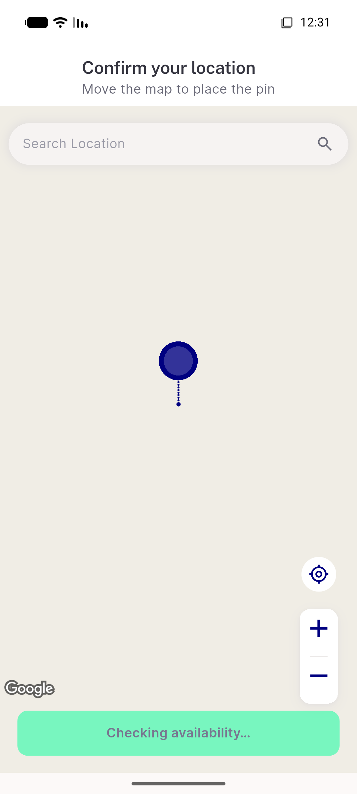
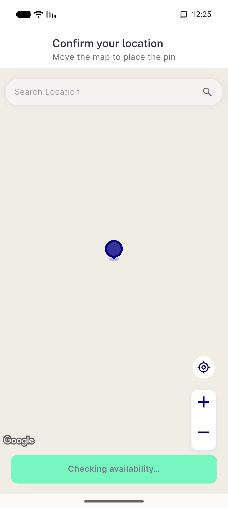
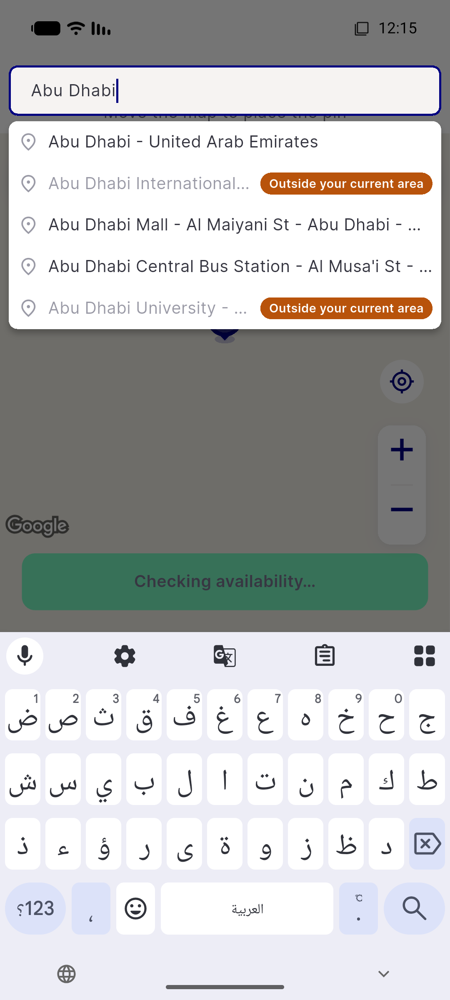
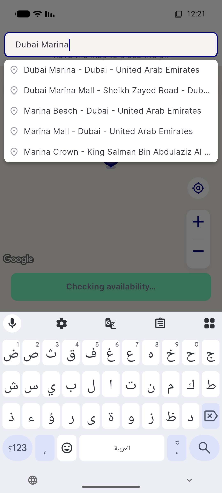
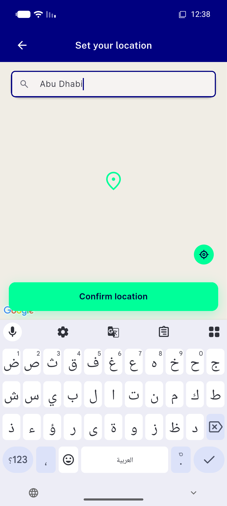
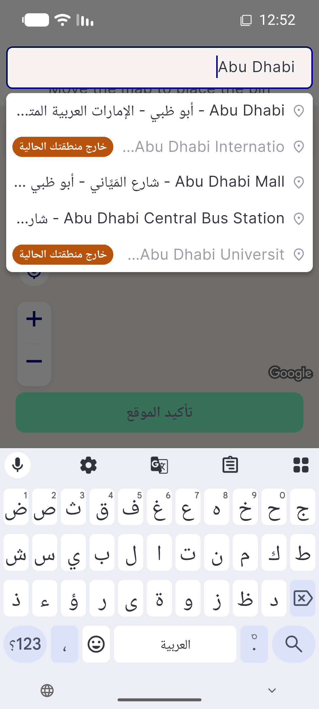

# QA Evidence — NEARS-3730

**FAIL - AC6 double [FAIL] log line on genuine get-zone-id failure (task_bug), all other 11 ACs PASS/UNVERIFIABLE**

**6 screenshot(s).** Click any thumbnail for full resolution.

<table>
<tr>
<td align="center" width="33%"> ac11 pinned cta after search</td>
<td align="center" width="33%"> ac11 pinned cta before search</td>
<td align="center" width="33%"> ac2 mixed query badges</td>
</tr>
<tr>
<td align="center" width="33%"> ac5 ac12 failopen unbadged</td>
<td align="center" width="33%"> ac7 registration scope boundary</td>
<td align="center" width="33%"> ac9 rtl badge trailing</td>
</tr>
</table>

### Other artifacts
- [`bug-ac6-double-fail-log.log`](bug-ac6-double-fail-log.log)

---
*From `nears/docs/qa-evidence/NEARS-3730/` · public-repo scrub policy (no live secrets; verified clean).*
