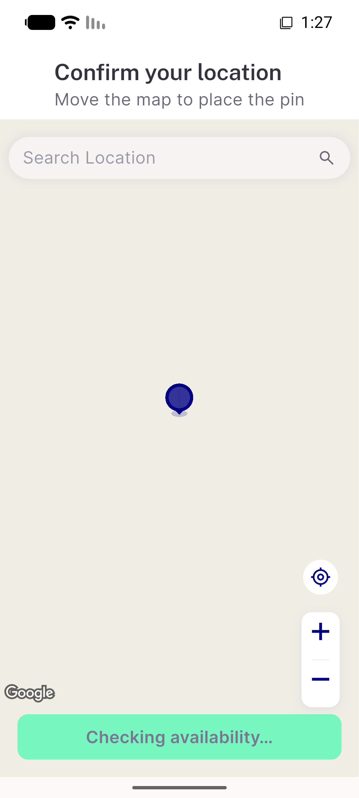

# QA Evidence — NEARS-3730

**PASS (delta re-QA fix_cycle 1) — AC6 fixed (exactly-one [FAIL] confirmed 4/4), AC8 dispatch-verified via NEARS-262 mirror channel (FA canonical channel structurally blocked, worktree gap NEARS-3649), AC5/AC11/AC12 regression-clean**

**9 screenshot(s).** Click any thumbnail for full resolution.

<table>
<tr>
<td align="center" width="33%"> ac11 mainscreen unaffected postprobe</td>
<td align="center" width="33%"> ac11 pinned cta after search</td>
<td align="center" width="33%"> ac11 pinned cta before search</td>
</tr>
<tr>
<td align="center" width="33%"> ac2 mixed query badges</td>
<td align="center" width="33%"> ac5 ac12 failopen fix cycle2</td>
<td align="center" width="33%"> ac5 ac12 failopen unbadged</td>
</tr>
<tr>
<td align="center" width="33%"> ac6 mixed badges fix cycle2</td>
<td align="center" width="33%"> ac7 registration scope boundary</td>
<td align="center" width="33%"> ac9 rtl badge trailing</td>
</tr>
</table>

### Other artifacts
- [`ac6-single-fail-log-fix-cycle2.log`](ac6-single-fail-log-fix-cycle2.log)
- [`bug-ac6-double-fail-log.log`](bug-ac6-double-fail-log.log)

---
*From `nears/docs/qa-evidence/NEARS-3730/` · public-repo scrub policy (no live secrets; verified clean).*
