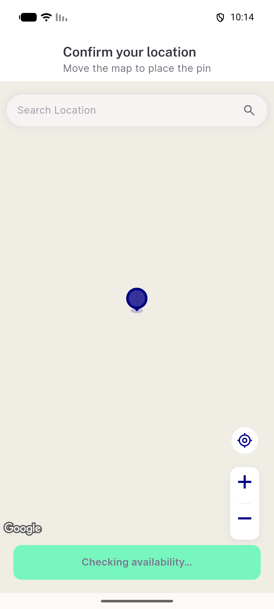
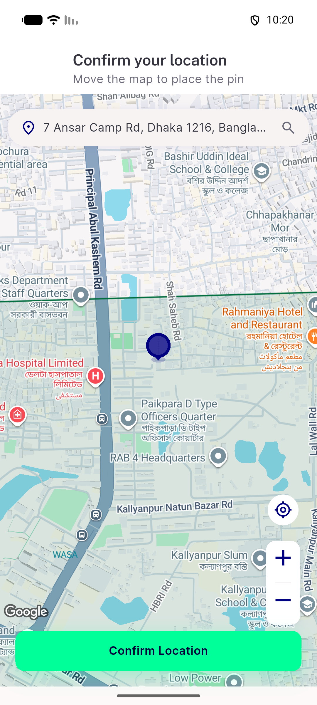
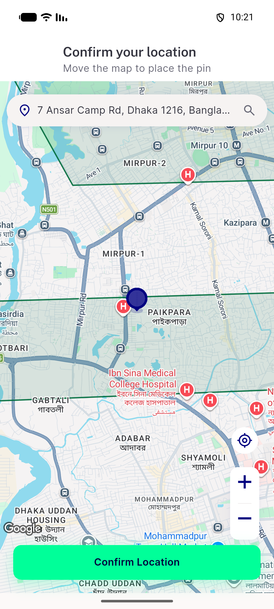
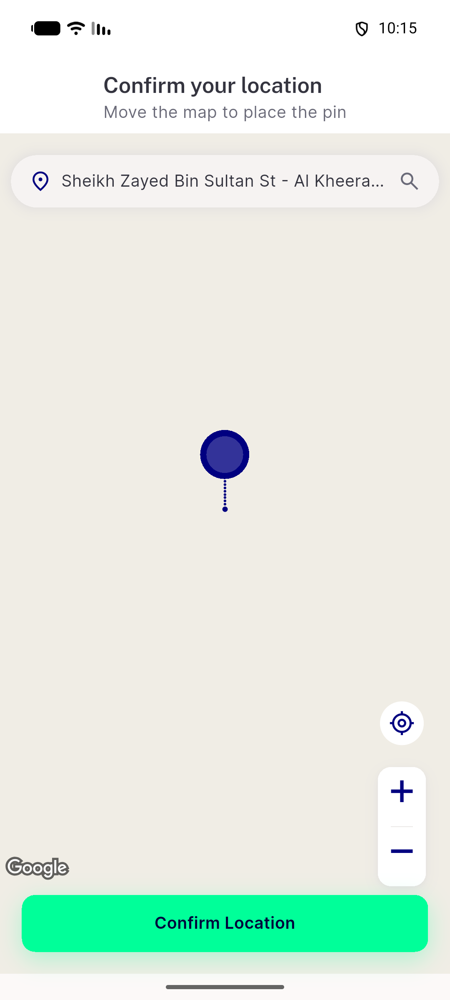
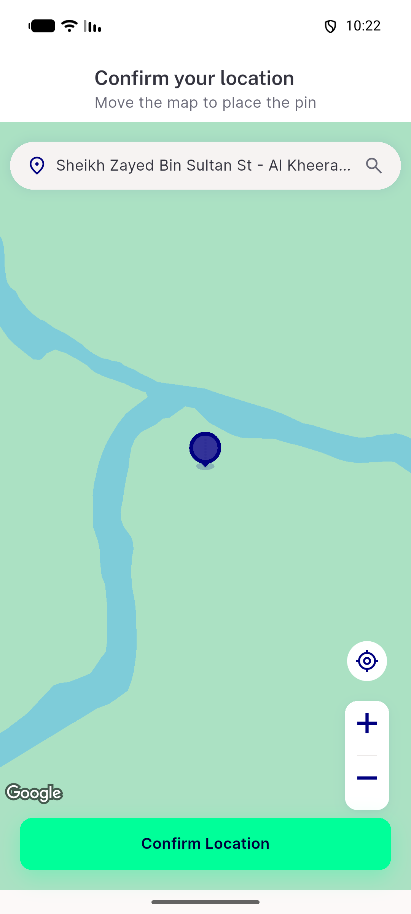
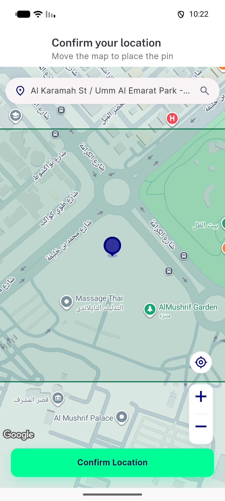
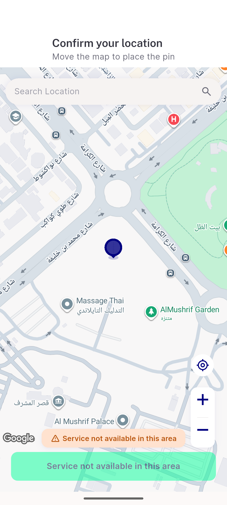
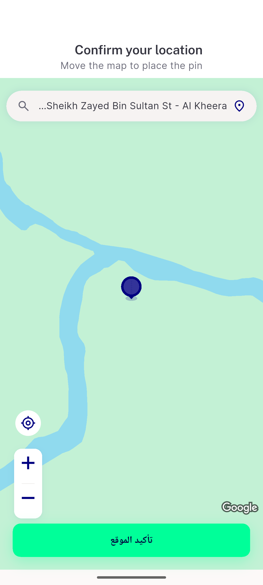

# QA Evidence — NEARS-3731

**PASS — pick-map supported-area polygon overlay (Android emulator NEARS_2424_QA)**

**8 screenshot(s).** Click any thumbnail for full resolution.

<table>
<tr>
<td align="center" width="33%"> ac1 fresh overlay mobile</td>
<td align="center" width="33%"> ac1 fresh overlay unsuffixed</td>
<td align="center" width="33%"> ac1 zone1 zoomedout</td>
</tr>
<tr>
<td align="center" width="33%"> ac1 zone2 overlay</td>
<td align="center" width="33%"> ac2 zone2 camera idle</td>
<td align="center" width="33%"> ac2 zone400 nested</td>
</tr>
<tr>
<td align="center" width="33%"> ac5 network fail usable</td>
<td align="center" width="33%"> ac9 rtl overlay</td>
</tr>
</table>

---
*From `nears/docs/qa-evidence/NEARS-3731/` · public-repo scrub policy (no live secrets; verified clean).*
