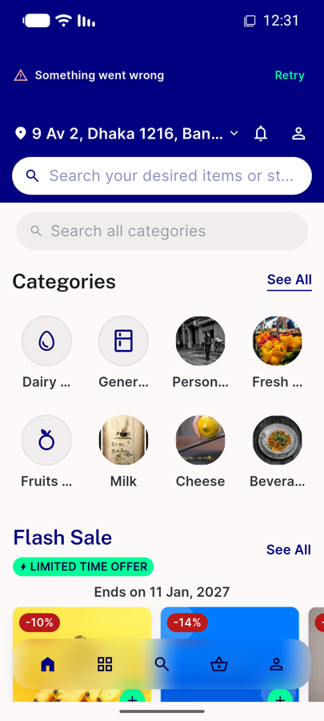
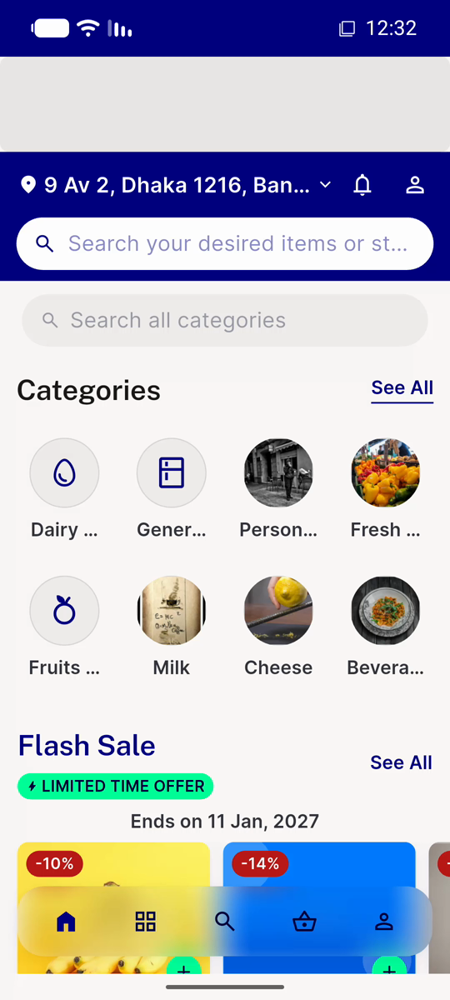
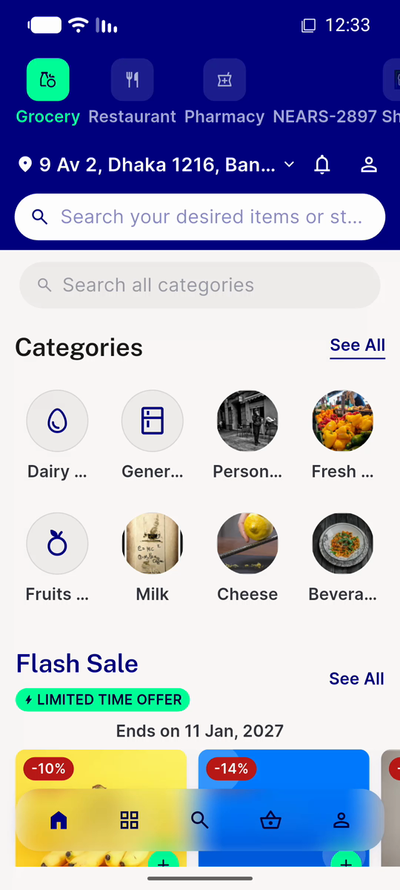
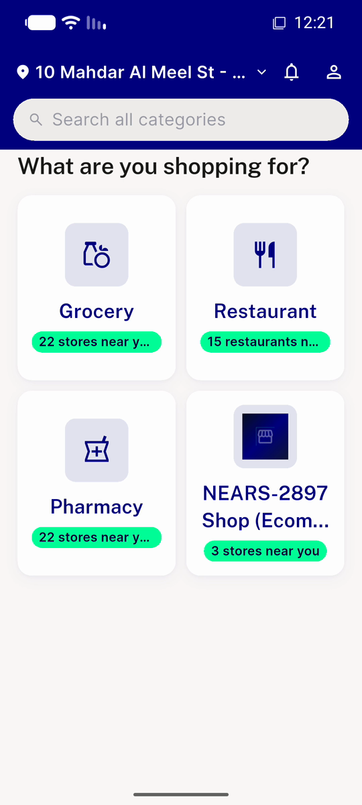
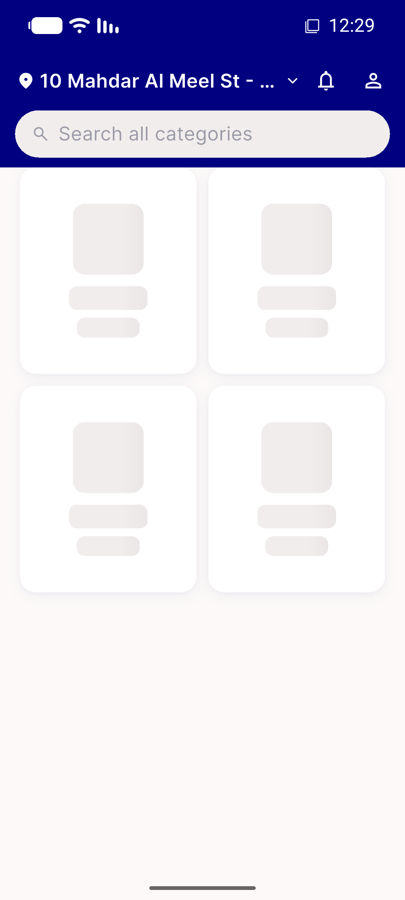
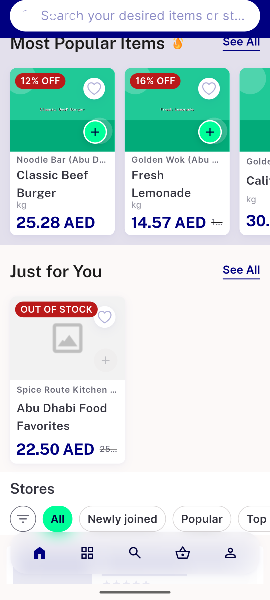
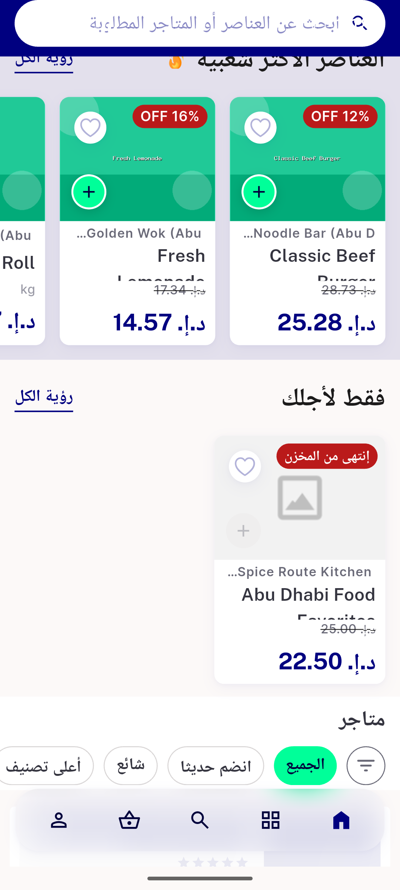

# QA Evidence — NEARS-3740

**NEARS-3740 [8] cycle 1 delta — PASS (AC3 + TB1/NEARS-3741 verified live)**

**10 screenshot(s).** Click any thumbnail for full resolution.

<table>
<tr>
<td align="center" width="33%"> ac2 nocache error retry row</td>
<td align="center" width="33%"> ac2 retry loading</td>
<td align="center" width="33%"> ac2 retry success tiles</td>
</tr>
<tr>
<td align="center" width="33%"> ac3 grid after reload en</td>
<td align="center" width="33%"> ac3 grid during delayed reload ar to en</td>
<td align="center" width="33%"> bug food home zero total during reload</td>
</tr>
<tr>
<td align="center" width="33%"> bug grid stuck shimmer no retry</td>
<td align="center" width="33%"> bug grocery home zero total during reload rtl</td>
<td align="center" width="33%"> c1 ac3 food during reload ar to en</td>
</tr>
<tr>
<td align="center" width="33%"> c1 ac3 food during reload en to ar rtl</td>
</tr>
</table>

### Other artifacts
- [`ac1-ac2-logcat.log`](ac1-ac2-logcat.log)
- [`ac3-watcher.log`](ac3-watcher.log)
- [`bug-food-home-zero-total-during-reload.log`](bug-food-home-zero-total-during-reload.log)
- [`bug-food-module-header-copy-after-language-switch.log`](bug-food-module-header-copy-after-language-switch.log)
- [`bug-get-stores-500-cache-deadlock.log`](bug-get-stores-500-cache-deadlock.log)
- [`bug-grid-stuck-shimmer-no-retry-dump.xml`](bug-grid-stuck-shimmer-no-retry-dump.xml)
- [`bug-grid-stuck-shimmer-no-retry.log`](bug-grid-stuck-shimmer-no-retry.log)
- [`c1-ac3-watcher.log`](c1-ac3-watcher.log)
- [`progress.md`](progress.md)

---
*From `nears/docs/qa-evidence/NEARS-3740/` · public-repo scrub policy (no live secrets; verified clean).*
