# QA Evidence — NEARS-3769

**NEARS-3769 QA PASS - NSearchField + 2 UserApp swaps, emulator-5566 + widgetbook web**

**11 screenshot(s).** Click any thumbnail for full resolution.

<table>
<tr>
<td align="center" width="33%"><a href="ac-regr-login-ninput.png">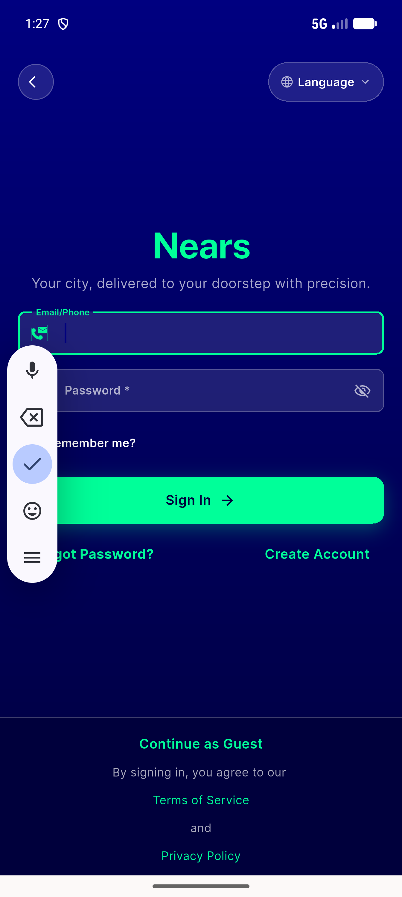</a> ac regr login ninput</td>
<td align="center" width="33%"><a href="ac-regr-registration-ninput.png">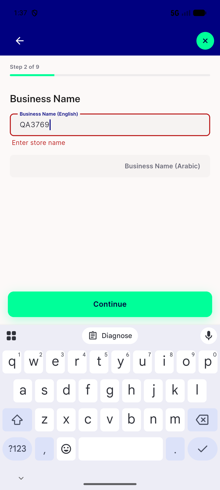</a> ac regr registration ninput</td>
<td align="center" width="33%"><a href="ac5-store-item-search-en.png">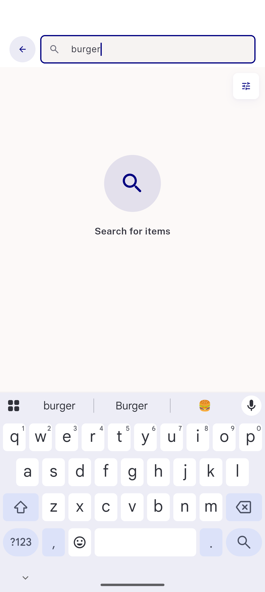</a> ac5 store item search en</td>
</tr>
<tr>
<td align="center" width="33%"><a href="ac6-store-item-search-ar-1.3x.png">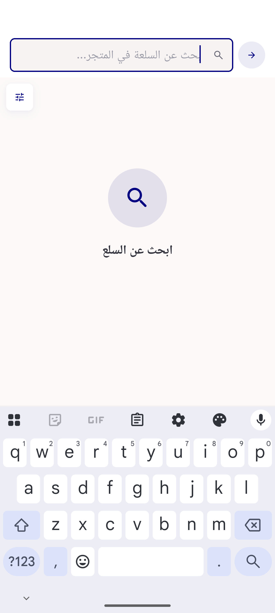</a> ac6 store item search ar 1.3x</td>
<td align="center" width="33%"><a href="wb-0-modes.png">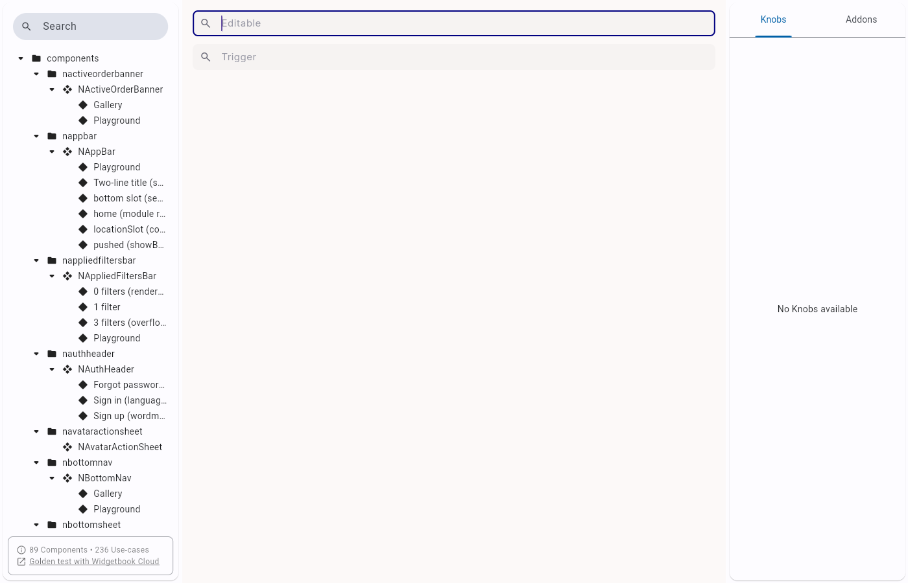</a> wb 0 modes</td>
<td align="center" width="33%"><a href="wb-1-on-navy.png">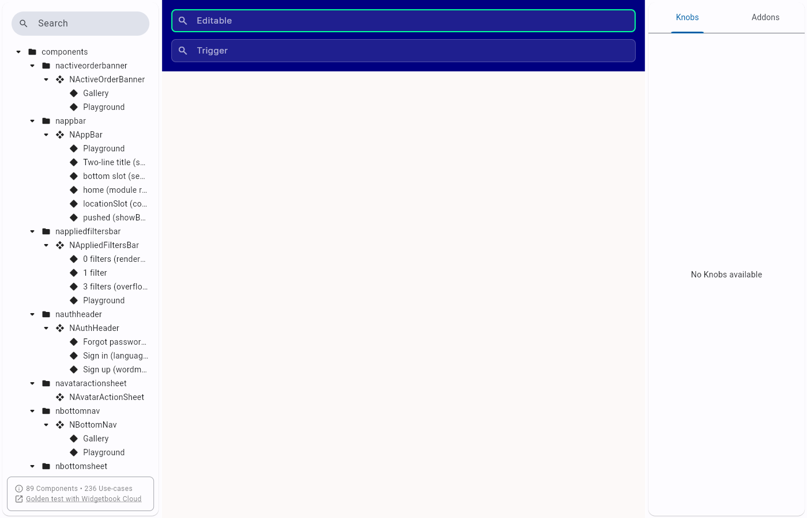</a> wb 1 on navy</td>
</tr>
<tr>
<td align="center" width="33%"><a href="wb-2-location-pin.png">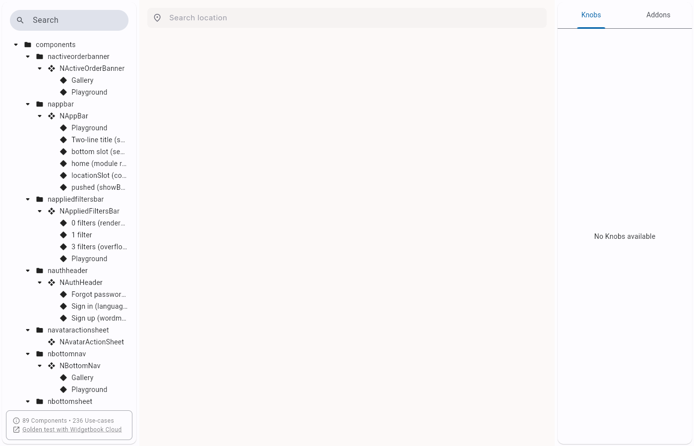</a> wb 2 location pin</td>
<td align="center" width="33%"><a href="wb-3-playground.png">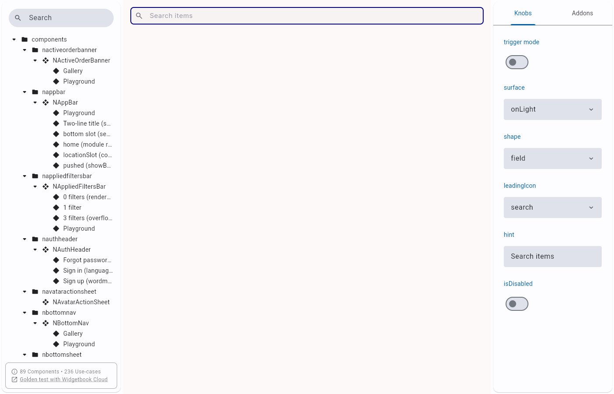</a> wb 3 playground</td>
<td align="center" width="33%"><a href="wb-4-playground.png">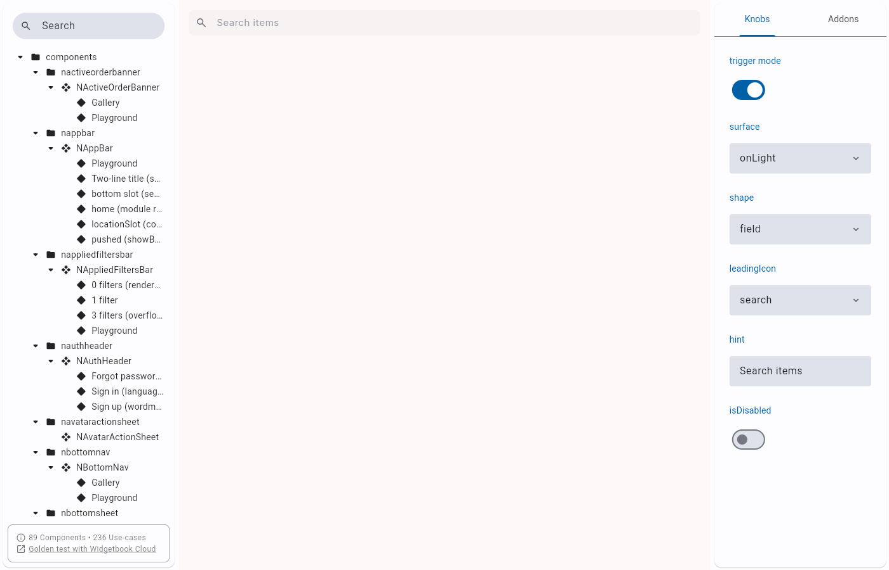</a> wb 4 playground</td>
</tr>
<tr>
<td align="center" width="33%"><a href="wb-5-playground.png">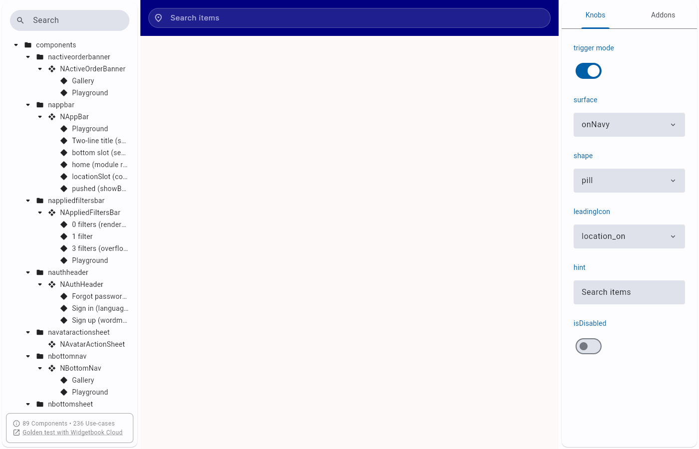</a> wb 5 playground</td>
<td align="center" width="33%"><a href="wb-6-playground.png">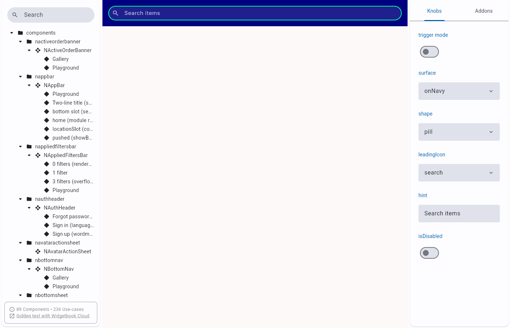</a> wb 6 playground</td>
</tr>
</table>

### Other artifacts
- [`parity-harness.log`](parity-harness.log)
- [`parity_test.dart.txt`](parity_test.dart.txt)
- [`progress.md`](progress.md)
- [`typeahead_test.dart.txt`](typeahead_test.dart.txt)

---
*From `nears/docs/qa-evidence/NEARS-3769/` · public-repo scrub policy (no live secrets; verified clean).*
