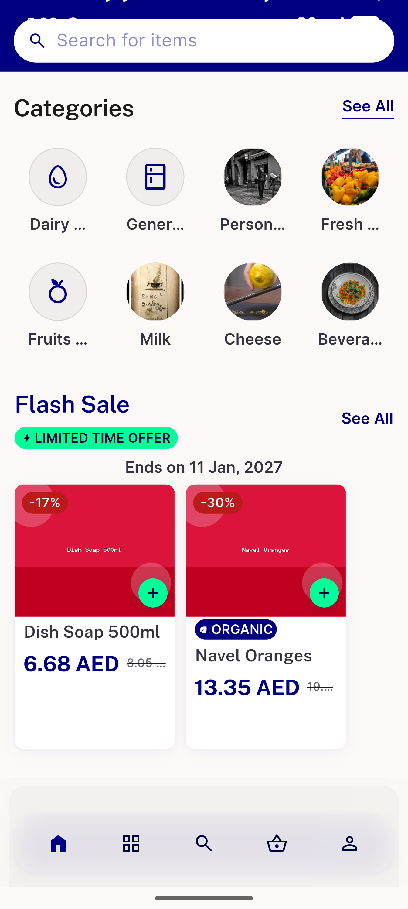
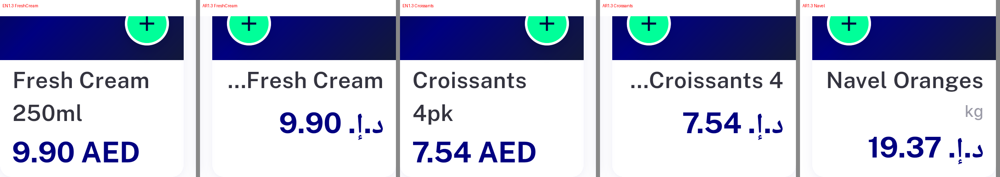
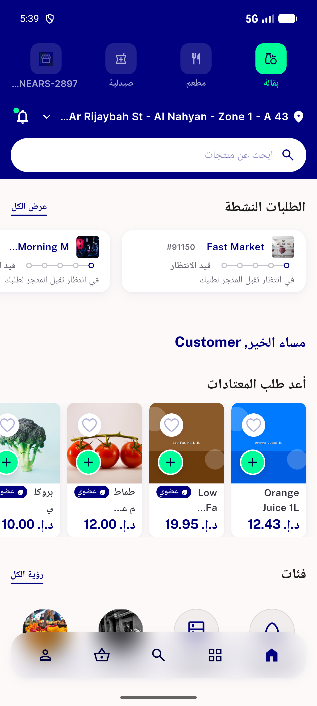
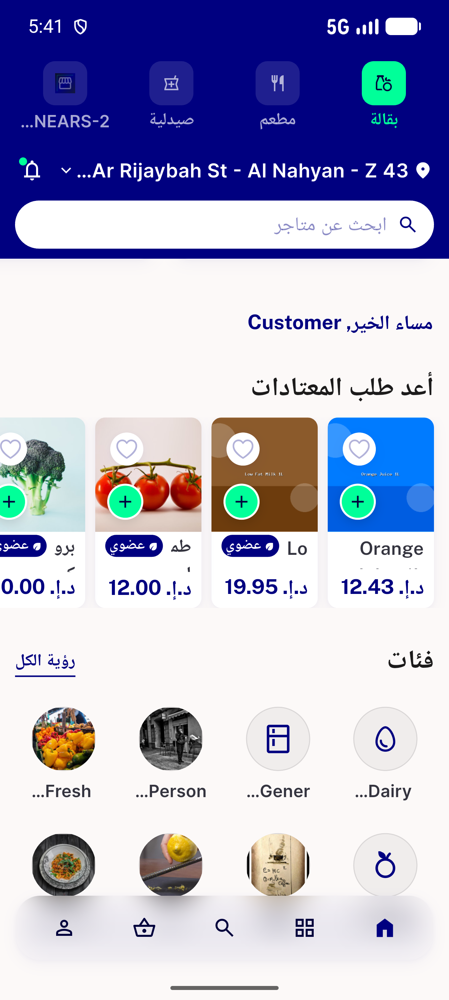
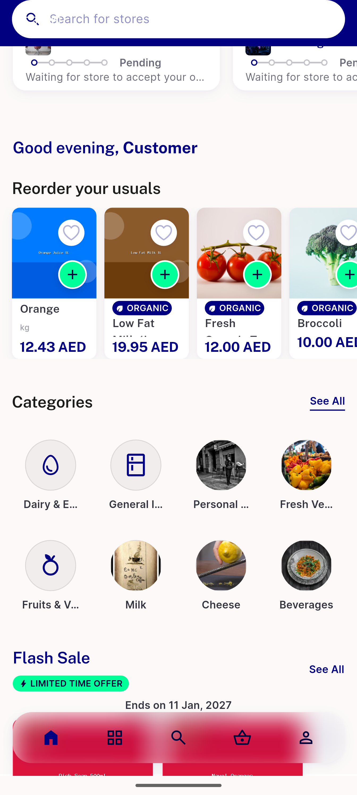

# QA Evidence — NEARS-3790

**cycle1 FAIL: AR store rail 150x240 name truncated + meta dropped; AC5 reorder PASS**

**8 screenshot(s).** Click any thumbnail for full resolution.

<table>
<tr>
<td align="center" width="33%"> ac1 ac2 flash sale 176x290 en 1.0x</td>
<td align="center" width="33%"> ac3 item view all 2col single trailing gap en 1.0x</td>
<td align="center" width="33%"> ac4 flash sale 176 organic stacked en 1.3x</td>
</tr>
<tr>
<td align="center" width="33%"> bug ar 1.3x store rail name truncated meta dropped mid band</td>
<td align="center" width="33%"> bug reorder rail ar 1.0x name squeezed beside badge</td>
<td align="center" width="33%"> bug reorder rail ar 1.3x name squeezed beside badge</td>
</tr>
<tr>
<td align="center" width="33%"> bug reorder rail organic name collapsed overflow 1.3x</td>
<td align="center" width="33%"> bug reorder rail stacked name clipped 1.0x</td>
</tr>
</table>

### Other artifacts
- [`addchk.py`](addchk.py)
- [`bug-reorder-rail-organic-name-collapsed-overflow-1.3x.log`](bug-reorder-rail-organic-name-collapsed-overflow-1.3x.log)
- [`bug-store-appbar-overflow-17px-1.3x.log`](bug-store-appbar-overflow-17px-1.3x.log)
- [`cards.py`](cards.py)
- [`hseg.py`](hseg.py)
- [`measure.py`](measure.py)
- [`progress.md`](progress.md)
- [`sweep-measurements.md`](sweep-measurements.md)

---
*From `nears/docs/qa-evidence/NEARS-3790/` · public-repo scrub policy (no live secrets; verified clean).*
