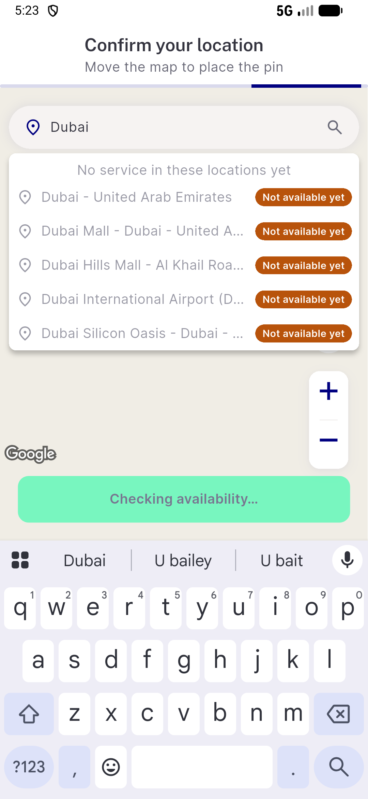

# QA Evidence — NEARS-3793

**PASS — NEARS-3793 unserved-location copy, emulator-5568, c0bc35369**

**3 screenshot(s).** Click any thumbnail for full resolution.

<table>
<tr>
<td align="center" width="33%"> ac1 en pickmap unserved</td>
<td align="center" width="33%"> ac2 ac6 ar rtl pickmap unserved</td>
<td align="center" width="33%"> ac4 ar saved addresses</td>
</tr>
</table>

### Other artifacts
- [`ac1-ac7-en-dump.xml`](ac1-ac7-en-dump.xml)
- [`ac2-ac6-ar-dump.xml`](ac2-ac6-ar-dump.xml)
- [`ac3-pending-dump.xml`](ac3-pending-dump.xml)
- [`ac3-served-abudhabi-dump.xml`](ac3-served-abudhabi-dump.xml)
- [`ac4-ar-saved-addresses-dump.xml`](ac4-ar-saved-addresses-dump.xml)
- [`progress.md`](progress.md)

---
*From `nears/docs/qa-evidence/NEARS-3793/` · public-repo scrub policy (no live secrets; verified clean).*
