# QA Evidence — NEARS-3799

**NEARS-3799 cycle 4 delta re-QA: PASS (AC14 store_items_list verified in real FA)**

**21 screenshot(s).** Click any thumbnail for full resolution.

<table>
<tr>
<td align="center" width="33%"><a href="ac-closed-veil-menurow.png">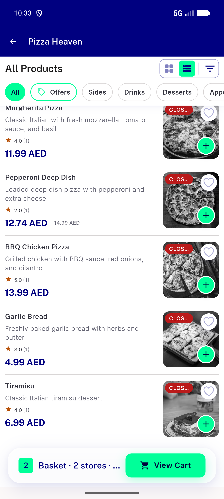</a> ac closed veil menurow</td>
<td align="center" width="33%"><a href="ac-dls-widgetbook-menurow.png">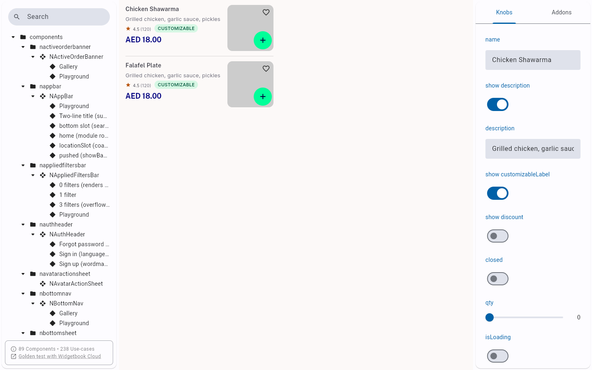</a> ac dls widgetbook menurow</td>
<td align="center" width="33%"><a href="ac-nonfood-list-row-unchanged.png">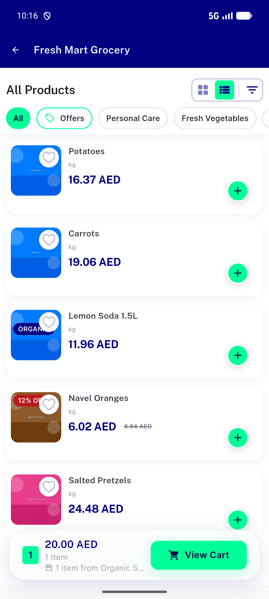</a> ac nonfood list row unchanged</td>
</tr>
<tr>
<td align="center" width="33%"><a href="ac-nonfood-search-2col-grid.png">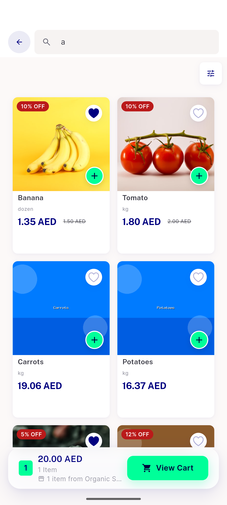</a> ac nonfood search 2col grid</td>
<td align="center" width="33%"><a href="ac-nonfood-store-entry-contact-sheet.png">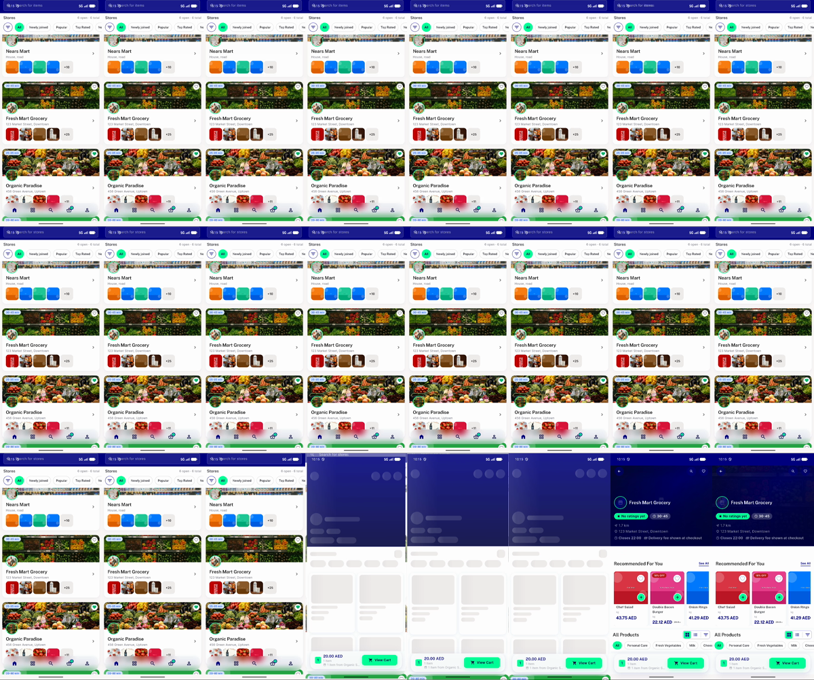</a> ac nonfood store entry contact sheet</td>
<td align="center" width="33%"><a href="ac-skeleton-idonly-entry-contact-sheet.png">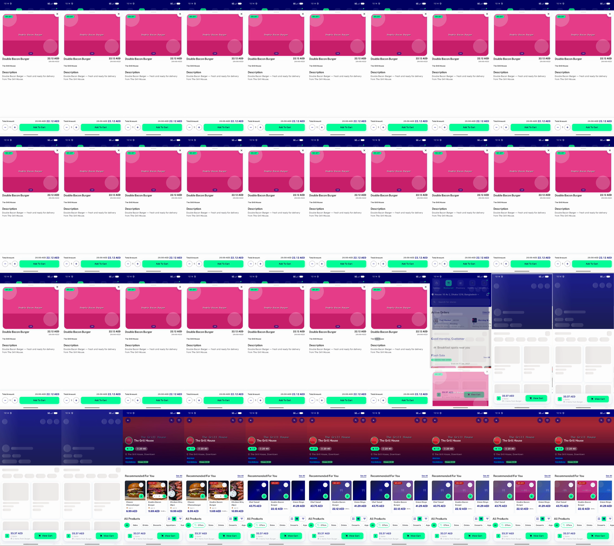</a> ac skeleton idonly entry contact sheet</td>
</tr>
<tr>
<td align="center" width="33%"><a href="ac-skeleton-store-entry-food.png">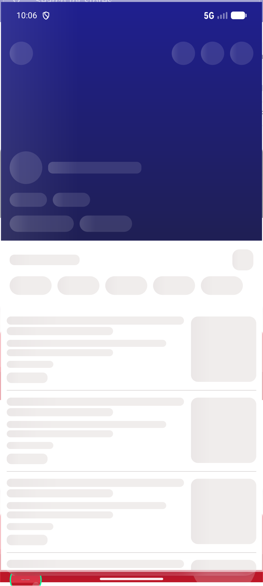</a> ac skeleton store entry food</td>
<td align="center" width="33%"><a href="ac-stepper-ltr-qty2.png">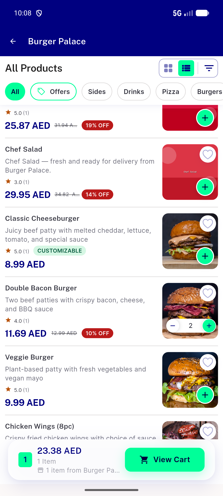</a> ac stepper ltr qty2</td>
<td align="center" width="33%"><a href="ac-store47-rows-open-items.png">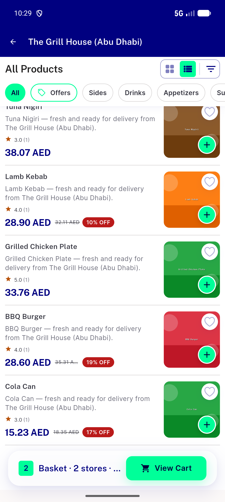</a> ac store47 rows open items</td>
</tr>
<tr>
<td align="center" width="33%"> ac textscale 1.3x ltr</td>
<td align="center" width="33%"><a href="ac1-en-ltr-menurow.png">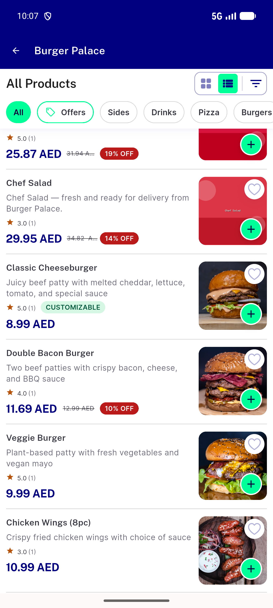</a> ac1 en ltr menurow</td>
<td align="center" width="33%"><a href="ac2-ar-rtl-instore-search.png">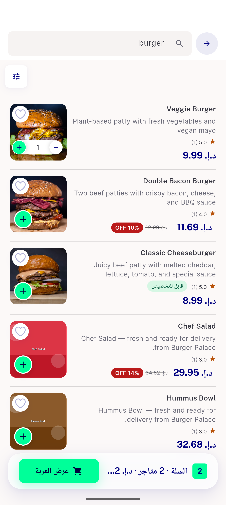</a> ac2 ar rtl instore search</td>
</tr>
<tr>
<td align="center" width="33%"> ac2 ar rtl menurow</td>
<td align="center" width="33%"> bug menurow closed chip truncated</td>
<td align="center" width="33%"><a href="bug-menurow-struck-price-truncated.png">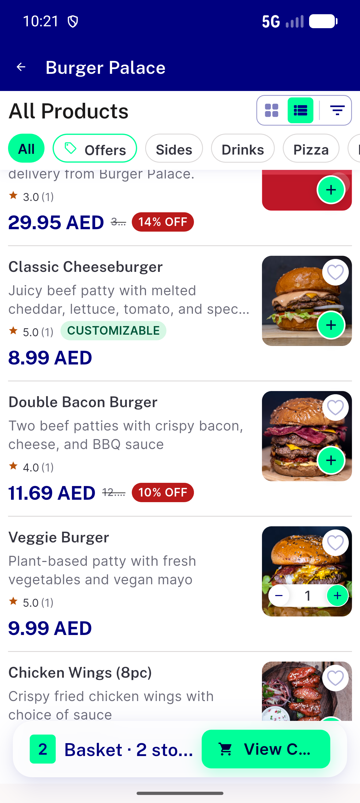</a> bug menurow struck price truncated</td>
</tr>
<tr>
<td align="center" width="33%"><a href="c2-ac10-closed-en-1.0x.png">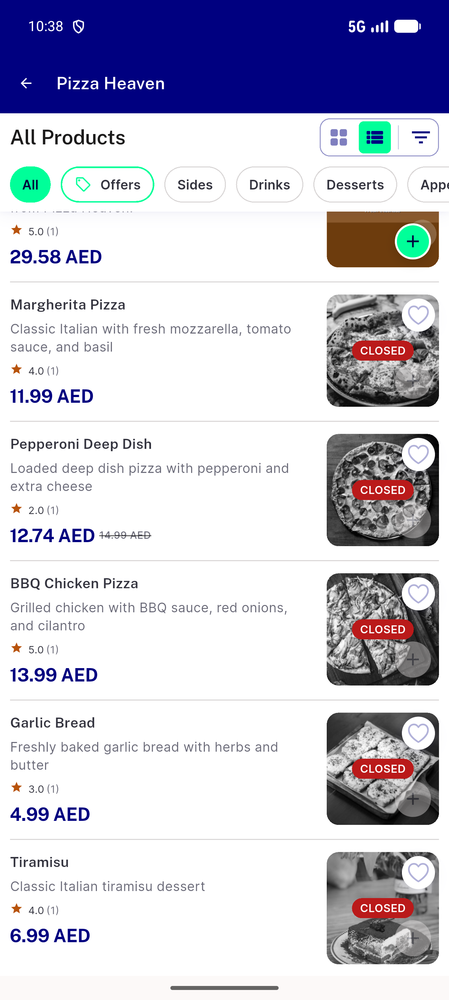</a> c2 ac10 closed en 1.0x</td>
<td align="center" width="33%"><a href="c2-ac2-rtl-ar-1.3x-closed-and-discount.png">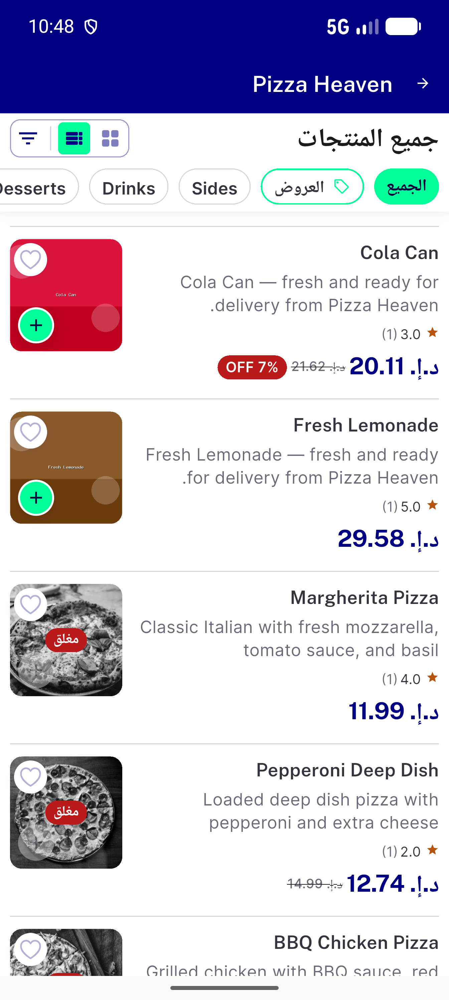</a> c2 ac2 rtl ar 1.3x closed and discount</td>
<td align="center" width="33%"><a href="c2-ac3-closed-struck-1.3x-ltr.png">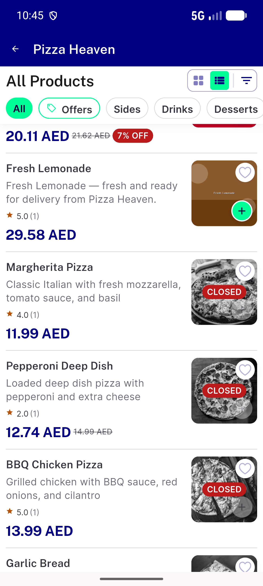</a> c2 ac3 closed struck 1.3x ltr</td>
</tr>
<tr>
<td align="center" width="33%"><a href="c2-ac3-open-discount-struck-1.3x-ltr.png">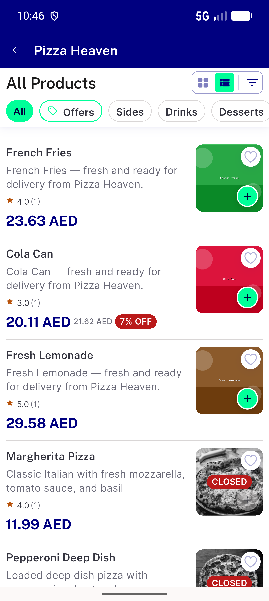</a> c2 ac3 open discount struck 1.3x ltr</td>
<td align="center" width="33%"><a href="c3-ac14-menurow-add-stepper-qty1.png">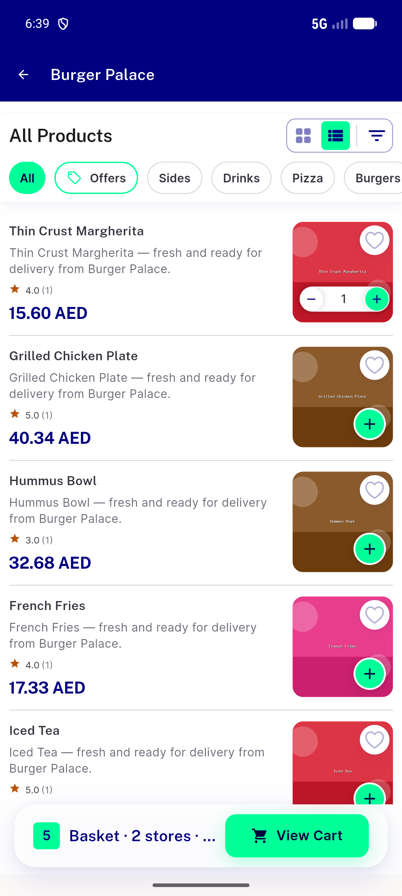</a> c3 ac14 menurow add stepper qty1</td>
<td align="center" width="33%"> c4 ac14 menurow stepper store items list</td>
</tr>
</table>

### Other artifacts
- [`ac-closed-store47-a11y-dump.xml`](ac-closed-store47-a11y-dump.xml)
- [`bug-cart-add-addons-int-parse.log`](bug-cart-add-addons-int-parse.log)
- [`bug-compact-table-semantics-assert.log`](bug-compact-table-semantics-assert.log)
- [`bug-menurow-closed-item-add-not-disabled.log`](bug-menurow-closed-item-add-not-disabled.log)
- [`bug-menurow-store-page-analytics-context-items-view.log`](bug-menurow-store-page-analytics-context-items-view.log)
- [`c3-ac14-analytics-fa-capture.log`](c3-ac14-analytics-fa-capture.log)
- [`c4-ac14-analytics-fa-capture.log`](c4-ac14-analytics-fa-capture.log)
- [`progress.md`](progress.md)

---
*From `nears/docs/qa-evidence/NEARS-3799/` · public-repo scrub policy (no live secrets; verified clean).*
