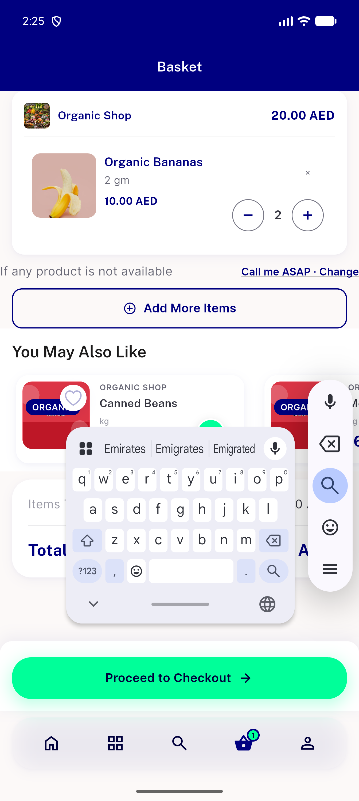
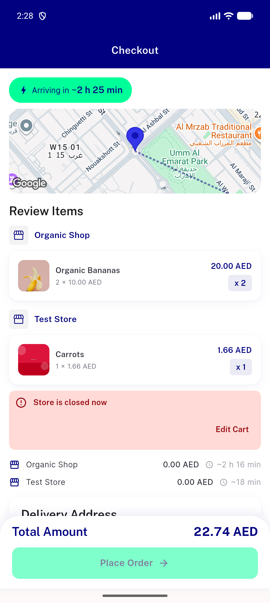
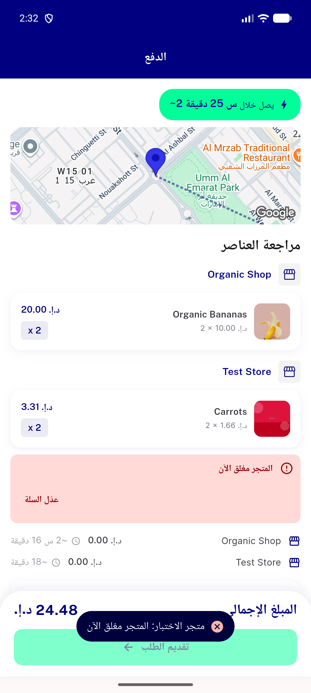
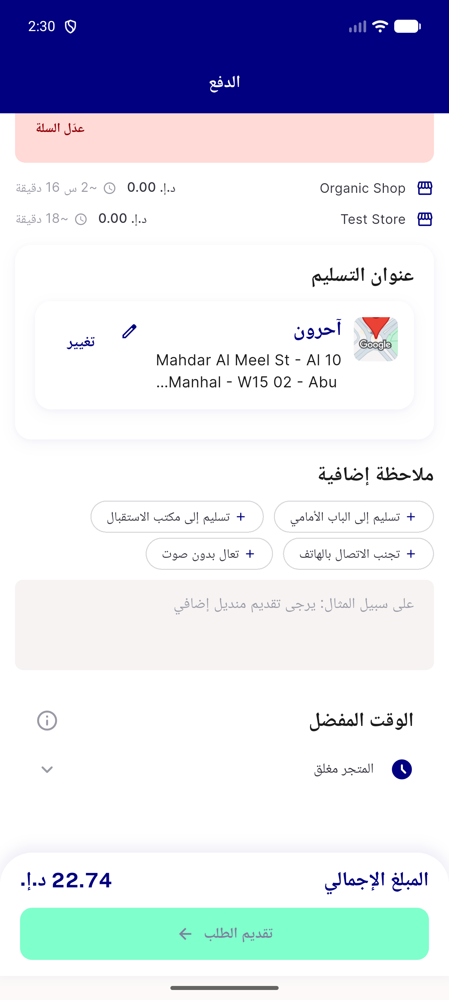
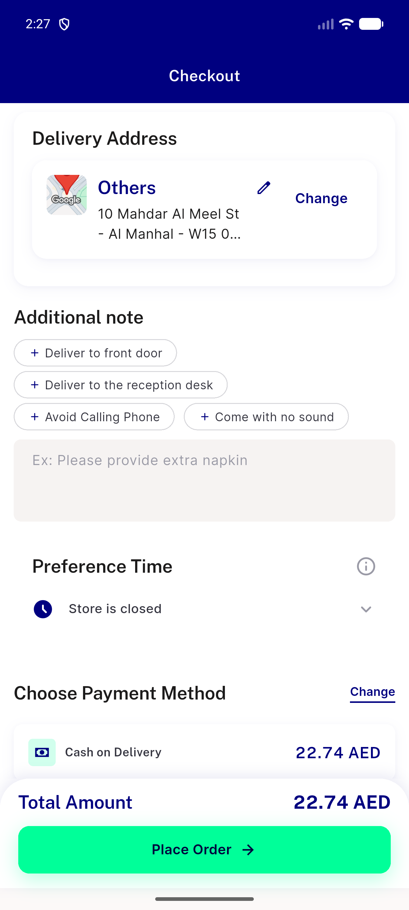
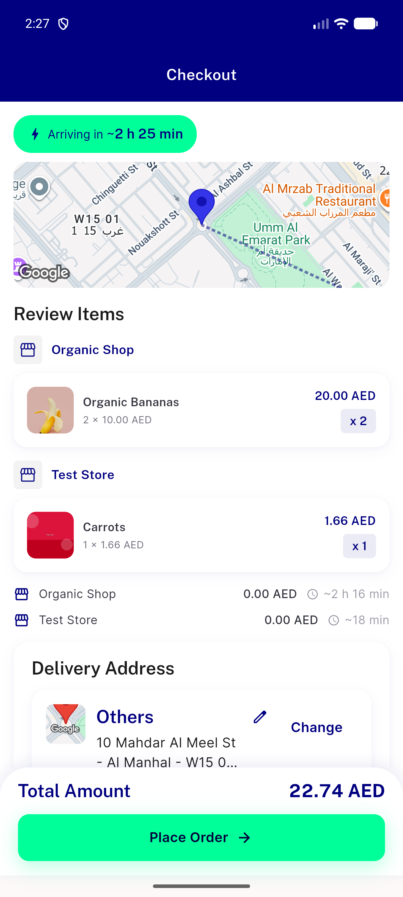
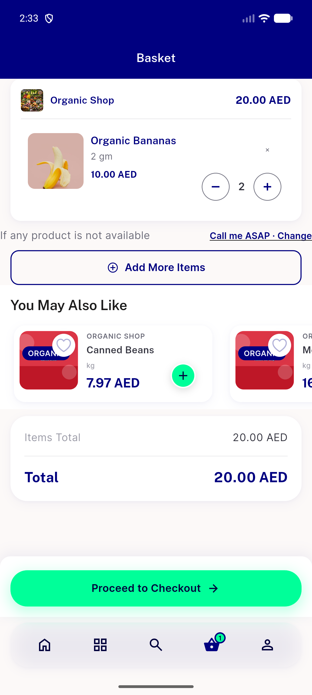

# QA Evidence — NEARS-3802

**PASS — #15 a-d + #16 (live NEARS-3788, emulator-5554)**

**7 screenshot(s).** Click any thumbnail for full resolution.

<table>
<tr>
<td align="center" width="33%"> cart start</td>
<td align="center" width="33%"> 15b gate card en</td>
<td align="center" width="33%"> 15d snackbar ar</td>
</tr>
<tr>
<td align="center" width="33%"> checkout address ar</td>
<td align="center" width="33%"> checkout address en scrolled</td>
<td align="center" width="33%"> checkout address en</td>
</tr>
<tr>
<td align="center" width="33%"> cart restored</td>
</tr>
</table>

### Other artifacts
- [`15-after-confirm-en.xml`](15-after-confirm-en.xml)
- [`15b-gate-en.xml`](15b-gate-en.xml)
- [`15b-retry-en.xml`](15b-retry-en.xml)
- [`15c-fail-lines.log`](15c-fail-lines.log)
- [`15d-after-confirm-ar.xml`](15d-after-confirm-ar.xml)
- [`16-checkout-ar-scrolled.xml`](16-checkout-ar-scrolled.xml)
- [`16-checkout-ar.xml`](16-checkout-ar.xml)
- [`16-checkout-en-scrolled.xml`](16-checkout-en-scrolled.xml)
- [`16-checkout-en.xml`](16-checkout-en.xml)
- [`progress.md`](progress.md)

---
*From `nears/docs/qa-evidence/NEARS-3802/` · public-repo scrub policy (no live secrets; verified clean).*
