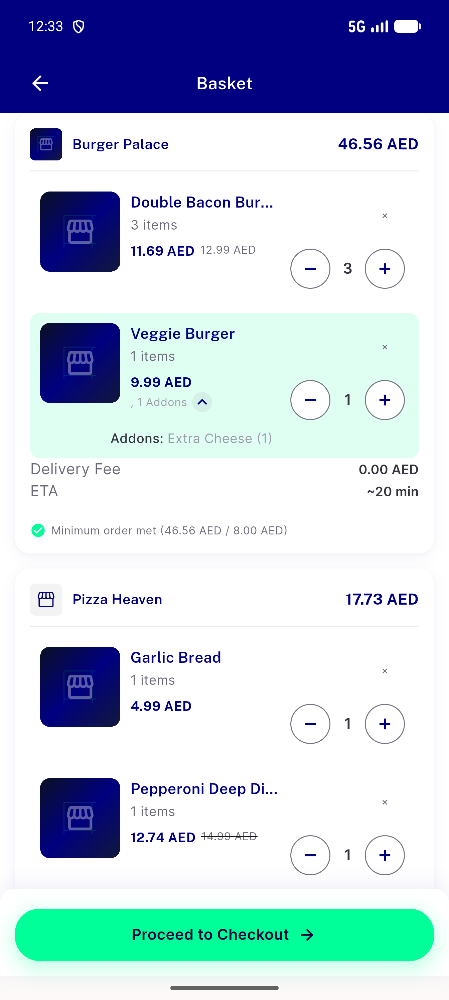
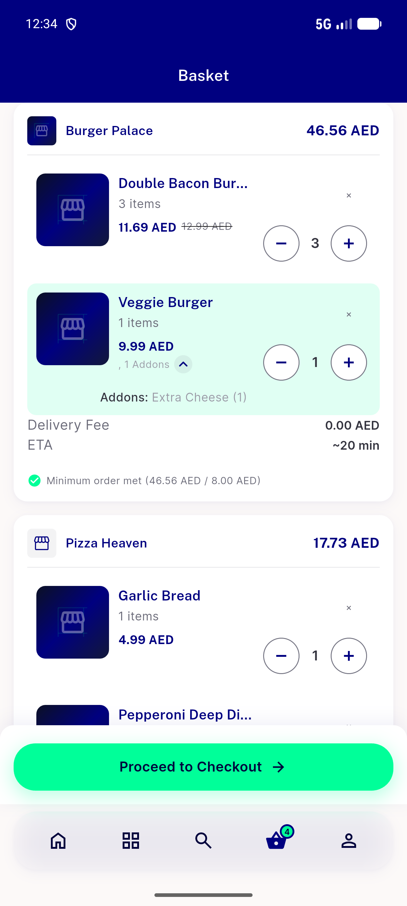
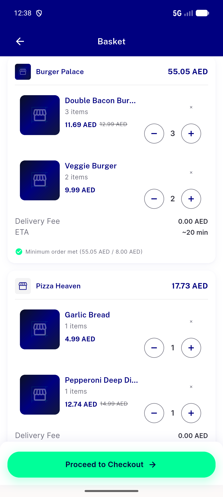

# QA Evidence — NEARS-3808

**NEARS-3808 QA cycle 1 (AC4 delta): PASS — FA add_to_cart observed**

**3 screenshot(s).** Click any thumbnail for full resolution.

<table>
<tr>
<td align="center" width="33%"> ac1 grid add veggie extra cheese cart</td>
<td align="center" width="33%"> ac3 cold relaunch cart addons</td>
<td align="center" width="33%"> cart restored module2</td>
</tr>
</table>

### Other artifacts
- [`ac1-ac4-add-log.txt`](ac1-ac4-add-log.txt)
- [`ac1-ac4-grid-quickadd-item18-log.txt`](ac1-ac4-grid-quickadd-item18-log.txt)
- [`ac2-row-layout-add-log.txt`](ac2-row-layout-add-log.txt)
- [`ac3-cold-relaunch-log.txt`](ac3-cold-relaunch-log.txt)
- [`ac4-cycle1-cart-after-restore.txt`](ac4-cycle1-cart-after-restore.txt)
- [`ac4-cycle1-fa-add_to_cart.log`](ac4-cycle1-fa-add_to_cart.log)
- [`ac5-session-fail-err-summary.txt`](ac5-session-fail-err-summary.txt)
- [`ac6-cart-list-add_ons-shape.txt`](ac6-cart-list-add_ons-shape.txt)
- [`bug-search-results-semantics-assertion.log`](bug-search-results-semantics-assertion.log)
- [`cart-restore-before-after.txt`](cart-restore-before-after.txt)
- [`progress.md`](progress.md)

---
*From `nears/docs/qa-evidence/NEARS-3808/` · public-repo scrub policy (no live secrets; verified clean).*
