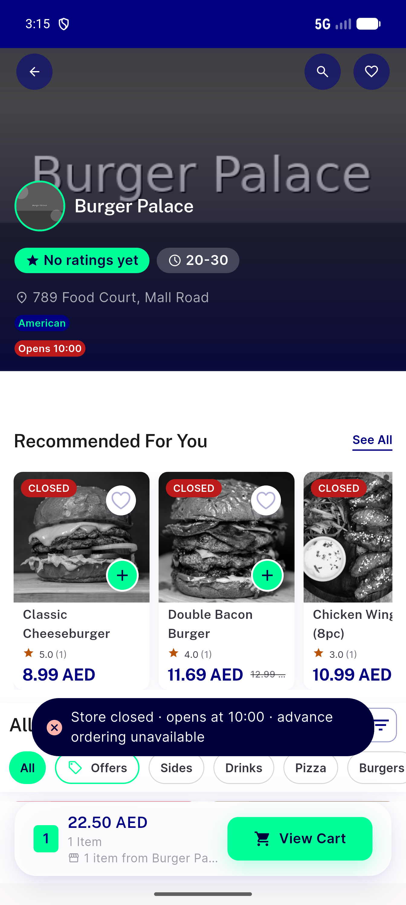

# QA Evidence — NEARS-3809

**NEARS-3809 QA fix_cycle 0: FAIL/INCOMPLETE - AC1-7 PASS, AC8 UNVERIFIABLE-live (Place Order branch untested)**

**1 screenshot(s).** Click any thumbnail for full resolution.

<table>
<tr>
<td align="center" width="33%"> ac7 store page quickadd blocked</td>
</tr>
</table>

### Other artifacts
- [`ac5-food-closed-item-sheet-a11y.xml`](ac5-food-closed-item-sheet-a11y.xml)
- [`ac6-grocery-closed-item-sheet-a11y.xml`](ac6-grocery-closed-item-sheet-a11y.xml)
- [`ac7-store-page-a11y.xml`](ac7-store-page-a11y.xml)
- [`api-responses.log`](api-responses.log)
- [`bug-campaign-quickadd-wrong-item.log`](bug-campaign-quickadd-wrong-item.log)
- [`bug-cart-list-addons-int-parse.log`](bug-cart-list-addons-int-parse.log)
- [`bug-search-results-semantics-assertion.log`](bug-search-results-semantics-assertion.log)
- [`progress.md`](progress.md)
- [`x-arabic-rtl-food-closed-item-sheet-a11y.xml`](x-arabic-rtl-food-closed-item-sheet-a11y.xml)

---
*From `nears/docs/qa-evidence/NEARS-3809/` · public-repo scrub policy (no live secrets; verified clean).*
