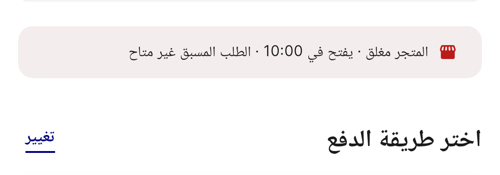
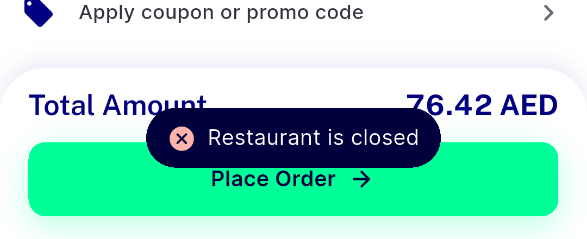

# QA Evidence — NEARS-3809

**NEARS-3809 fix_cycle 2 AC8: FAIL - group closed-food block works (no request, 1 WARN) but snackbar hidden under confirm sheet**

**3 screenshot(s).** Click any thumbnail for full resolution.

<table>
<tr>
<td align="center" width="33%"> ac7 store page quickadd blocked</td>
<td align="center" width="33%"> ac8 c1 checkout food closed notice ar</td>
<td align="center" width="33%"> bug group closed snackbar hidden under confirm sheet</td>
</tr>
</table>

### Other artifacts
- [`ac5-food-closed-item-sheet-a11y.xml`](ac5-food-closed-item-sheet-a11y.xml)
- [`ac6-grocery-closed-item-sheet-a11y.xml`](ac6-grocery-closed-item-sheet-a11y.xml)
- [`ac7-store-page-a11y.xml`](ac7-store-page-a11y.xml)
- [`ac8-c1-after-place-order-tap-a11y.xml`](ac8-c1-after-place-order-tap-a11y.xml)
- [`ac8-c1-checkout-food-closed-a11y.xml`](ac8-c1-checkout-food-closed-a11y.xml)
- [`ac8-c1-checkout-food-closed-ar-rtl-a11y.xml`](ac8-c1-checkout-food-closed-ar-rtl-a11y.xml)
- [`ac8-c1-confirm-sheet-multistore-a11y.xml`](ac8-c1-confirm-sheet-multistore-a11y.xml)
- [`ac8-c1-control-open-1200-checkout-a11y.xml`](ac8-c1-control-open-1200-checkout-a11y.xml)
- [`ac8-c1-control-open-1200-checkout-top-a11y.xml`](ac8-c1-control-open-1200-checkout-top-a11y.xml)
- [`ac8-c1-control-open-1200-slot-sheet-a11y.xml`](ac8-c1-control-open-1200-slot-sheet-a11y.xml)
- [`ac8-c2-checkout-food-closed-a11y.xml`](ac8-c2-checkout-food-closed-a11y.xml)
- [`ac8-c2-control-1200-checkout-ar-a11y.xml`](ac8-c2-control-1200-checkout-ar-a11y.xml)
- [`ac8-c2-control-1200-slot-sheet-ar-a11y.xml`](ac8-c2-control-1200-slot-sheet-ar-a11y.xml)
- [`ac8-c2-snackbar-revealed-ar-a11y.xml`](ac8-c2-snackbar-revealed-ar-a11y.xml)
- [`ac8-c2-snackbar-revealed-en-a11y.xml`](ac8-c2-snackbar-revealed-en-a11y.xml)
- [`api-responses.log`](api-responses.log)
- [`bug-campaign-quickadd-wrong-item.log`](bug-campaign-quickadd-wrong-item.log)
- [`bug-cart-list-addons-int-parse.log`](bug-cart-list-addons-int-parse.log)
- [`bug-group-checkout-bypasses-food-closed-preflight.log`](bug-group-checkout-bypasses-food-closed-preflight.log)
- [`bug-group-closed-snackbar-hidden-under-confirm-sheet.log`](bug-group-closed-snackbar-hidden-under-confirm-sheet.log)
- [`bug-search-results-semantics-assertion.log`](bug-search-results-semantics-assertion.log)
- [`progress.md`](progress.md)
- [`x-arabic-rtl-food-closed-item-sheet-a11y.xml`](x-arabic-rtl-food-closed-item-sheet-a11y.xml)

---
*From `nears/docs/qa-evidence/NEARS-3809/` · public-repo scrub policy (no live secrets; verified clean).*
