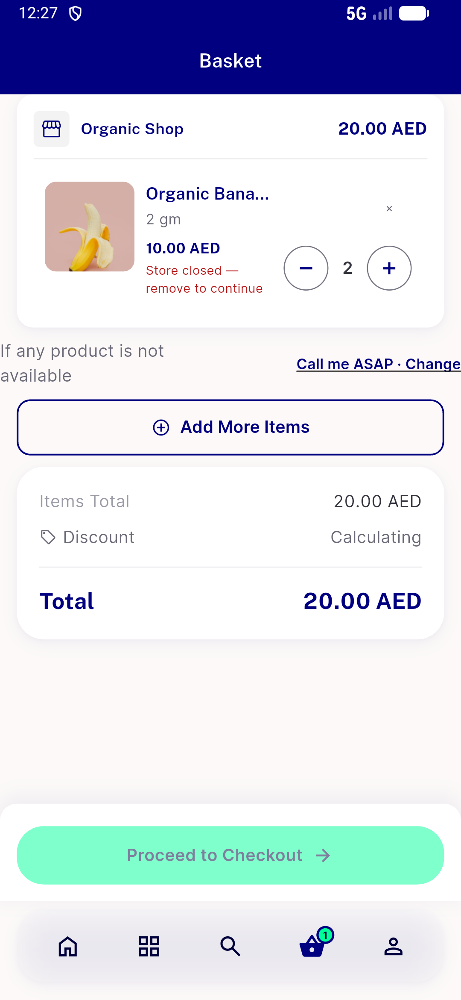
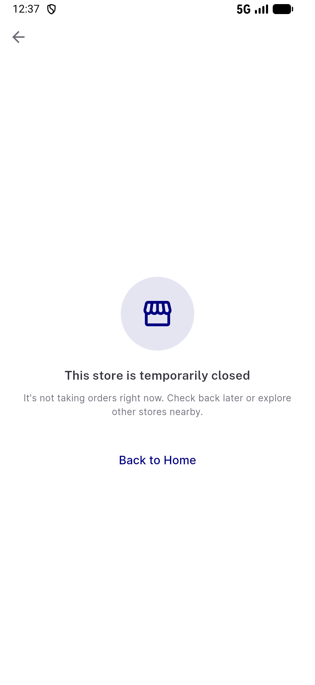
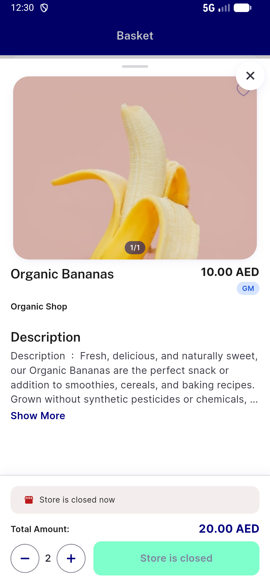
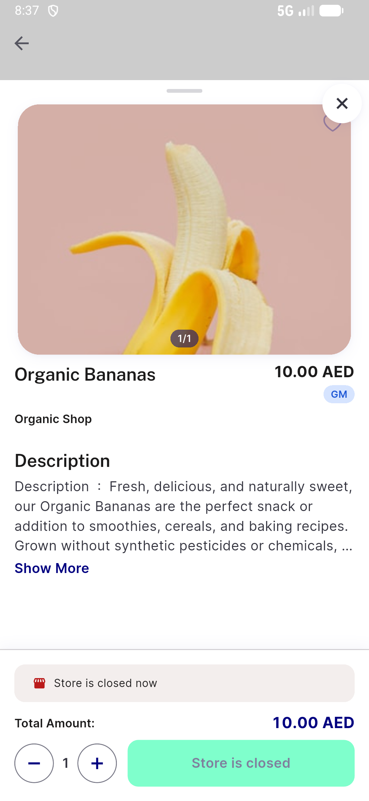

# QA Evidence — NEARS-3810

**cycle 2 delta: AC9 PASS on composed code (3ad2ed235)**

**7 screenshot(s).** Click any thumbnail for full resolution.

<table>
<tr>
<td align="center" width="33%"> ac6 cart closed row ar</td>
<td align="center" width="33%"> ac6 cart closed row en</td>
<td align="center" width="33%"> ac7 deeplink cold store9 ar</td>
</tr>
<tr>
<td align="center" width="33%"> ac7 deeplink cold store9 en</td>
<td align="center" width="33%"> ac8 favourites stores closed en</td>
<td align="center" width="33%"> ac9 item sheet store9 en</td>
</tr>
<tr>
<td align="center" width="33%"> c2 ac9 item58 sheet closed</td>
</tr>
</table>

### Other artifacts
- [`ac6-cart-ar.xml`](ac6-cart-ar.xml)
- [`ac6-cart-en.xml`](ac6-cart-en.xml)
- [`ac6-cart-food-open-rows.xml`](ac6-cart-food-open-rows.xml)
- [`ac7-deeplink-cold-store9-ar.xml`](ac7-deeplink-cold-store9-ar.xml)
- [`ac7-deeplink-cold-store9-en.xml`](ac7-deeplink-cold-store9-en.xml)
- [`ac7-deeplink-warm-store9-ar.xml`](ac7-deeplink-warm-store9-ar.xml)
- [`ac7-deeplink-warm-store9-en.xml`](ac7-deeplink-warm-store9-en.xml)
- [`ac7-regression-notfound-cold-ar.xml`](ac7-regression-notfound-cold-ar.xml)
- [`ac8-favourites-stores-after-unfav-en.xml`](ac8-favourites-stores-after-unfav-en.xml)
- [`ac8-favourites-stores-en.xml`](ac8-favourites-stores-en.xml)
- [`ac8-wishlist-after.tsv`](ac8-wishlist-after.tsv)
- [`ac8-wishlist-before.tsv`](ac8-wishlist-before.tsv)
- [`ac9-item-sheet-store9-en.xml`](ac9-item-sheet-store9-en.xml)
- [`bug-cold-deeplink-moduleless-403s.log`](bug-cold-deeplink-moduleless-403s.log)
- [`bug-food-cart-addons-int-parse.log`](bug-food-cart-addons-int-parse.log)
- [`bug-warm-crossmodule-item-deeplink-404.log`](bug-warm-crossmodule-item-deeplink-404.log)
- [`c2-ac9-item58-sheet-dump.xml`](c2-ac9-item58-sheet-dump.xml)
- [`progress.md`](progress.md)

---
*From `nears/docs/qa-evidence/NEARS-3810/` · public-repo scrub policy (no live secrets; verified clean).*
