# QA Evidence — NEARS-3816

**NEARS-3816 QA PASS - NStoreCard inline ETA + delivery_dining glyph (emulator-5572)**

**14 screenshot(s).** Click any thumbnail for full resolution.

<table>
<tr>
<td align="center" width="33%"><a href="ac1-home-available-near-you-rail.png">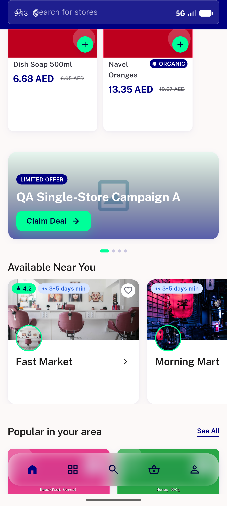</a> ac1 home available near you rail</td>
<td align="center" width="33%"><a href="ac2-stores-list-eco-market-rating-eta.png">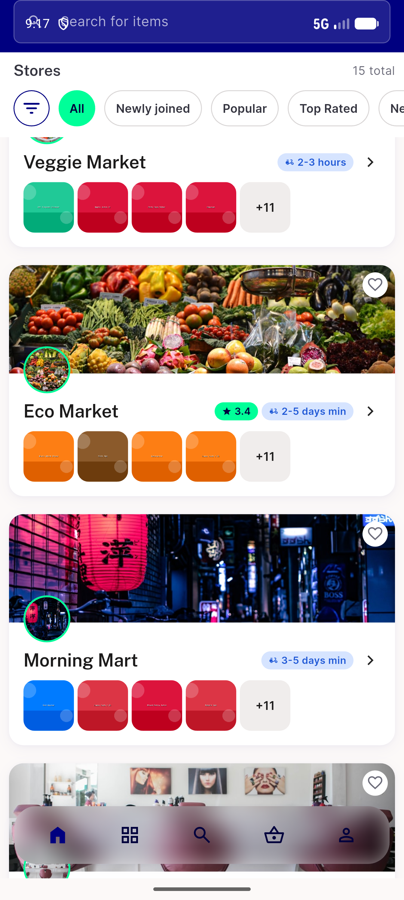</a> ac2 stores list eco market rating eta</td>
<td align="center" width="33%"><a href="ac2-stores-list-fast-market.png">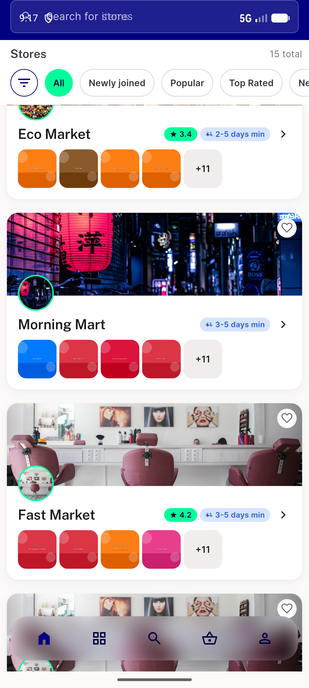</a> ac2 stores list fast market</td>
</tr>
<tr>
<td align="center" width="33%"><a href="ac2-stores-list-inline-no-rating.png">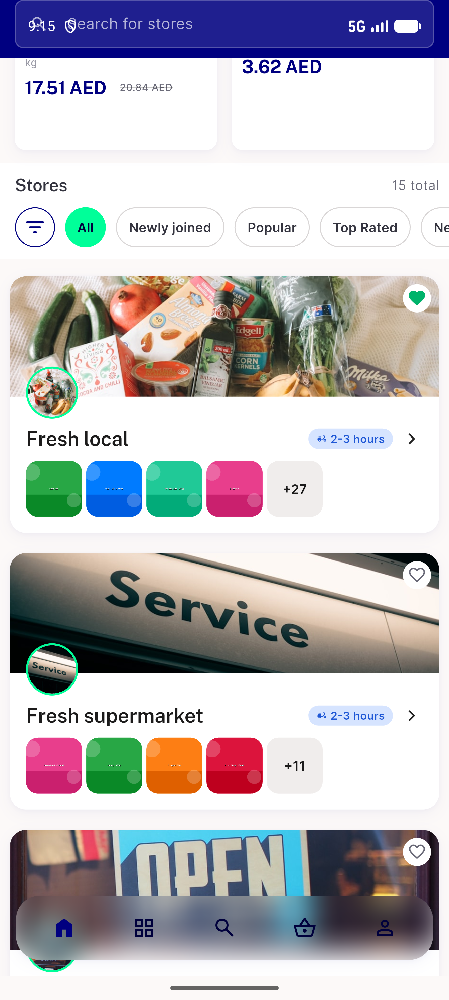</a> ac2 stores list inline no rating</td>
<td align="center" width="33%"><a href="ac3-pharmacy-list-long-name-truncates.png">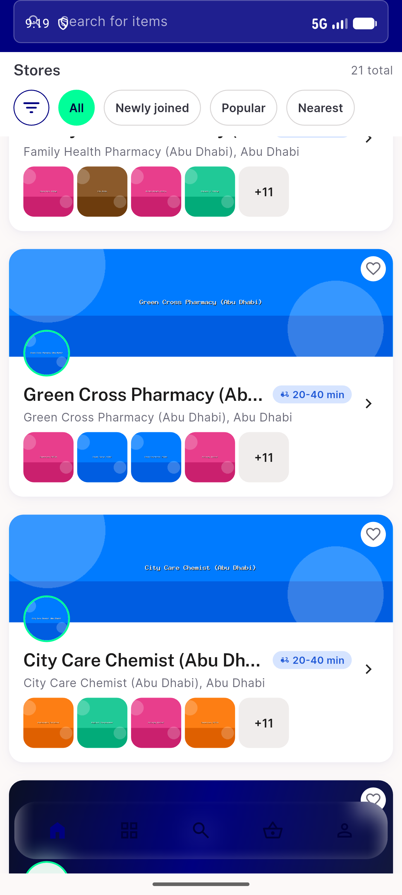</a> ac3 pharmacy list long name truncates</td>
<td align="center" width="33%"><a href="ac4-rtl-ar-stores-list.png">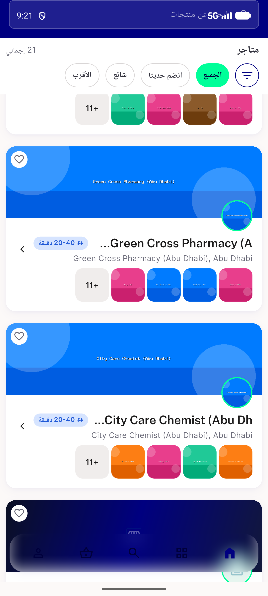</a> ac4 rtl ar stores list</td>
</tr>
<tr>
<td align="center" width="33%"><a href="ac5-1_3x-native-width-no-overflow.png">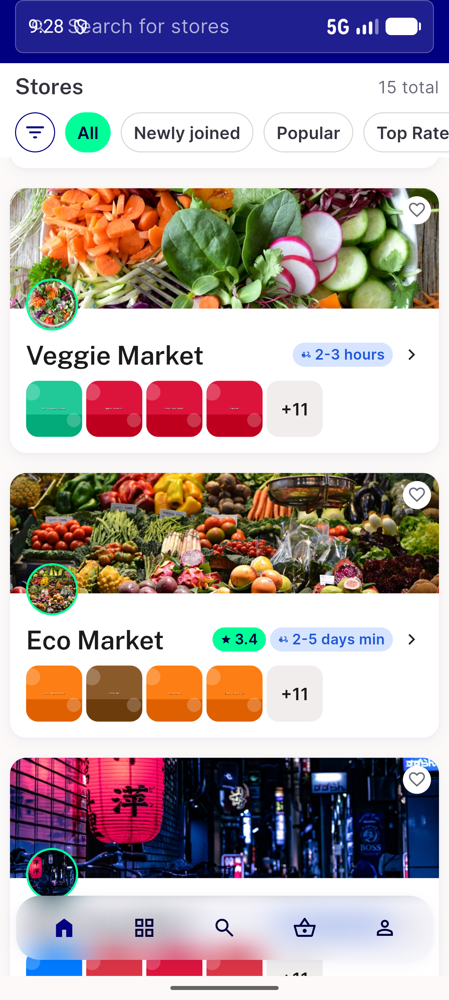</a> ac5 1 3x native width no overflow</td>
<td align="center" width="33%"><a href="ac5-360dp-plus-1_3x-worstcase.png">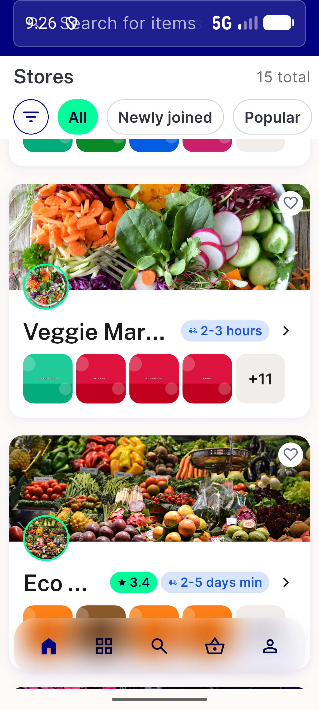</a> ac5 360dp plus 1 3x worstcase</td>
<td align="center" width="33%"><a href="ac7-ac8-checkout-arriving-pill-and-group-row.png">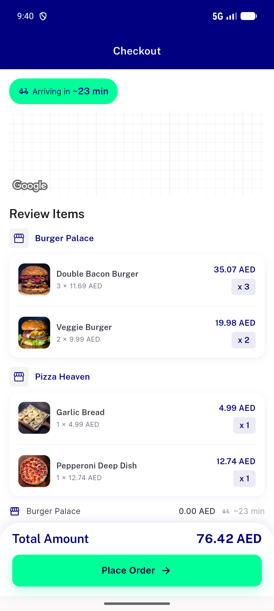</a> ac7 ac8 checkout arriving pill and group row</td>
</tr>
<tr>
<td align="center" width="33%"><a href="ac7-order-status-hero-arrival-glyph.png">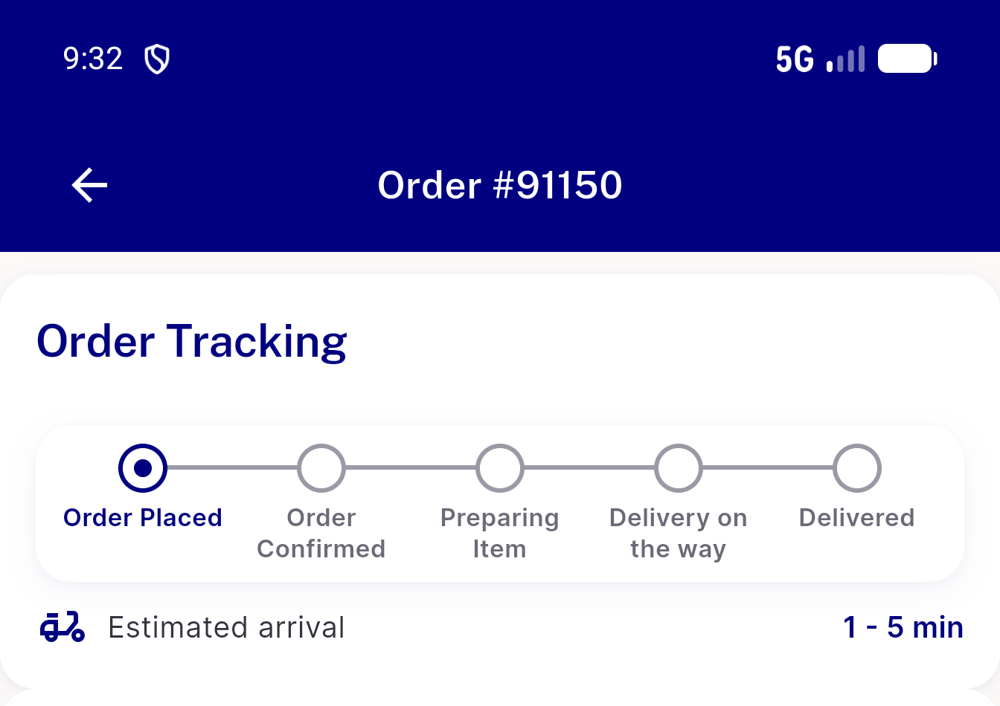</a> ac7 order status hero arrival glyph</td>
<td align="center" width="33%"><a href="ac7-search-grouped-compare-row.png">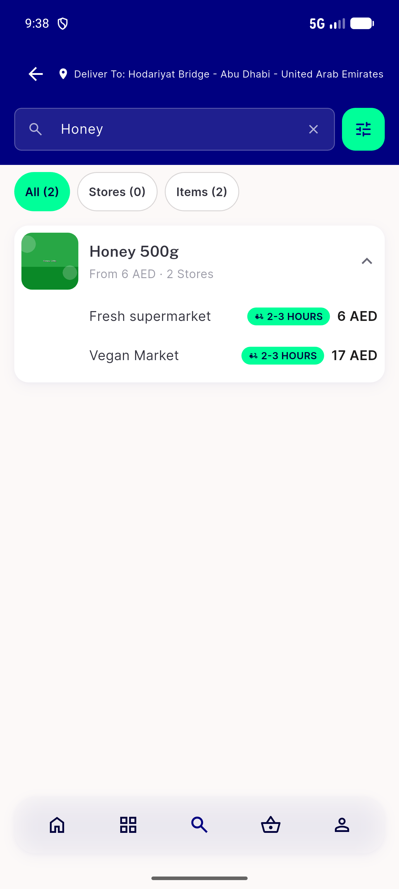</a> ac7 search grouped compare row</td>
<td align="center" width="33%"><a href="ac7-store-hero-glass-pill.png">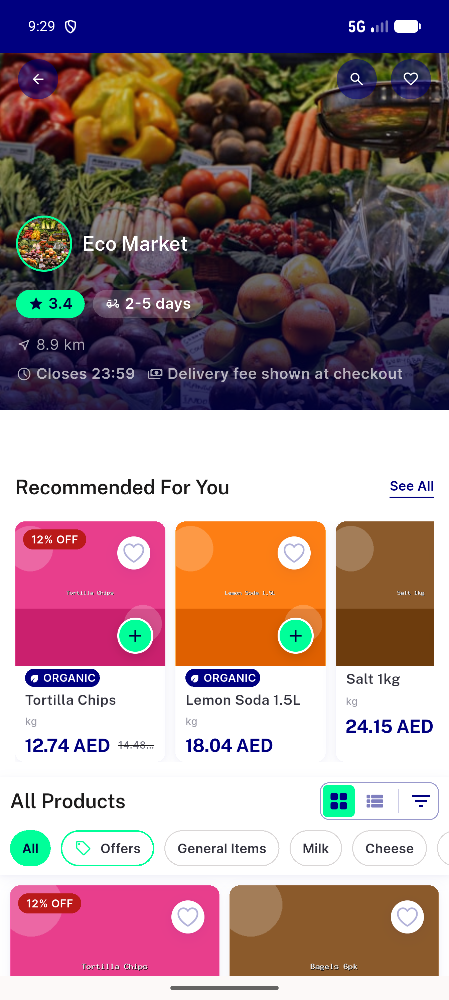</a> ac7 store hero glass pill</td>
</tr>
<tr>
<td align="center" width="33%"> bug order group stuck skeleton after back</td>
<td align="center" width="33%"><a href="ux-360dp-1_0x-eco-market-legible.png">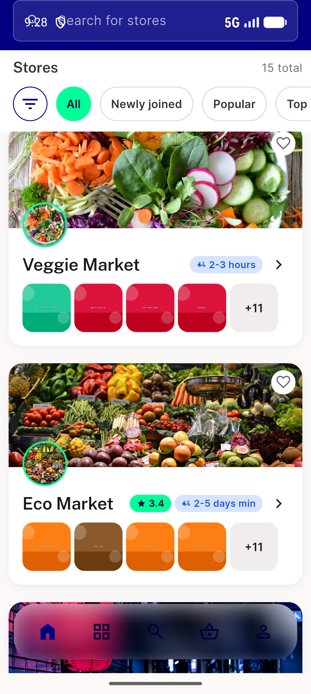</a> ux 360dp 1 0x eco market legible</td>
</tr>
</table>

### Other artifacts
- [`ac9-a11y-pharmacy-list.xml`](ac9-a11y-pharmacy-list.xml)
- [`bug-order-group-stuck-skeleton-after-back.log`](bug-order-group-stuck-skeleton-after-back.log)
- [`progress.md`](progress.md)

---
*From `nears/docs/qa-evidence/NEARS-3816/` · public-repo scrub policy (no live secrets; verified clean).*
