# QA Evidence — NEARS-3817

**FAIL — row layout: favourite heart hides the status word (SOLD OUT reads SOLD, CLOSED loses D); compact/grid/menuRow PASS**

**18 screenshot(s).** Click any thumbnail for full resolution.

<table>
<tr>
<td align="center" width="33%"><a href="ac1-ac2-ac4-ac7-compact-search-ar-1.0x.png">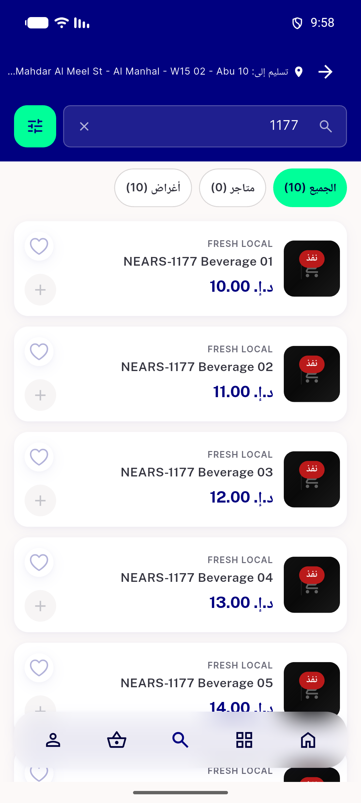</a> ac1 ac2 ac4 ac7 compact search ar 1.0x</td>
<td align="center" width="33%"> ac1 ac2 ac4 ac7 compact search ar 1.3x</td>
<td align="center" width="33%"><a href="ac1-ac2-ac4-ac7-grid-store-ar-1.0x.png">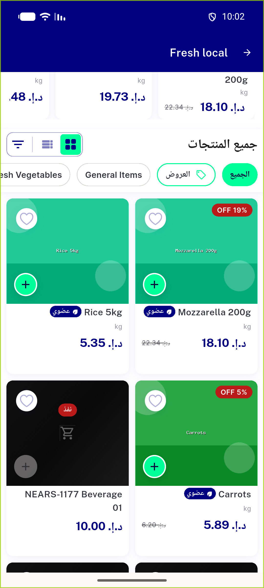</a> ac1 ac2 ac4 ac7 grid store ar 1.0x</td>
</tr>
<tr>
<td align="center" width="33%"><a href="ac1-ac2-ac4-ac7-grid-store-ar-1.3x.png">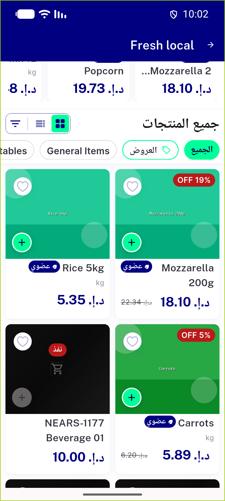</a> ac1 ac2 ac4 ac7 grid store ar 1.3x</td>
<td align="center" width="33%"><a href="ac1-ac2-ac4-ac7-menurow-widgetbook-fallback-sheet.png">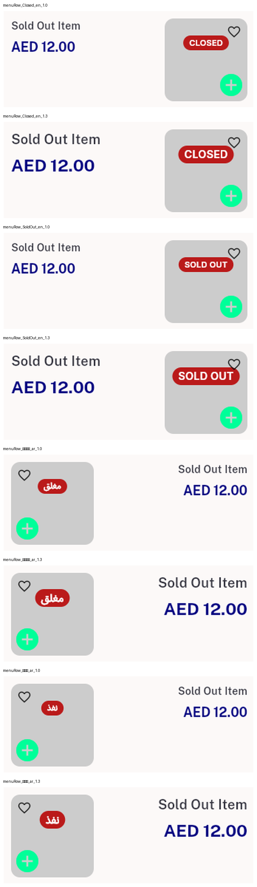</a> ac1 ac2 ac4 ac7 menurow widgetbook fallback sheet</td>
<td align="center" width="33%"><a href="ac1-ac2-ac4-ac7-row-store-ar-1.0x.png">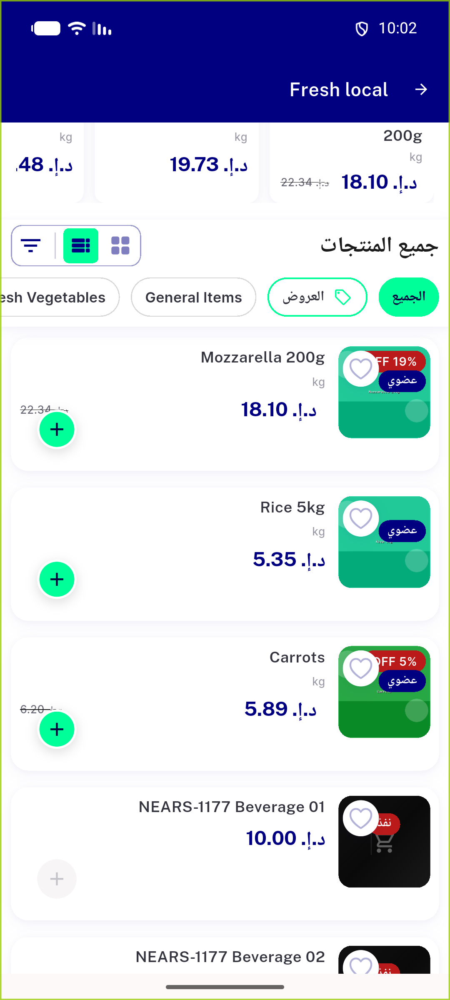</a> ac1 ac2 ac4 ac7 row store ar 1.0x</td>
</tr>
<tr>
<td align="center" width="33%"><a href="ac1-ac2-ac4-ac7-row-store-ar-1.3x.png">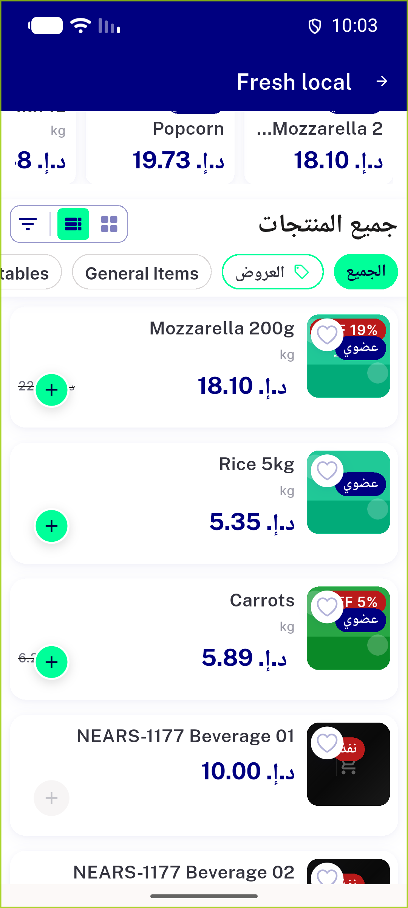</a> ac1 ac2 ac4 ac7 row store ar 1.3x</td>
<td align="center" width="33%"><a href="ac1-ac2-ac7-compact-search-en-1.0x.png">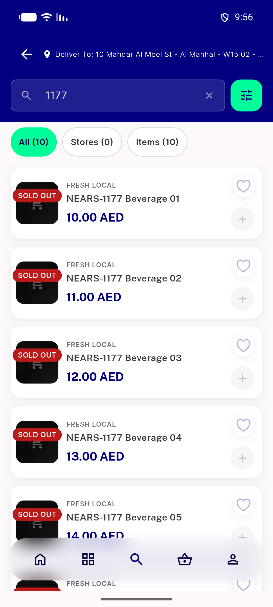</a> ac1 ac2 ac7 compact search en 1.0x</td>
<td align="center" width="33%"><a href="ac1-ac2-ac7-compact-search-en-1.3x.png">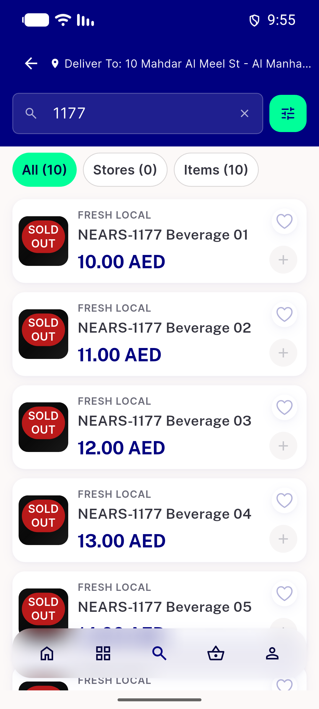</a> ac1 ac2 ac7 compact search en 1.3x</td>
</tr>
<tr>
<td align="center" width="33%"><a href="ac1-ac2-ac7-grid-store-en-1.0x.png">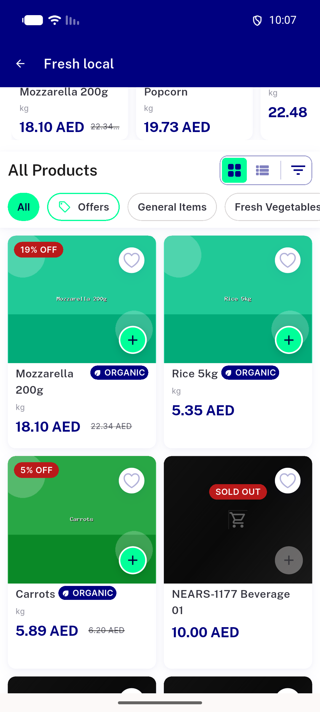</a> ac1 ac2 ac7 grid store en 1.0x</td>
<td align="center" width="33%"><a href="ac1-ac2-ac7-grid-store-en-1.3x.png">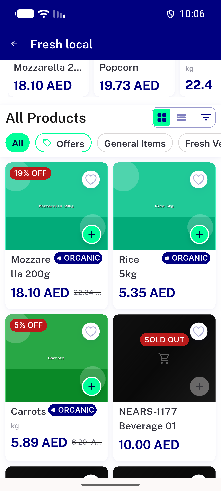</a> ac1 ac2 ac7 grid store en 1.3x</td>
<td align="center" width="33%"><a href="ac1-ac2-ac7-row-store-en-1.0x.png">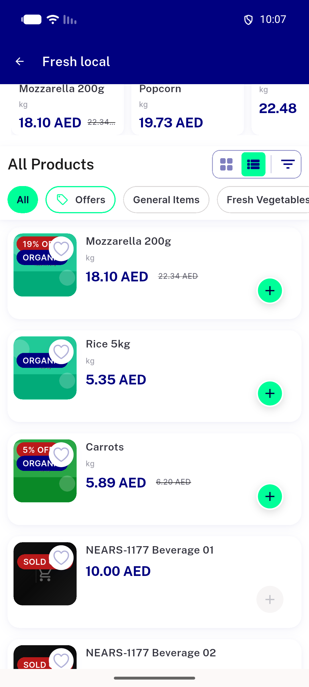</a> ac1 ac2 ac7 row store en 1.0x</td>
</tr>
<tr>
<td align="center" width="33%"><a href="ac1-ac2-ac7-row-store-en-1.3x.png">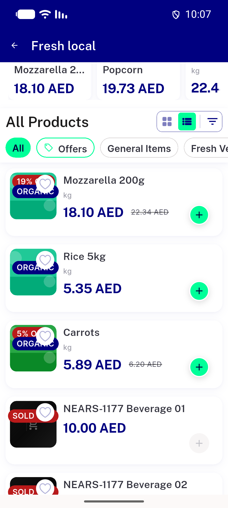</a> ac1 ac2 ac7 row store en 1.3x</td>
<td align="center" width="33%"><a href="ac7-closed-all-layouts-widgetbook-fallback-sheet.png">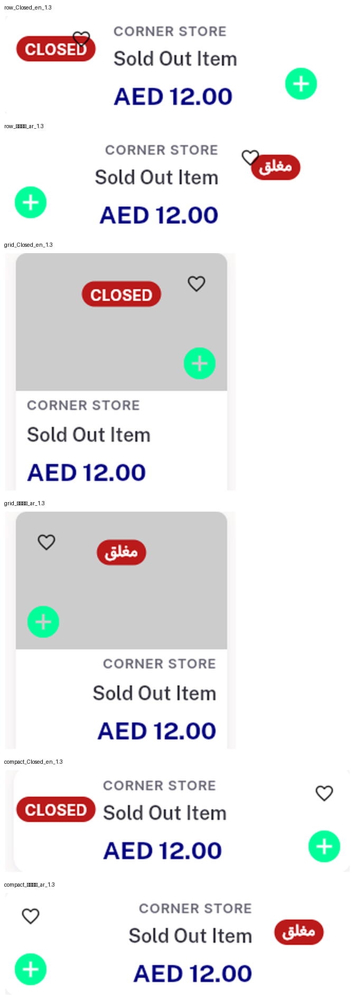</a> ac7 closed all layouts widgetbook fallback sheet</td>
<td align="center" width="33%"><a href="bug-grid-name-midword-break-organic.png">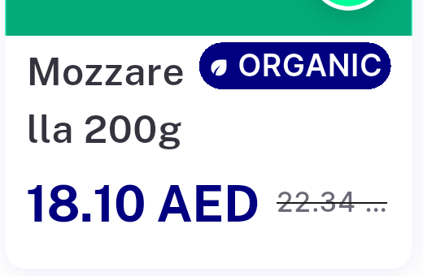</a> bug grid name midword break organic</td>
</tr>
<tr>
<td align="center" width="33%"> bug row heart hides sold out en 1.0x</td>
<td align="center" width="33%"><a href="bug-row-heart-hides-sold-out-en-1.3x.png">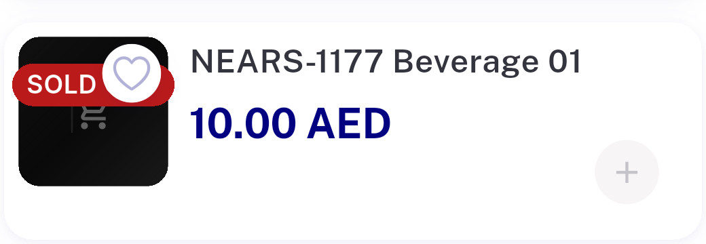</a> bug row heart hides sold out en 1.3x</td>
<td align="center" width="33%"> bug row heart occludes chip</td>
</tr>
</table>

### Other artifacts
- [`00-baseline-prechange-goldens.log`](00-baseline-prechange-goldens.log)
- [`01-red-postchange-vs-old-baselines.log`](01-red-postchange-vs-old-baselines.log)
- [`02-mutation1-anchor.log`](02-mutation1-anchor.log)
- [`03-mutation2-row-zorder.log`](03-mutation2-row-zorder.log)
- [`04-post-rebaseline-green.log`](04-post-rebaseline-green.log)
- [`05-mutation3-grid-zorder-unit.log`](05-mutation3-grid-zorder-unit.log)
- [`06-mutation4-no-wrap-unit.log`](06-mutation4-no-wrap-unit.log)
- [`07-dls-golden-guard.log`](07-dls-golden-guard.log)
- [`08-base-8abbc2eb9-userapp-dls-golden-preexisting-red.log`](08-base-8abbc2eb9-userapp-dls-golden-preexisting-red.log)
- [`09-base-8abbc2eb9-store-card-sentence-case-preexisting-red.log`](09-base-8abbc2eb9-store-card-sentence-case-preexisting-red.log)
- [`ac3-row-a11y-dump-ar-1.3x.xml`](ac3-row-a11y-dump-ar-1.3x.xml)
- [`bug-search-results-semantics-assertion.log`](bug-search-results-semantics-assertion.log)
- [`red-diffs`](red-diffs)

---
*From `nears/docs/qa-evidence/NEARS-3817/` · public-repo scrub policy (no live secrets; verified clean).*
