# QA Evidence — NEARS-3817

**Fix cycle 1 @061d536d3 PASS — row/menuRow chip below heart (full label + heart), closed grid no heart, compact unchanged**

**13 screenshot(s).** Click any thumbnail for full resolution.

<table>
<tr>
<td align="center" width="33%"> bug grid name midword break organic</td>
<td align="center" width="33%"> c1 ac7 closed live grid rail ar 1.3x</td>
<td align="center" width="33%"><a href="c1-compact-search-ar-1.0x.png">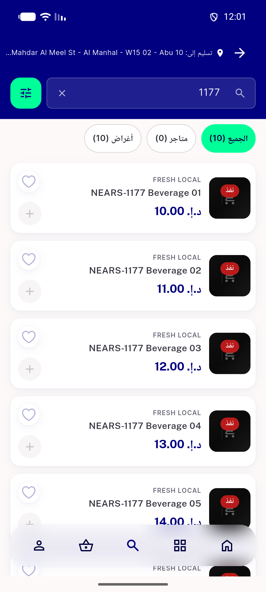</a> c1 compact search ar 1.0x</td>
</tr>
<tr>
<td align="center" width="33%"><a href="c1-compact-search-ar-1.3x.png">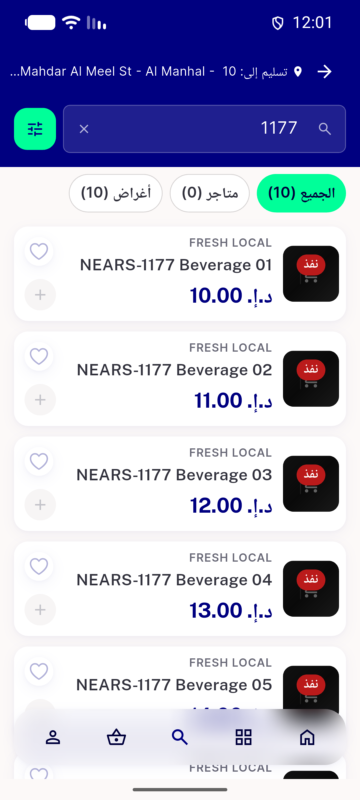</a> c1 compact search ar 1.3x</td>
<td align="center" width="33%"><a href="c1-grid-store-ar-1.0x.png">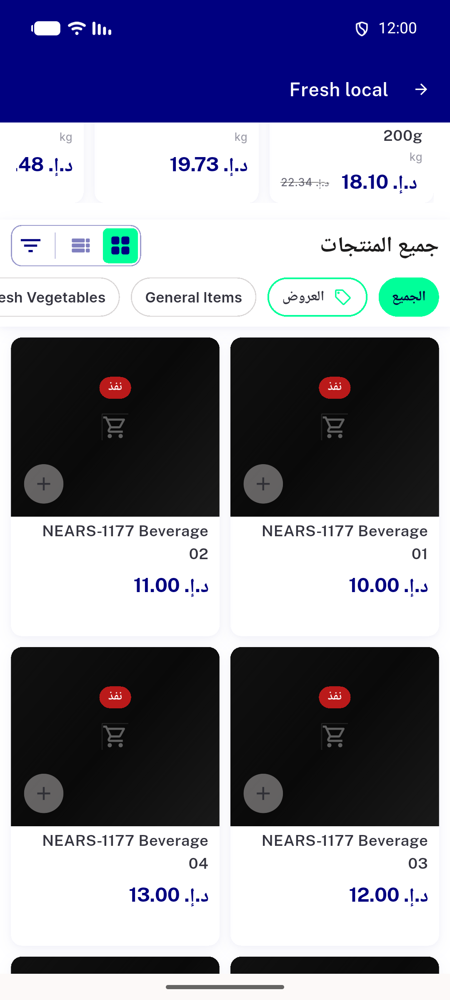</a> c1 grid store ar 1.0x</td>
<td align="center" width="33%"><a href="c1-grid-store-ar-1.3x-closed.png">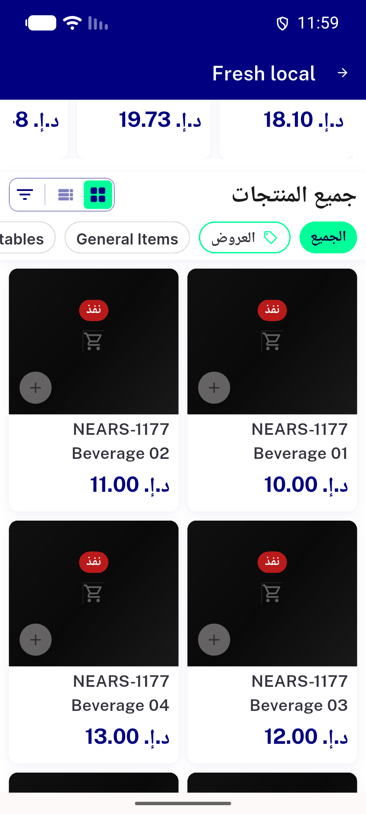</a> c1 grid store ar 1.3x closed</td>
</tr>
<tr>
<td align="center" width="33%"><a href="c1-grid-store-en-1.0x.png">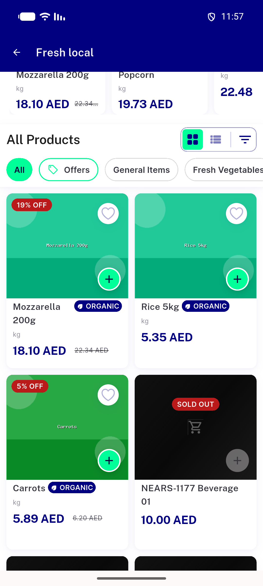</a> c1 grid store en 1.0x</td>
<td align="center" width="33%"><a href="c1-grid-store-en-1.3x.png">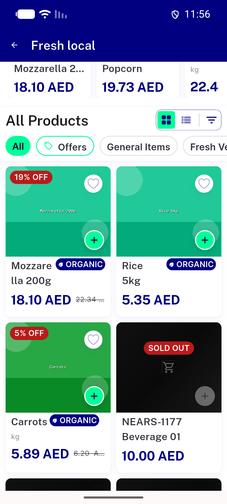</a> c1 grid store en 1.3x</td>
<td align="center" width="33%"><a href="c1-menurow-row-grid-closed-widgetbook-fallback-sheet.png">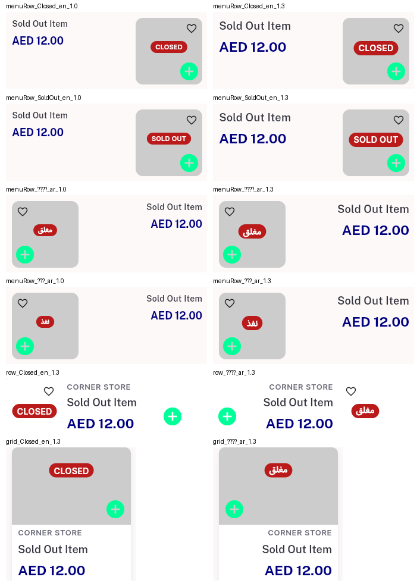</a> c1 menurow row grid closed widgetbook fallback sheet</td>
</tr>
<tr>
<td align="center" width="33%"><a href="c1-row-store-ar-1.0x.png">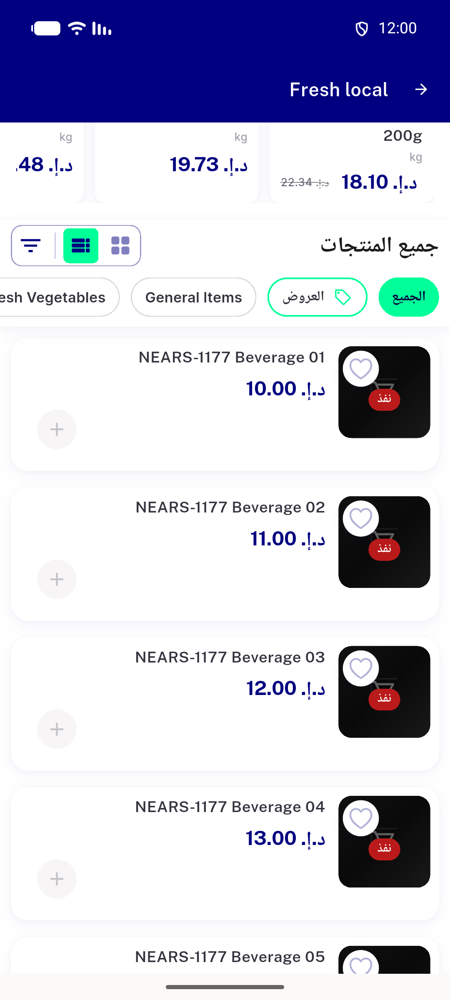</a> c1 row store ar 1.0x</td>
<td align="center" width="33%"><a href="c1-row-store-ar-1.3x.png">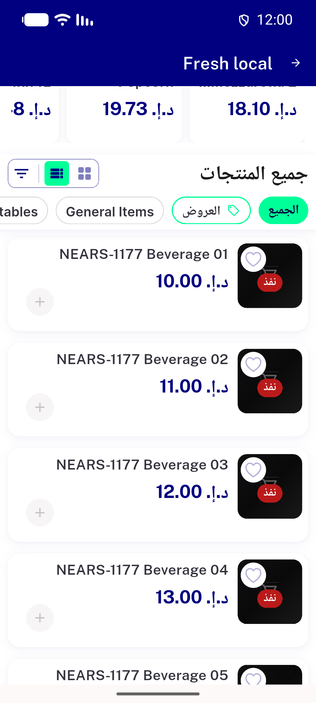</a> c1 row store ar 1.3x</td>
<td align="center" width="33%"><a href="c1-row-store-en-1.0x.png">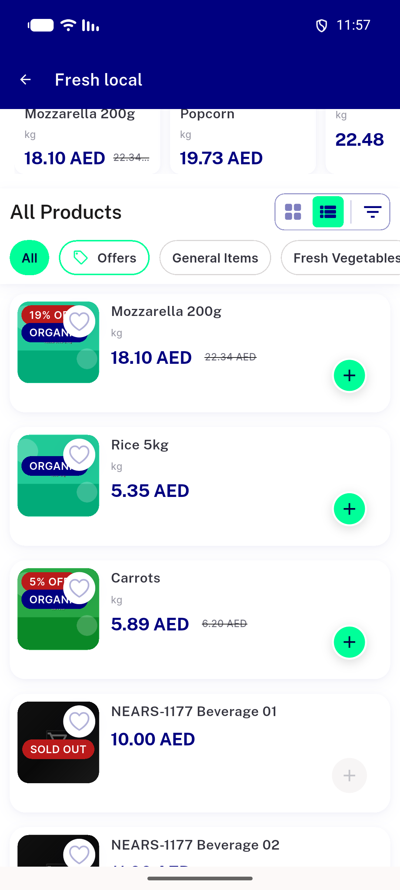</a> c1 row store en 1.0x</td>
</tr>
<tr>
<td align="center" width="33%"><a href="c1-row-store-en-1.3x.png">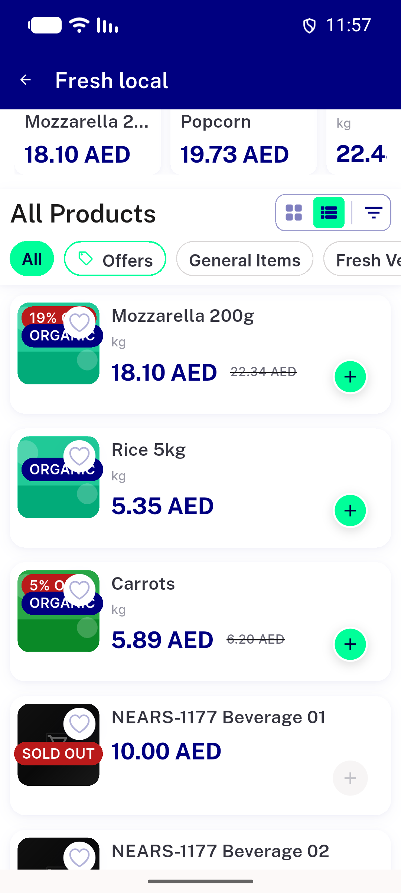</a> c1 row store en 1.3x</td>
</tr>
</table>

### Other artifacts
- [`00-baseline-prechange-goldens.log`](00-baseline-prechange-goldens.log)
- [`01-red-postchange-vs-old-baselines.log`](01-red-postchange-vs-old-baselines.log)
- [`02-mutation1-anchor.log`](02-mutation1-anchor.log)
- [`03-mutation2-row-zorder.log`](03-mutation2-row-zorder.log)
- [`04-post-rebaseline-green.log`](04-post-rebaseline-green.log)
- [`05-mutation3-grid-zorder-unit.log`](05-mutation3-grid-zorder-unit.log)
- [`06-mutation4-no-wrap-unit.log`](06-mutation4-no-wrap-unit.log)
- [`07-dls-golden-guard.log`](07-dls-golden-guard.log)
- [`08-base-8abbc2eb9-userapp-dls-golden-preexisting-red.log`](08-base-8abbc2eb9-userapp-dls-golden-preexisting-red.log)
- [`09-base-8abbc2eb9-store-card-sentence-case-preexisting-red.log`](09-base-8abbc2eb9-store-card-sentence-case-preexisting-red.log)
- [`bug-search-results-semantics-assertion.log`](bug-search-results-semantics-assertion.log)
- [`c1-ac3-grid-a11y-dump-en-1.3x.xml`](c1-ac3-grid-a11y-dump-en-1.3x.xml)
- [`c1-ac3-row-a11y-dump-en-1.3x.xml`](c1-ac3-row-a11y-dump-en-1.3x.xml)
- [`cycle1-01-red-row-anchor-vs-cycle0-baselines.log`](cycle1-01-red-row-anchor-vs-cycle0-baselines.log)
- [`cycle1-02-heart-vs-label-measurements.txt`](cycle1-02-heart-vs-label-measurements.txt)
- [`cycle1-02-probe-source.dart.txt`](cycle1-02-probe-source.dart.txt)
- [`cycle1-03-mutation-row-gap.log`](cycle1-03-mutation-row-gap.log)
- [`cycle1-04-post-rebaseline-green.log`](cycle1-04-post-rebaseline-green.log)
- [`cycle1-05-mutation-old-row-anchor-unit.log`](cycle1-05-mutation-old-row-anchor-unit.log)
- [`cycle1-06-dls-golden-guard.log`](cycle1-06-dls-golden-guard.log)
- [`cycle1-red-diffs`](cycle1-red-diffs)
- [`cycle1b-01-below-heart-fit-measurements.txt`](cycle1b-01-below-heart-fit-measurements.txt)
- [`cycle1b-01-probe-source.dart.txt`](cycle1b-01-probe-source.dart.txt)
- [`cycle1b-02-red-menurow-anchor-vs-e39-baselines.log`](cycle1b-02-red-menurow-anchor-vs-e39-baselines.log)
- [`cycle1b-03-mutation-old-menurow-anchor-golden.log`](cycle1b-03-mutation-old-menurow-anchor-golden.log)
- [`cycle1b-04-mutation-old-menurow-anchor-unit.log`](cycle1b-04-mutation-old-menurow-anchor-unit.log)
- [`cycle1b-05-post-rebaseline-green.log`](cycle1b-05-post-rebaseline-green.log)
- [`cycle1b-06-dls-golden-guard.log`](cycle1b-06-dls-golden-guard.log)
- [`cycle1b-red-diffs`](cycle1b-red-diffs)
- [`cycle1c-01-grid-no-heart-measurements.txt`](cycle1c-01-grid-no-heart-measurements.txt)
- [`cycle1c-01-probe-source.dart.txt`](cycle1c-01-probe-source.dart.txt)
- [`cycle1c-02-red-unit-closed-grid.log`](cycle1c-02-red-unit-closed-grid.log)
- [`cycle1c-03-red-unit-real-font-grid.log`](cycle1c-03-red-unit-real-font-grid.log)
- [`cycle1c-04-red-golden-vs-b37-baselines.log`](cycle1c-04-red-golden-vs-b37-baselines.log)
- [`cycle1c-05-mutation-heart-back-golden.log`](cycle1c-05-mutation-heart-back-golden.log)
- [`cycle1c-05-mutation-heart-back-unit.log`](cycle1c-05-mutation-heart-back-unit.log)
- [`cycle1c-06-mutation-halal-over-chip-golden.log`](cycle1c-06-mutation-halal-over-chip-golden.log)
- [`cycle1c-06-mutation-halal-over-chip-unit.log`](cycle1c-06-mutation-halal-over-chip-unit.log)
- [`cycle1c-07-post-rebaseline-green.log`](cycle1c-07-post-rebaseline-green.log)
- [`cycle1c-08-dls-golden-guard.log`](cycle1c-08-dls-golden-guard.log)
- [`cycle1c-red-diffs`](cycle1c-red-diffs)
- [`pre-fix-0581928df`](pre-fix-0581928df)
- [`red-diffs`](red-diffs)

---
*From `nears/docs/qa-evidence/NEARS-3817/` · public-repo scrub policy (no live secrets; verified clean).*
