# QA Evidence — NEARS-3819

**QA [8] cycle 1 delta PASS — UX-F1 AR badge '+1', UX-F2 AR list separator; regr: store-card +N tile AR reversed (pre-existing)**

**18 screenshot(s).** Click any thumbnail for full resolution.

<table>
<tr>
<td align="center" width="33%"><a href="ac1-home-module-grid-en.png">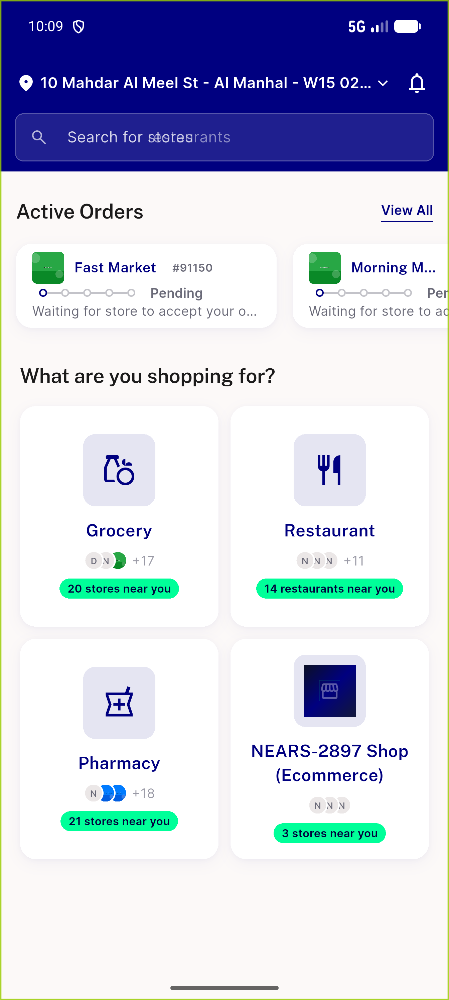</a> ac1 home module grid en</td>
<td align="center" width="33%"><a href="ac4-home-grid-ar-rtl.png">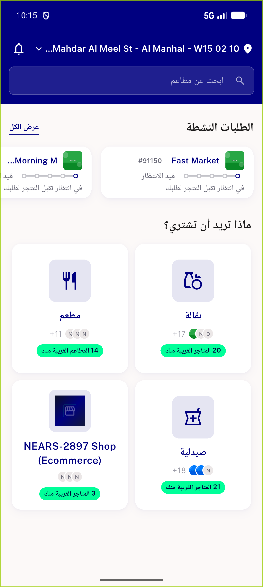</a> ac4 home grid ar rtl</td>
<td align="center" width="33%"><a href="ac5-home-grid-en-1_3x-narrow360dp.png">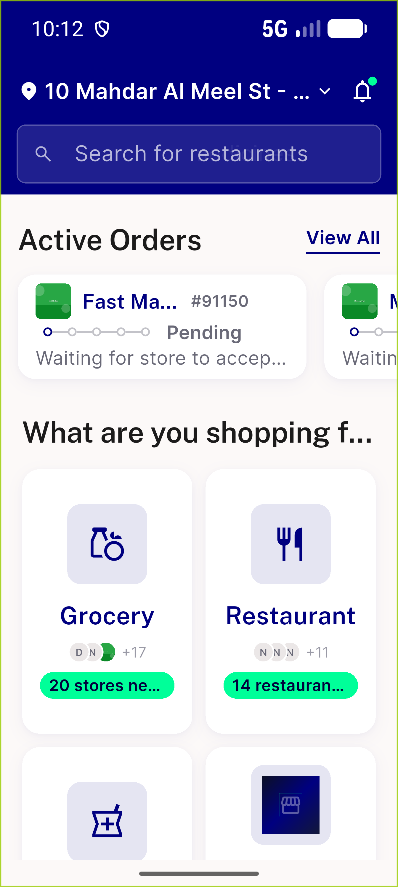</a> ac5 home grid en 1 3x narrow360dp</td>
</tr>
<tr>
<td align="center" width="33%"><a href="ac5-home-grid-en-1_3x.png">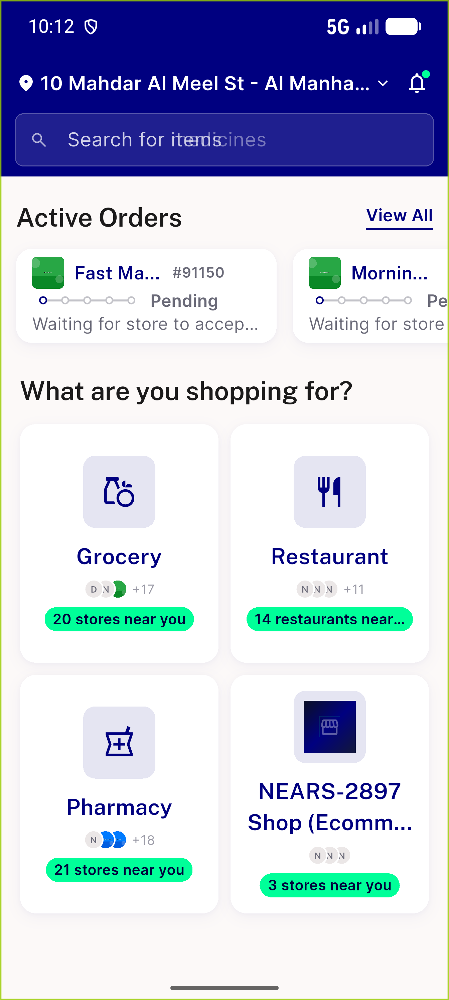</a> ac5 home grid en 1 3x</td>
<td align="center" width="33%"><a href="ac8-after-refresh-logos.png">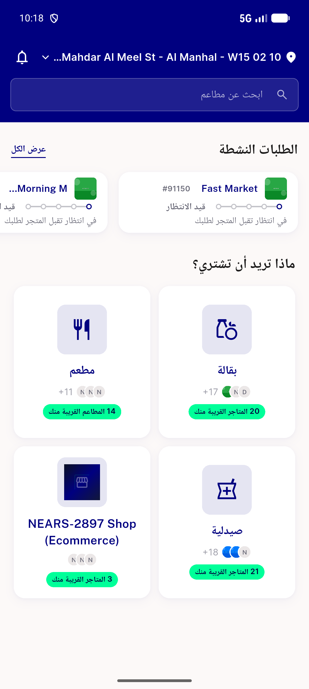</a> ac8 after refresh logos</td>
<td align="center" width="33%"><a href="ac8-stale-cache-pill-only.png">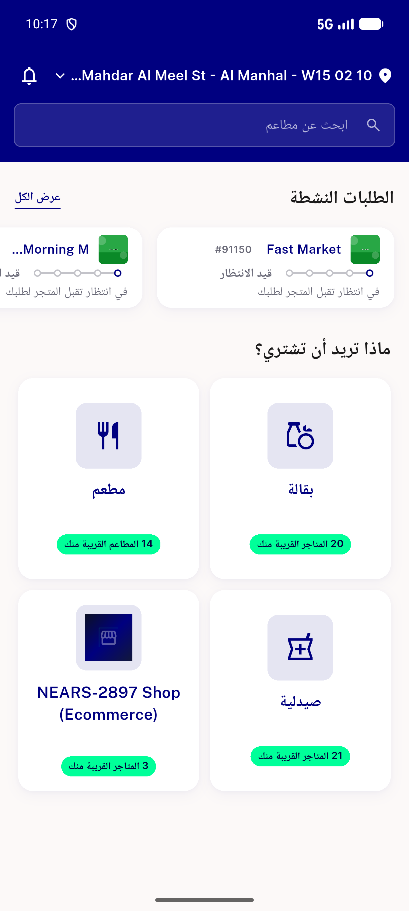</a> ac8 stale cache pill only</td>
</tr>
<tr>
<td align="center" width="33%"><a href="ac9-notifications-ar-rtl.png">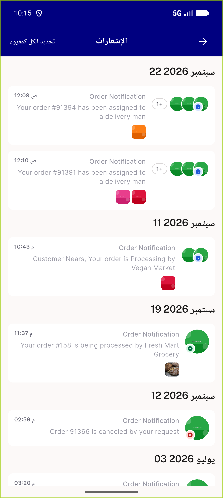</a> ac9 notifications ar rtl</td>
<td align="center" width="33%"><a href="ac9-notifications-en-row91391.png">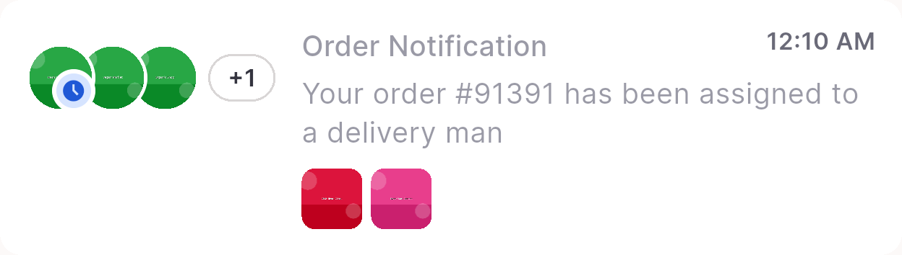</a> ac9 notifications en row91391</td>
<td align="center" width="33%"><a href="ac9-notifications-en.png">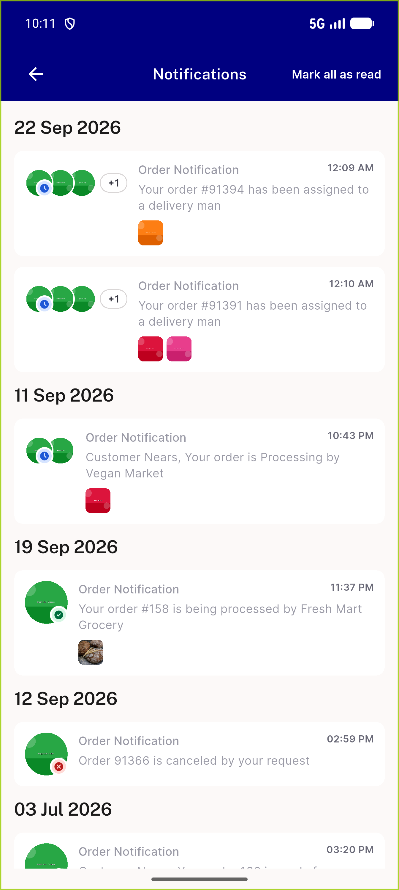</a> ac9 notifications en</td>
</tr>
<tr>
<td align="center" width="33%"><a href="bug-store-card-overflow-tile-ar-reversed.png">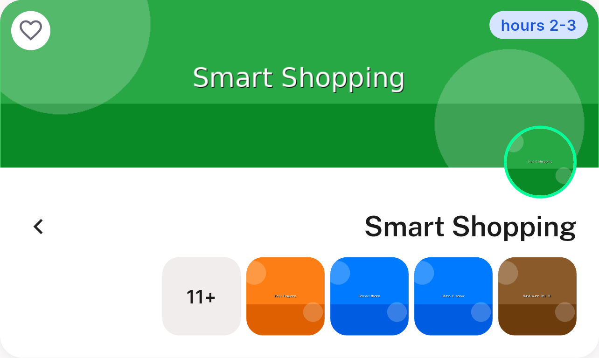</a> bug store card overflow tile ar reversed</td>
<td align="center" width="33%"> fix1 ac4 home grid ar rtl</td>
<td align="center" width="33%"><a href="fix1-ac9-notifications-ar-rtl-rows.png">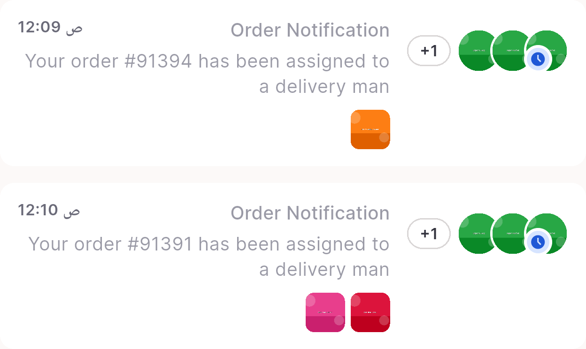</a> fix1 ac9 notifications ar rtl rows</td>
</tr>
<tr>
<td align="center" width="33%"><a href="fix1-ac9-notifications-ar-rtl.png">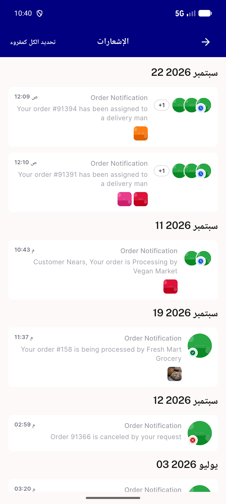</a> fix1 ac9 notifications ar rtl</td>
<td align="center" width="33%"><a href="fix1-ac9-notifications-en.png">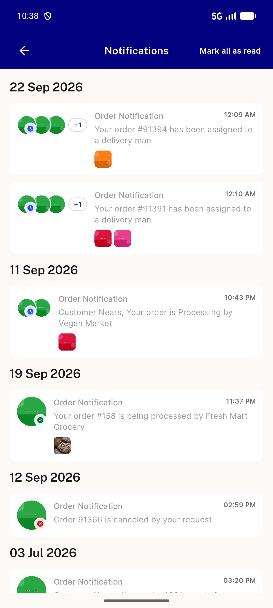</a> fix1 ac9 notifications en</td>
<td align="center" width="33%"><a href="fix1-home-grid-en.png">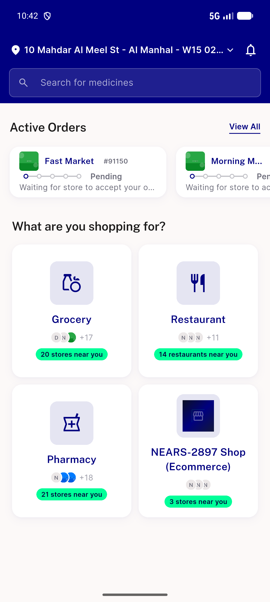</a> fix1 home grid en</td>
</tr>
<tr>
<td align="center" width="33%"><a href="fix1-regr-grocery-store-cards-ar.png">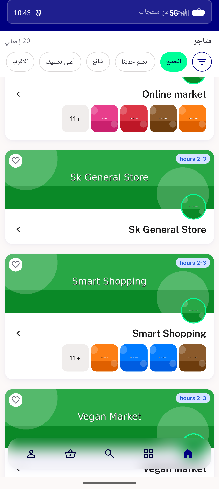</a> fix1 regr grocery store cards ar</td>
<td align="center" width="33%"><a href="fix1-regr-order-status-cards-ar.png">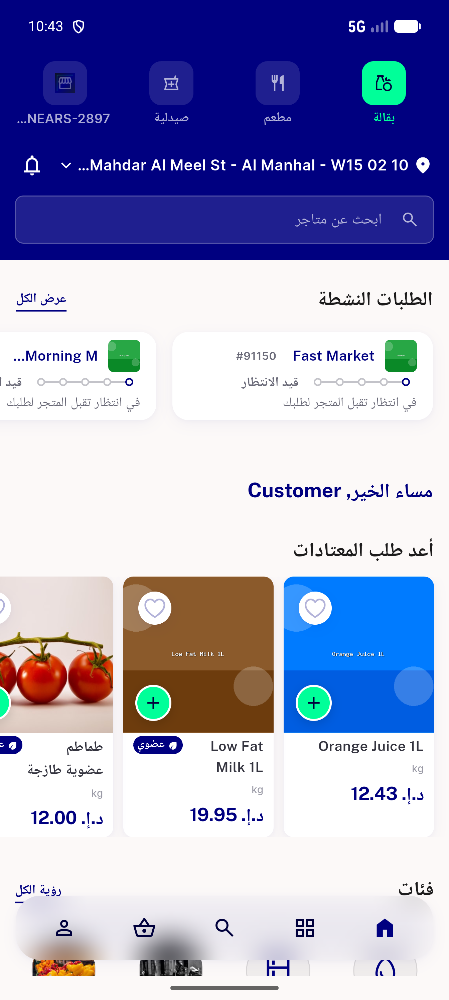</a> fix1 regr order status cards ar</td>
<td align="center" width="33%"><a href="regr-grocery-store-list-ar.png">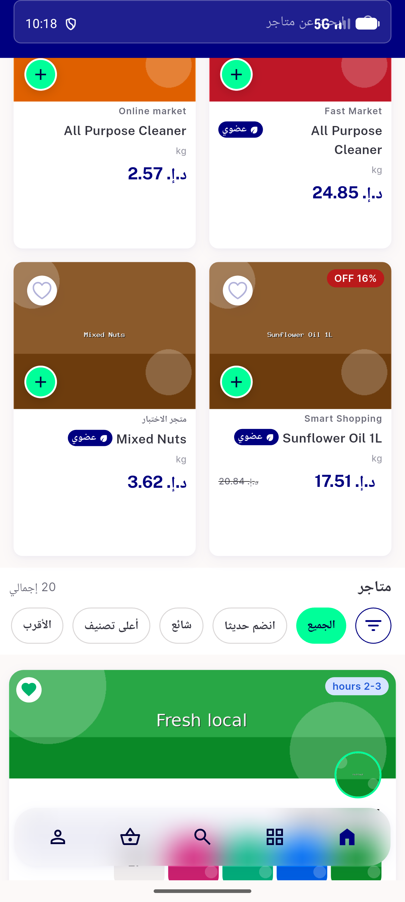</a> regr grocery store list ar</td>
</tr>
</table>

### Other artifacts
- [`api-module-before-after.log`](api-module-before-after.log)
- [`fix1-ac6-module-grid-ar-a11y.xml`](fix1-ac6-module-grid-ar-a11y.xml)
- [`fix1-ac6-module-grid-en-a11y.xml`](fix1-ac6-module-grid-en-a11y.xml)
- [`progress.md`](progress.md)

---
*From `nears/docs/qa-evidence/NEARS-3819/` · public-repo scrub policy (no live secrets; verified clean).*
