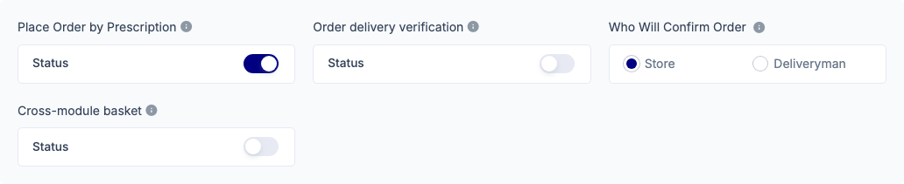
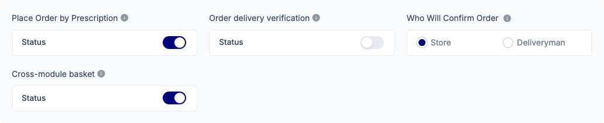
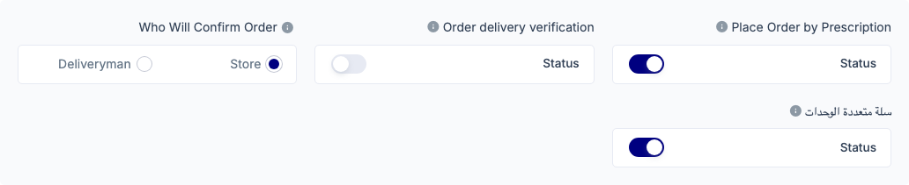
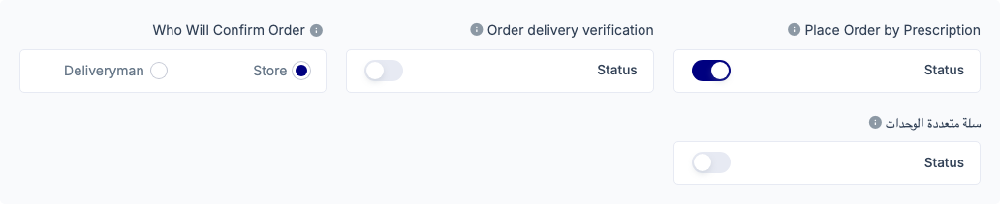

# QA Evidence — NEARS-3829

**NEARS-3829 PASS — cross_module_basket admin toggle + config field (Admin web, branch 5c0a8b7a4)**

**4 screenshot(s).** Click any thumbnail for full resolution.

<table>
<tr>
<td align="center" width="33%"> en off other setup</td>
<td align="center" width="33%"> en on other setup</td>
<td align="center" width="33%"> ar on other setup</td>
</tr>
<tr>
<td align="center" width="33%"> ar off other setup</td>
</tr>
</table>

### Other artifacts
- [`ac1-ac3-config-diff.txt`](ac1-ac3-config-diff.txt)
- [`progress.md`](progress.md)

---
*From `nears/docs/qa-evidence/NEARS-3829/` · public-repo scrub policy (no live secrets; verified clean).*
