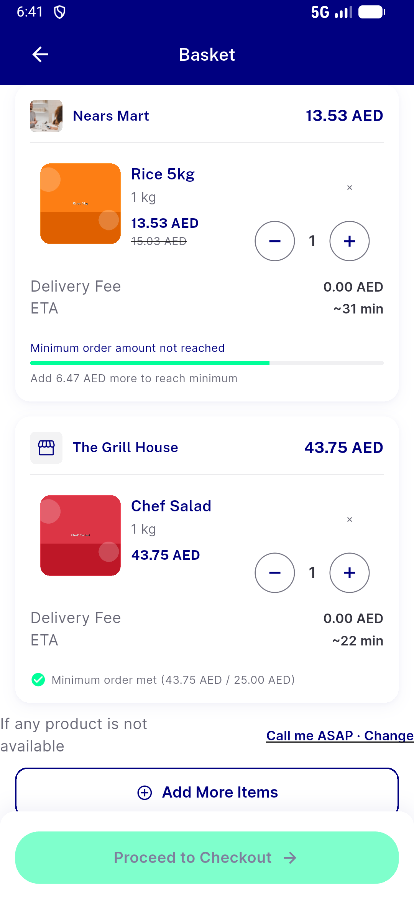
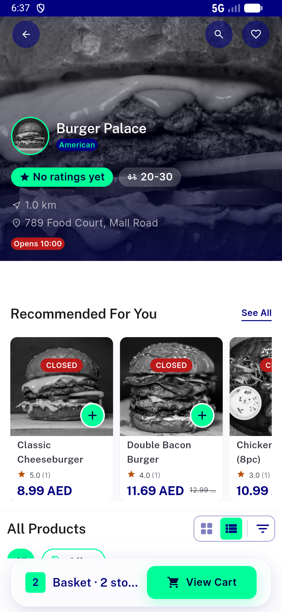
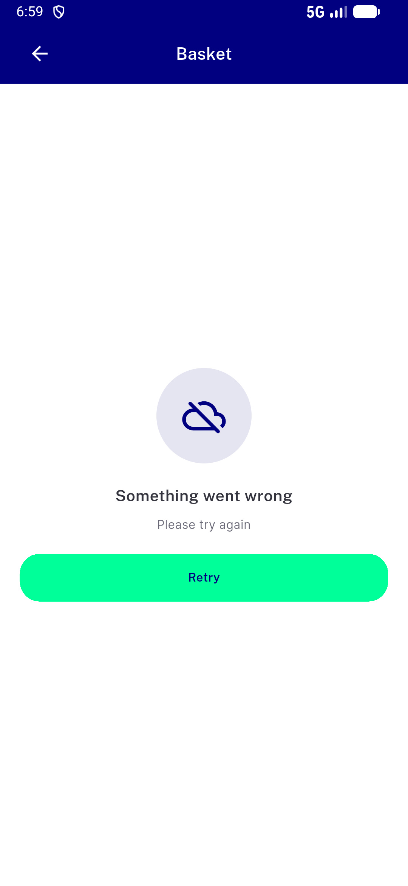
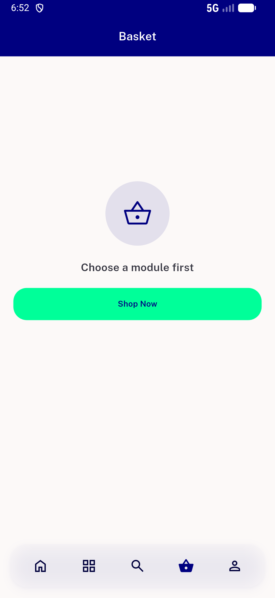
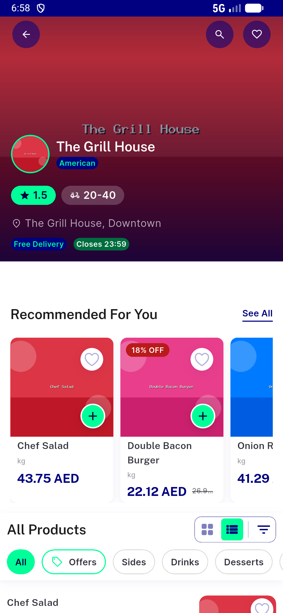
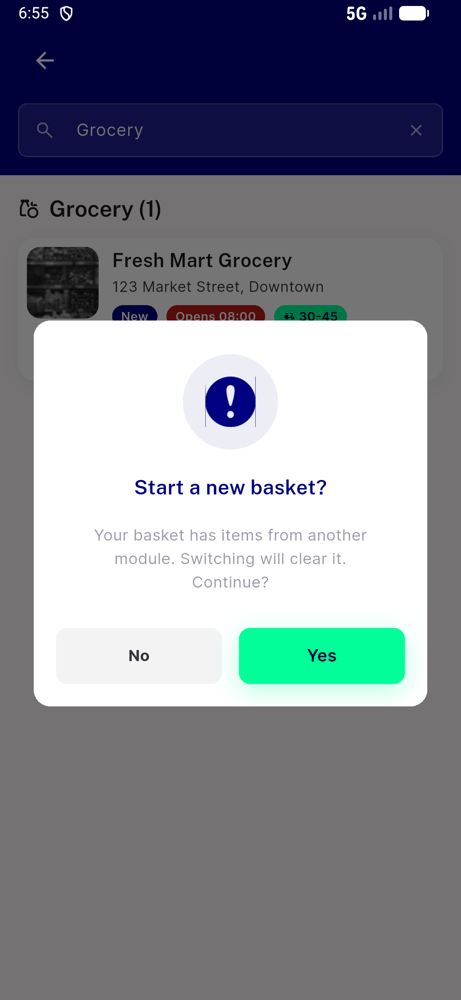
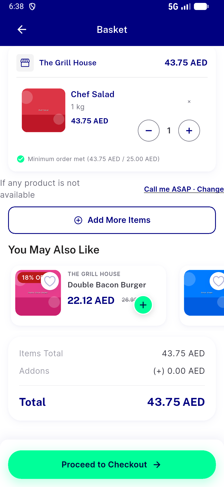
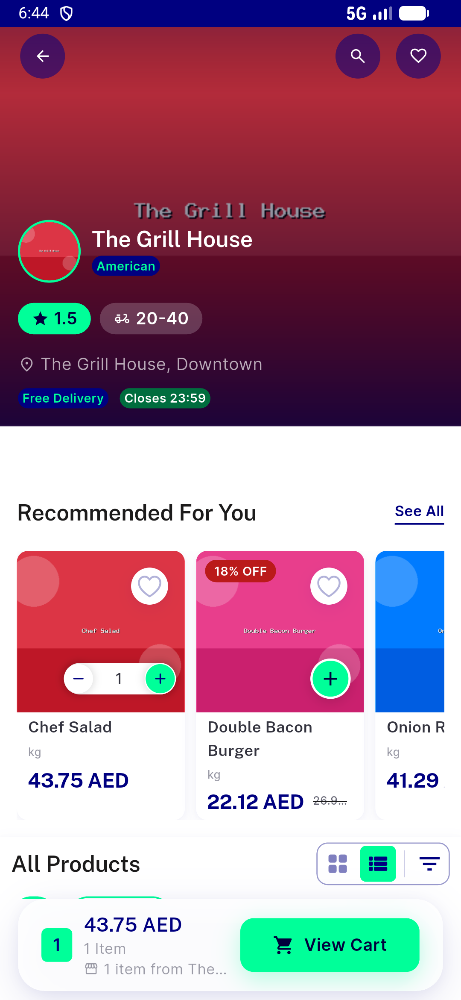
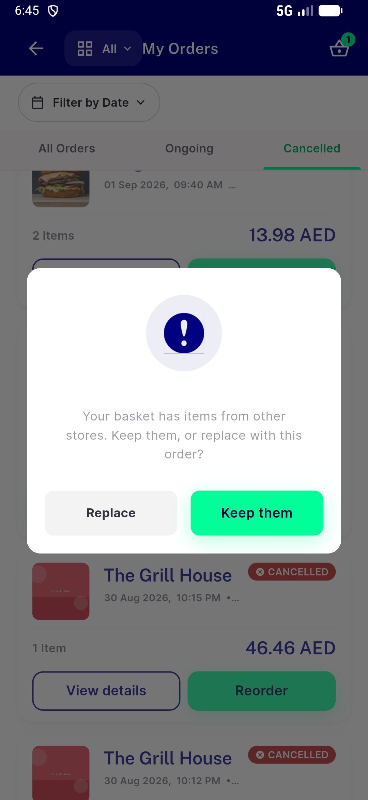

# QA Evidence — NEARS-3841

**NEARS-3841 QA PASS — cart API module-optional under cross_module_basket (emulator-5570, build 4a287e457)**

**10 screenshot(s).** Click any thumbnail for full resolution.

<table>
<tr>
<td align="center" width="33%"> ac1 guest cart two modules no module selected</td>
<td align="center" width="33%"> ac1 loggedin cart two modules no module selected</td>
<td align="center" width="33%"> ac3 guest search tap no reset basket kept</td>
</tr>
<tr>
<td align="center" width="33%"> aclog cart load failure error retry</td>
<td align="center" width="33%"> acreg flag off moduleless choose a module first</td>
<td align="center" width="33%"> acreg flag off reorder same store cleared</td>
</tr>
<tr>
<td align="center" width="33%"> acreg flag off start new basket dialog</td>
<td align="center" width="33%"> guest remove cross module item</td>
<td align="center" width="33%"> k1a reorder same store basket kept</td>
</tr>
<tr>
<td align="center" width="33%"> k1b reorder keep replace dialog</td>
</tr>
</table>

### Other artifacts
- [`ac2-header-capture.log`](ac2-header-capture.log)
- [`aclog-cart-list-fail.log`](aclog-cart-list-fail.log)
- [`bug-guest-group-tax-401.log`](bug-guest-group-tax-401.log)
- [`bug-nitemcard-table-semantics-assert.log`](bug-nitemcard-table-semantics-assert.log)
- [`progress.md`](progress.md)
- [`skew-client-on-server-off.log`](skew-client-on-server-off.log)

---
*From `nears/docs/qa-evidence/NEARS-3841/` · public-repo scrub policy (no live secrets; verified clean).*
