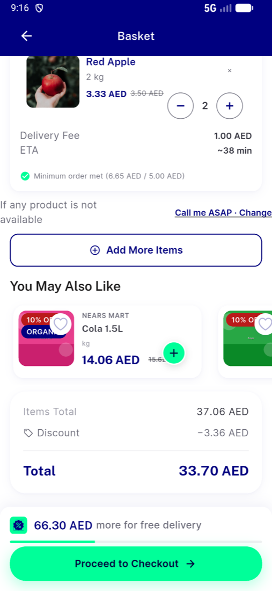
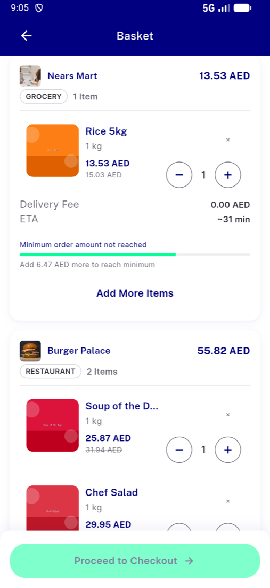

# QA Evidence — NEARS-3842

**FAIL: AC1/2/4/7/8/AC-LOG/RTL/AC-REG pass; mixed basket with no active module skips per-store delivery quote (fees 0.00) and 403s cart suggestions**

**6 screenshot(s).** Click any thumbnail for full resolution.

<table>
<tr>
<td align="center" width="33%"> ac1 mixed cart two sections light</td>
<td align="center" width="33%"> acreg flag on same module basketwide promo</td>
<td align="center" width="33%"> bug mixed null module delivery fee zero</td>
</tr>
<tr>
<td align="center" width="33%"> rtl ar long module name ellipsis full</td>
<td align="center" width="33%"> rtl ar long module name ellipsis header</td>
<td align="center" width="33%"> rtl ar mixed cart long module ellipsis</td>
</tr>
</table>

### Other artifacts
- [`aclog-degraded-cart-a11y-dump.xml`](aclog-degraded-cart-a11y-dump.xml)
- [`aclog-degraded-per-store.log`](aclog-degraded-per-store.log)
- [`bug-mixed-null-module-delivery-fee-zero.log`](bug-mixed-null-module-delivery-fee-zero.log)
- [`bug-suggested-items-403-module-null.log`](bug-suggested-items-403-module-null.log)
- [`finding-checkout-screen-sets-module.log`](finding-checkout-screen-sets-module.log)
- [`progress.md`](progress.md)

---
*From `nears/docs/qa-evidence/NEARS-3842/` · public-repo scrub policy (no live secrets; verified clean).*
