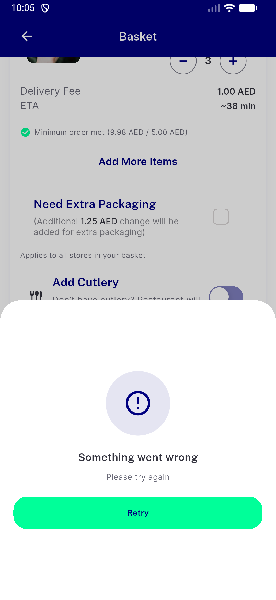
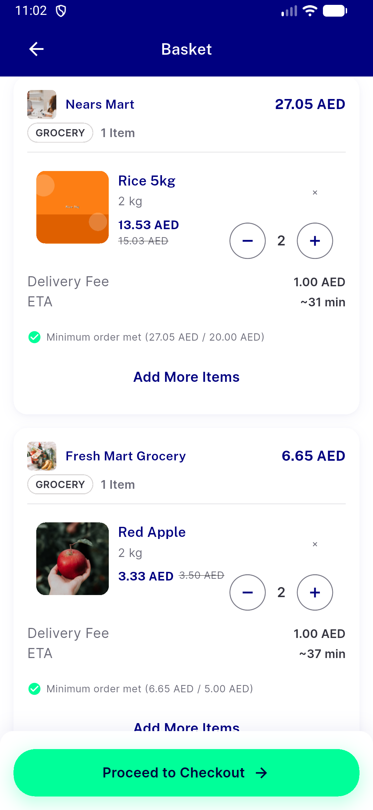
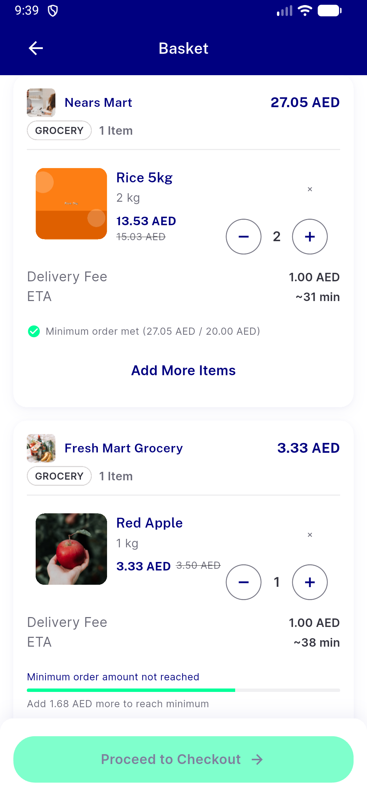
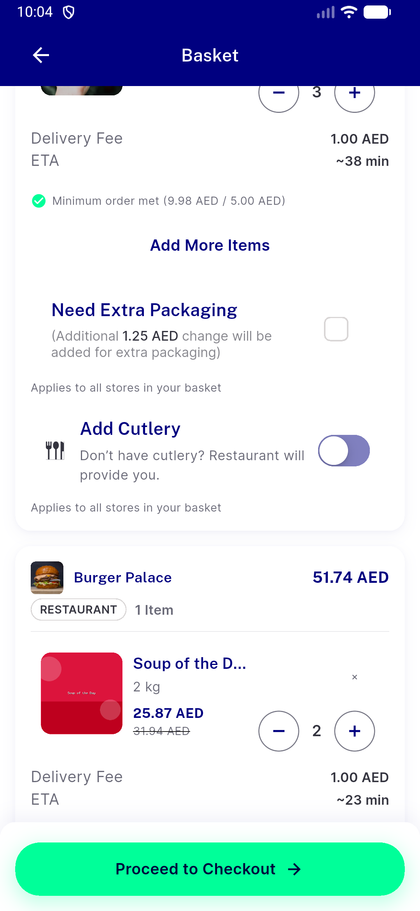

# QA Evidence — NEARS-3842

**QA cycle 3 FULL re-QA PASS @572563fe1 (emulator-5570)**

**10 screenshot(s).** Click any thumbnail for full resolution.

<table>
<tr>
<td align="center" width="33%"> ac1 mixed cart two sections light</td>
<td align="center" width="33%"> acreg flag on same module basketwide promo</td>
<td align="center" width="33%"> bug mixed null module cart row sheet details 403</td>
</tr>
<tr>
<td align="center" width="33%"> bug mixed null module delivery fee zero</td>
<td align="center" width="33%"> c3 ac1 mixed cart two row headers light</td>
<td align="center" width="33%"> fc1 ac3 module null edit B fees quoted</td>
</tr>
<tr>
<td align="center" width="33%"> fc2 tb3 module null increment persists</td>
<td align="center" width="33%"> rtl ar long module name ellipsis full</td>
<td align="center" width="33%"> rtl ar long module name ellipsis header</td>
</tr>
<tr>
<td align="center" width="33%"> rtl ar mixed cart long module ellipsis</td>
</tr>
</table>

### Other artifacts
- [`aclog-degraded-cart-a11y-dump.xml`](aclog-degraded-cart-a11y-dump.xml)
- [`aclog-degraded-per-store.log`](aclog-degraded-per-store.log)
- [`bug-mixed-null-module-delivery-fee-zero.log`](bug-mixed-null-module-delivery-fee-zero.log)
- [`bug-mixed-null-module-increment-flips-module-and-reverts.log`](bug-mixed-null-module-increment-flips-module-and-reverts.log)
- [`bug-mixed-null-module-item-sheet-details-403.log`](bug-mixed-null-module-item-sheet-details-403.log)
- [`bug-store-record-not-retried-after-failure.log`](bug-store-record-not-retried-after-failure.log)
- [`bug-suggested-items-403-module-null.log`](bug-suggested-items-403-module-null.log)
- [`c3-aclog-degraded-cart-a11y-bottom.xml`](c3-aclog-degraded-cart-a11y-bottom.xml)
- [`c3-aclog-degraded-cart-a11y-top.xml`](c3-aclog-degraded-cart-a11y-top.xml)
- [`c3-aclog-degraded-per-store.log`](c3-aclog-degraded-per-store.log)
- [`c3-headers-capture.log`](c3-headers-capture.log)
- [`finding-checkout-screen-sets-module.log`](finding-checkout-screen-sets-module.log)
- [`finding-sheet-add-switches-selected-module.log`](finding-sheet-add-switches-selected-module.log)
- [`progress.md`](progress.md)

---
*From `nears/docs/qa-evidence/NEARS-3842/` · public-repo scrub policy (no live secrets; verified clean).*
