# QA Evidence — NEARS-3843

**FAIL - AC3 food-row sheet Out of Stock under grocery; AC1/2a/2b/4/LOG/REG pass**

**22 screenshot(s).** Click any thumbnail for full resolution.

<table>
<tr>
<td align="center" width="33%"><a href="ac1-base-food-active-2.png">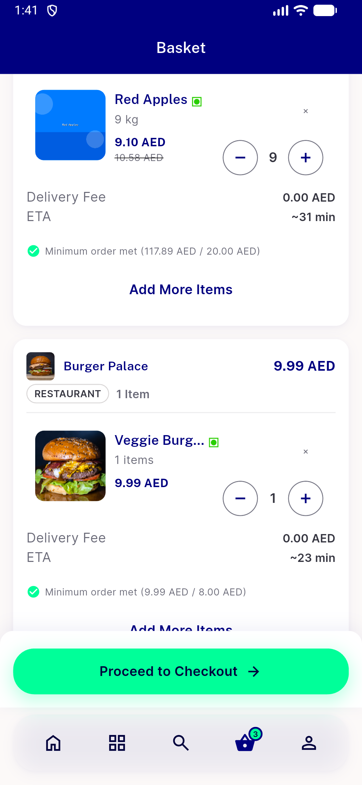</a> ac1 base food active 2</td>
<td align="center" width="33%"> ac1 base food active</td>
<td align="center" width="33%"> ac1 base grocery active 2</td>
</tr>
<tr>
<td align="center" width="33%"><a href="ac1-base-grocery-active.png">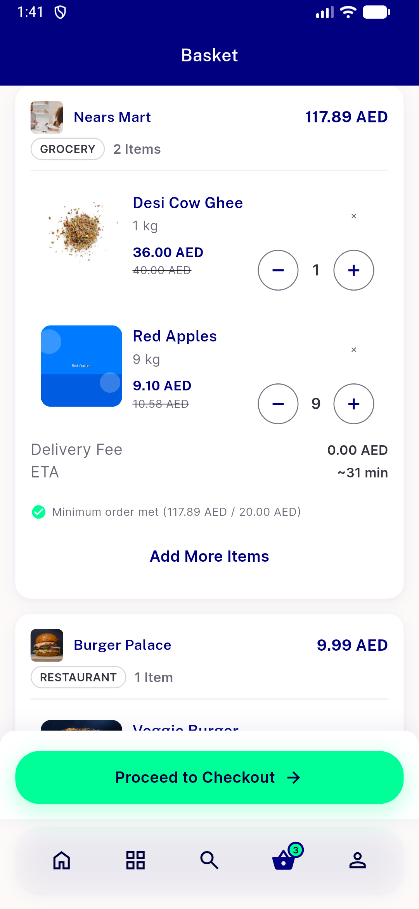</a> ac1 base grocery active</td>
<td align="center" width="33%"><a href="ac1-base-no-module.png">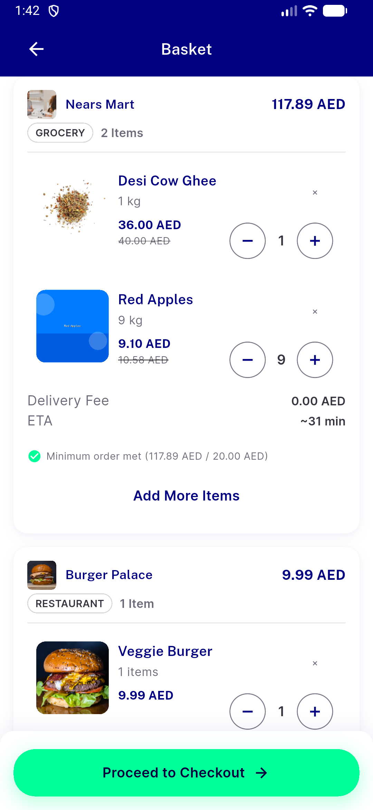</a> ac1 base no module</td>
<td align="center" width="33%"> ac1 fix food active</td>
</tr>
<tr>
<td align="center" width="33%"><a href="ac1-fix-grocery-active.png">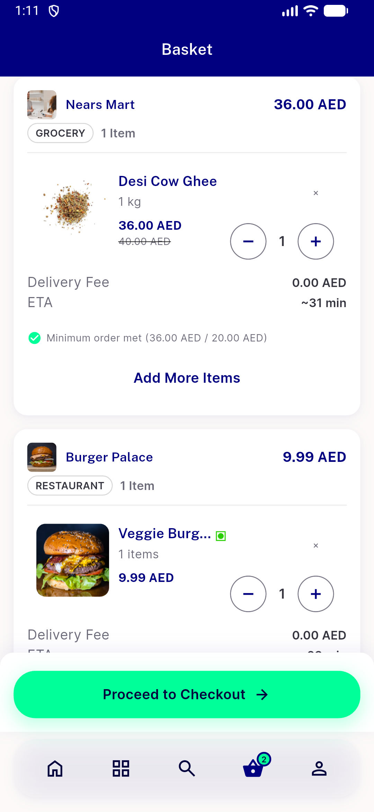</a> ac1 fix grocery active</td>
<td align="center" width="33%"><a href="ac1-fix-no-module.png">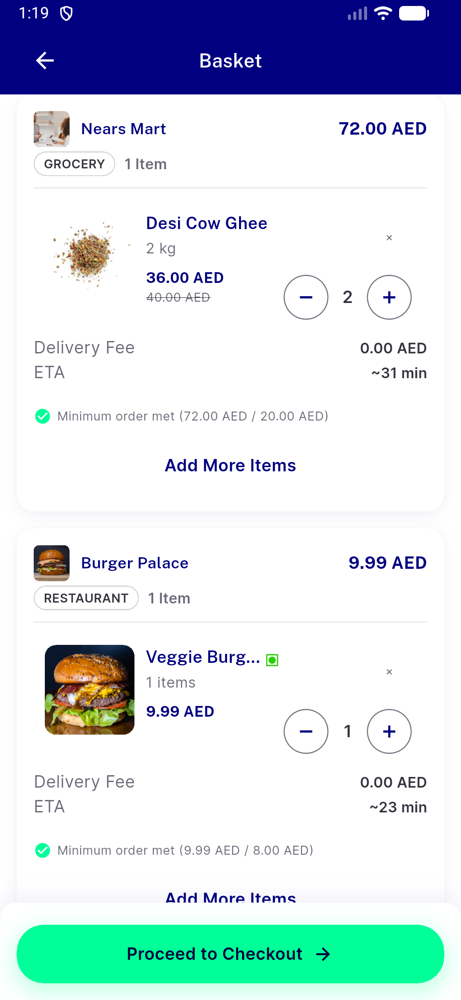</a> ac1 fix no module</td>
<td align="center" width="33%"><a href="ac1-fix-rtl-ar-food-active.png">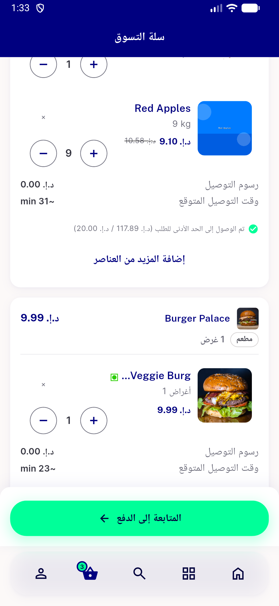</a> ac1 fix rtl ar food active</td>
</tr>
<tr>
<td align="center" width="33%"><a href="ac1-fix-textscale-1.3-food-active-2.png">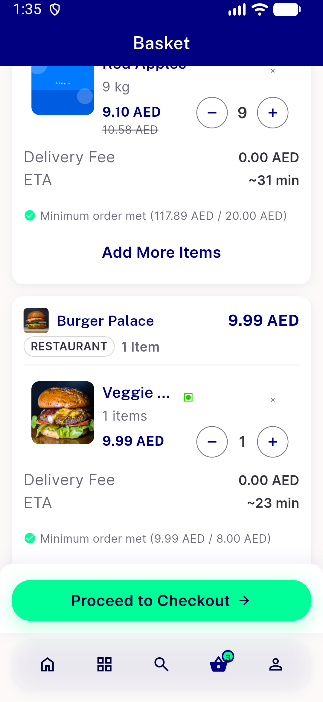</a> ac1 fix textscale 1.3 food active 2</td>
<td align="center" width="33%"><a href="ac1-fix-textscale-1.3-food-active.png">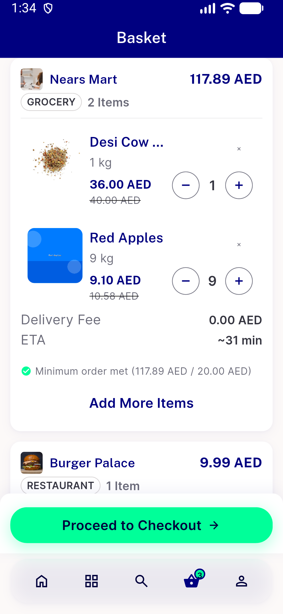</a> ac1 fix textscale 1.3 food active</td>
<td align="center" width="33%"><a href="ac2a-base-food-active-plus-to-10.png">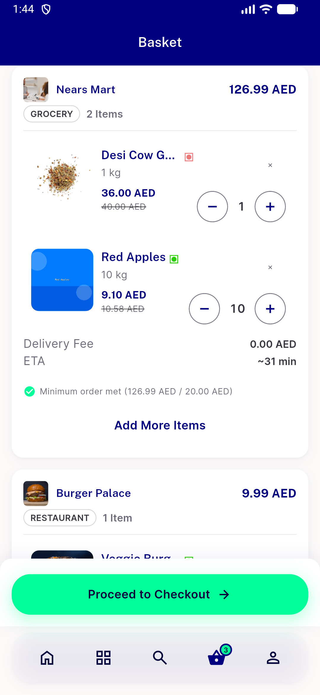</a> ac2a base food active plus to 10</td>
</tr>
<tr>
<td align="center" width="33%"> ac2a fix food active plus blocked</td>
<td align="center" width="33%"><a href="ac2b-base-grocery-active-plus-blocked.png">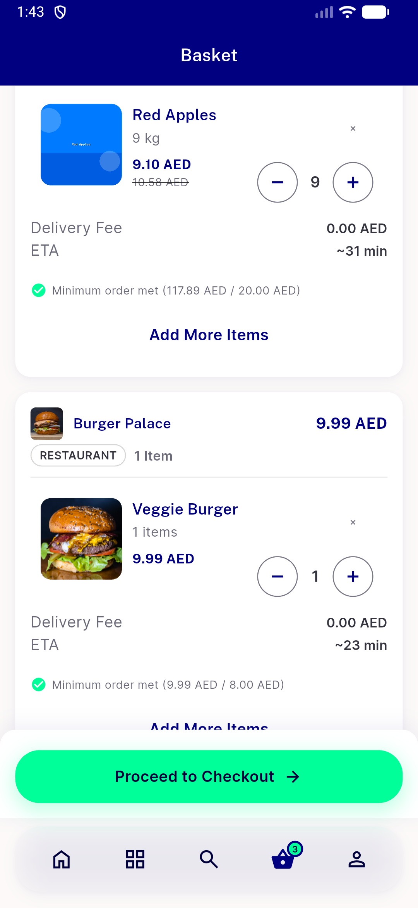</a> ac2b base grocery active plus blocked</td>
<td align="center" width="33%"><a href="ac2b-fix-grocery-active-plus-allowed.png">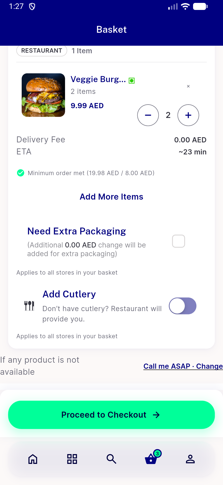</a> ac2b fix grocery active plus allowed</td>
</tr>
<tr>
<td align="center" width="33%"><a href="ac3-fix-grocery-row-food-active-sheet.png">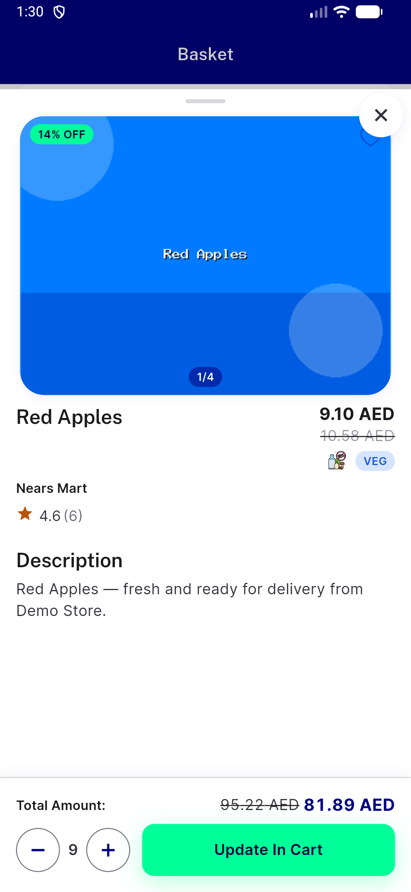</a> ac3 fix grocery row food active sheet</td>
<td align="center" width="33%"><a href="acreg-fix-flagoff-food-active.png">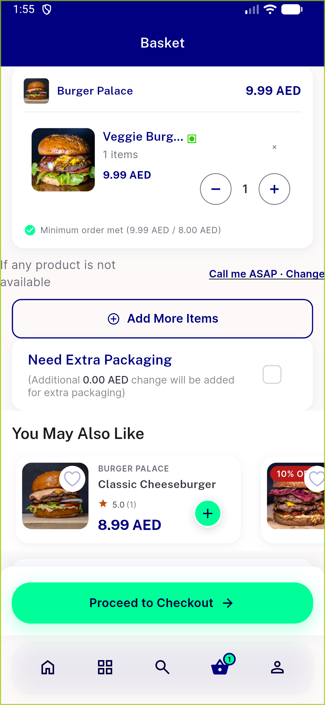</a> acreg fix flagoff food active</td>
<td align="center" width="33%"><a href="acreg-fix-flagoff-grocery-active.png">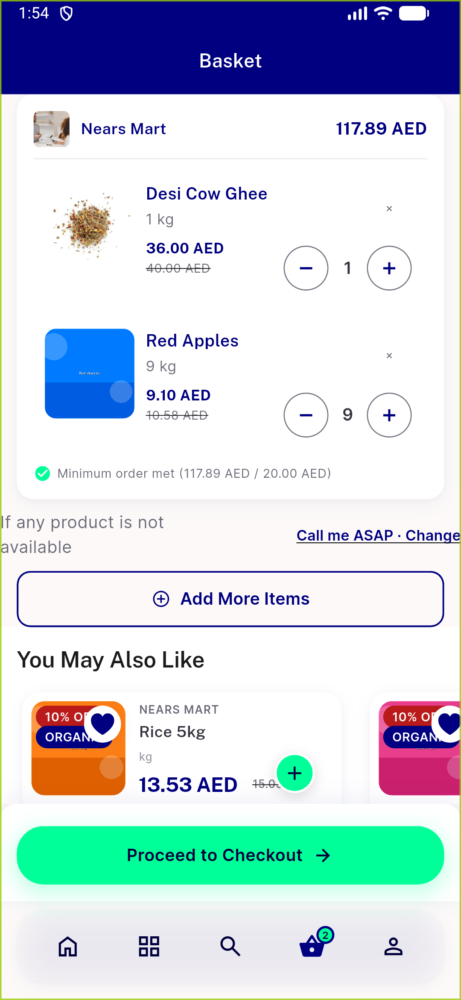</a> acreg fix flagoff grocery active</td>
</tr>
<tr>
<td align="center" width="33%"><a href="bug-ac3-sheet-food-row-grocery-out-of-stock.png">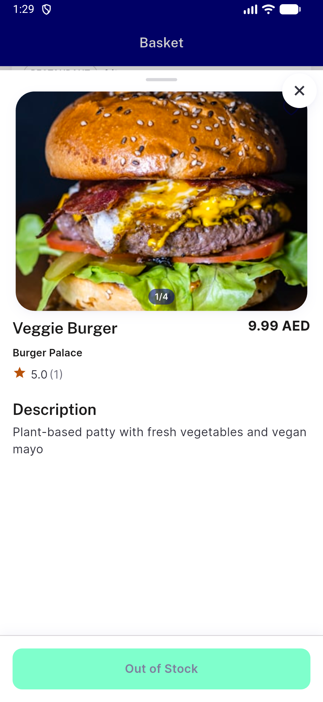</a> bug ac3 sheet food row grocery out of stock</td>
<td align="center" width="33%"><a href="bug-item-card-ambient-stock-sold-out.png">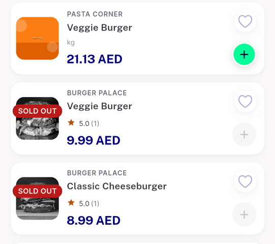</a> bug item card ambient stock sold out</td>
<td align="center" width="33%"><a href="reg-global-search-no-module-results.png">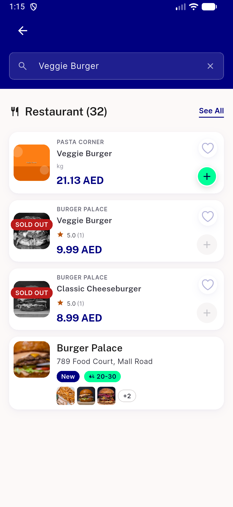</a> reg global search no module results</td>
</tr>
<tr>
<td align="center" width="33%"> toast ar only quantity available</td>
</tr>
</table>

### Other artifacts
- [`ac4-staples-add-all-fix.log`](ac4-staples-add-all-fix.log)
- [`bug-ac3-sheet-food-row-grocery-out-of-stock.log`](bug-ac3-sheet-food-row-grocery-out-of-stock.log)
- [`bug-ac3-sheet-food-row-grocery-out-of-stock.xml`](bug-ac3-sheet-food-row-grocery-out-of-stock.xml)
- [`bug-get-tax-403-flash-sale-stock-mismatch.log`](bug-get-tax-403-flash-sale-stock-mismatch.log)
- [`bug-global-search-semantics-table-assert.log`](bug-global-search-semantics-table-assert.log)
- [`bug-nitemcard-overflow-textscale-1.3.log`](bug-nitemcard-overflow-textscale-1.3.log)
- [`progress.md`](progress.md)

---
*From `nears/docs/qa-evidence/NEARS-3843/` · public-repo scrub policy (no live secrets; verified clean).*
