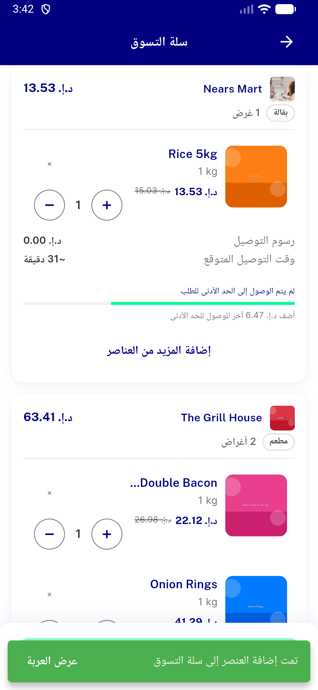
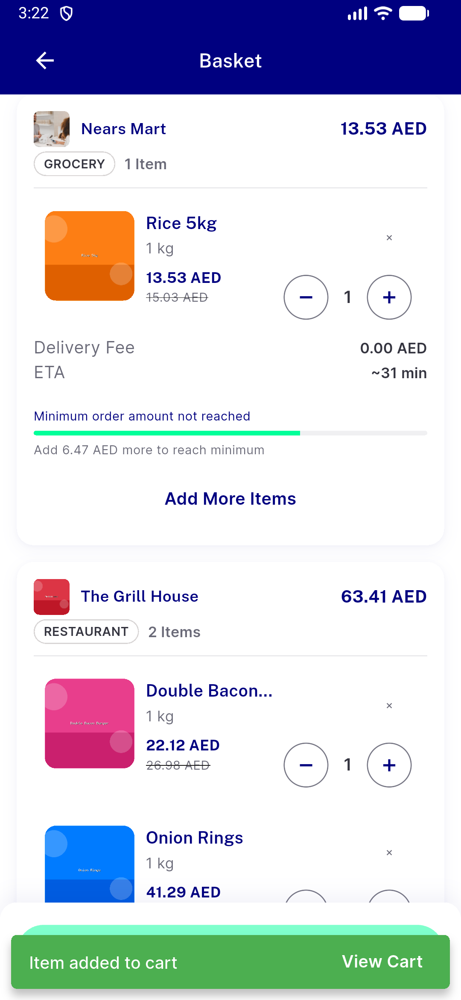
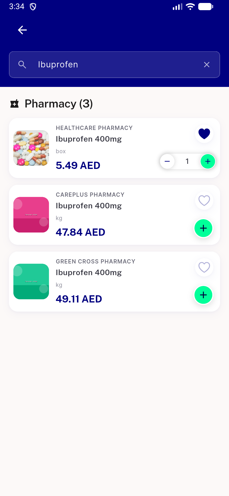
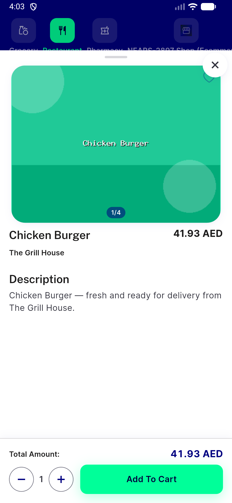
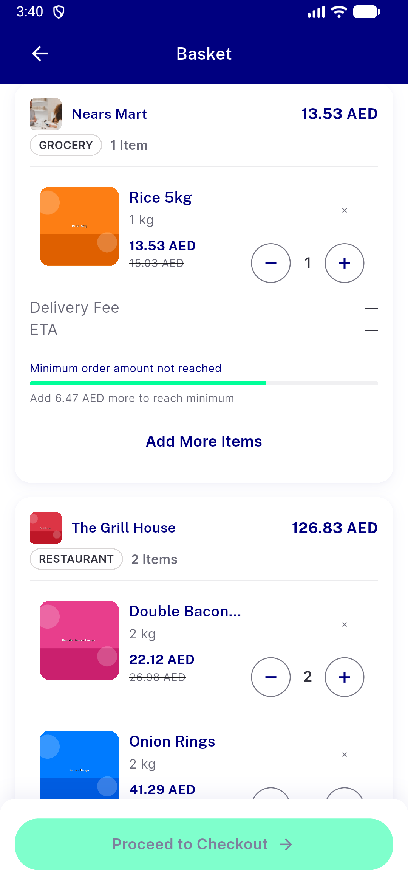
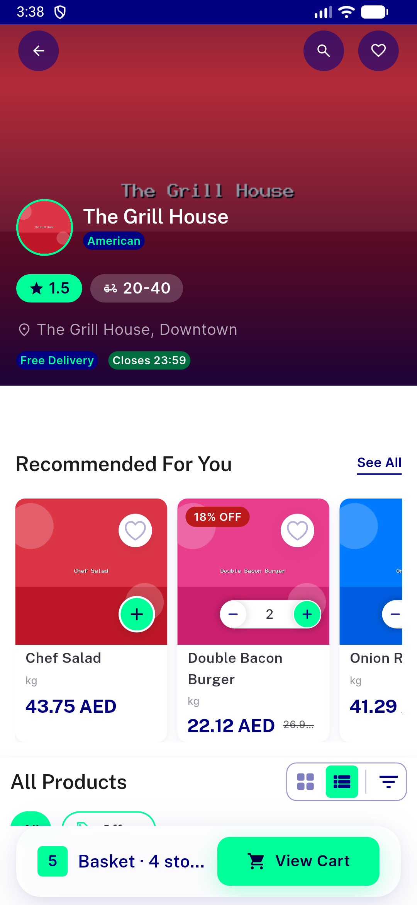
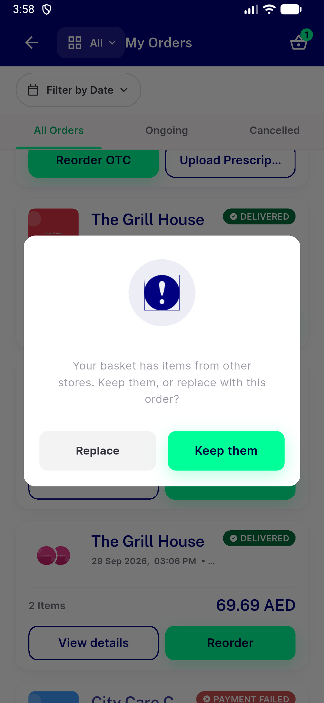
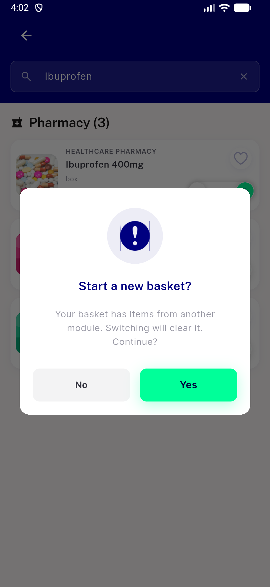
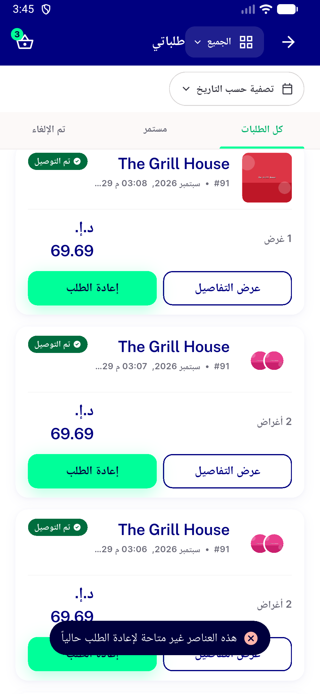
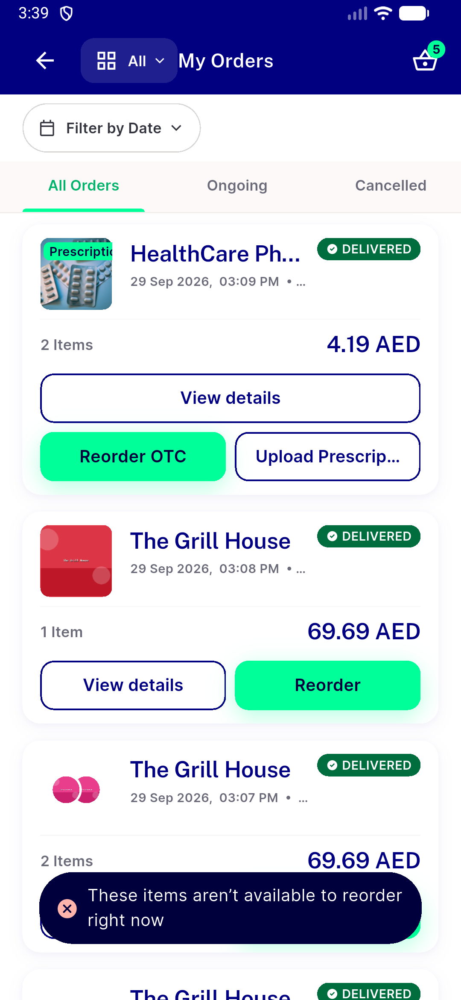

# QA Evidence — NEARS-3844

**PASS: cross_module_basket ON reorder adds across modules, no reset/Keep-Replace prompt; flag OFF unchanged**

**11 screenshot(s).** Click any thumbnail for full resolution.

<table>
<tr>
<td align="center" width="33%"> ac1 ac2 flowA list reorder cart ar</td>
<td align="center" width="33%"> ac1 ac2 flowA list reorder cart en</td>
<td align="center" width="33%"> ac1 flowC search add pharmacy no dialog en</td>
</tr>
<tr>
<td align="center" width="33%"> ac1 flowC search tapthrough no dialog item sheet en</td>
<td align="center" width="33%"> ac2 reorder otc cross module rx skipped en</td>
<td align="center" width="33%"> ac4 flowB store opens no dialog basket unchanged ar</td>
</tr>
<tr>
<td align="center" width="33%"> ac4 flowB store opens no dialog basket unchanged en</td>
<td align="center" width="33%"> acreg flagoff keep replace ndialog en</td>
<td align="center" width="33%"> acreg flagoff search reset dialog en</td>
</tr>
<tr>
<td align="center" width="33%"> m1 nothing to reorder stays on orders ar</td>
<td align="center" width="33%"> m1 nothing to reorder stays on orders en</td>
</tr>
</table>

### Other artifacts
- [`bug-mixed-basket-cod-confirm-silent.log`](bug-mixed-basket-cod-confirm-silent.log)
- [`bug-search-quickadd-bypasses-reset-flag-off.log`](bug-search-quickadd-bypasses-reset-flag-off.log)
- [`progress.md`](progress.md)

---
*From `nears/docs/qa-evidence/NEARS-3844/` · public-repo scrub policy (no live secrets; verified clean).*
