# QA Evidence — NEARS-3846

**QA [8] fix-cycle 2 PASS @1912013b2 — (C) probe A-H live, AC2/AC3/AC4/AC6/AC8/AC13/AC-REG, 3912 repro**

**37 screenshot(s).** Click any thumbnail for full resolution.

<table>
<tr>
<td align="center" width="33%"> fee breakdown mixed 2store surge EN 411dp</td>
<td align="center" width="33%"> 02a fee breakdown AR 360dp 1.3x longname</td>
<td align="center" width="33%"> 02b fee breakdown AR 360dp 1.3x tooltip open</td>
</tr>
<tr>
<td align="center" width="33%"> 04a payment section cod cap warning EN</td>
<td align="center" width="33%"> 04b payment section cod cap warning AR 360dp 1.3x</td>
<td align="center" width="33%"> 05a payment sheet removed online preferred EN</td>
</tr>
<tr>
<td align="center" width="33%"> 05b payment sheet removed cod cap EN</td>
<td align="center" width="33%"> 06a snackbar cash unavailable at place EN</td>
<td align="center" width="33%"> 06b snackbar asap only EN</td>
</tr>
<tr>
<td align="center" width="33%"> 06c validator 403 no reason generic path EN</td>
<td align="center" width="33%"> 06d snackbar cash unavailable AR</td>
<td align="center" width="33%"> 06e snackbar asap only AR</td>
</tr>
<tr>
<td align="center" width="33%"> 06f put payment method 403 home prompt EN</td>
<td align="center" width="33%"> 06g put 403 digital payment failed screen EN</td>
<td align="center" width="33%"> 07a payment failed dialog mixed cash absent EN</td>
</tr>
<tr>
<td align="center" width="33%"> 07b payment failed dialog single store cash present EN</td>
<td align="center" width="33%"> 07c home payment failed prompt mixed child no cash EN</td>
<td align="center" width="33%"> 07d digital payment failed screen mixed no cash EN</td>
</tr>
<tr>
<td align="center" width="33%"> 08a CONTROL base flagOFF same module 2store</td>
<td align="center" width="33%"> 08b flagOFF same module 2store NOrderSummaryRow EN</td>
<td align="center" width="33%"><a href="bug-3912-offline-group-basket-403-confirm-sheet-unchanged-t2.3s-EN-360dp.png">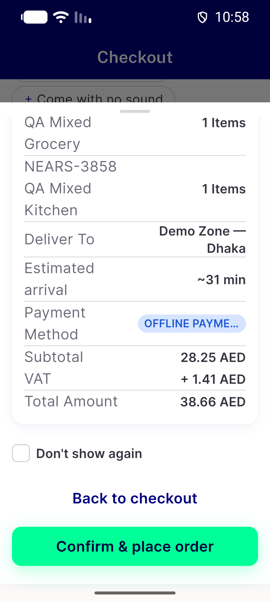</a> bug 3912 offline group basket 403 confirm sheet unchanged t2.3s EN 360dp</td>
</tr>
<tr>
<td align="center" width="33%"><a href="bug-codcap-pending-display-lag.png">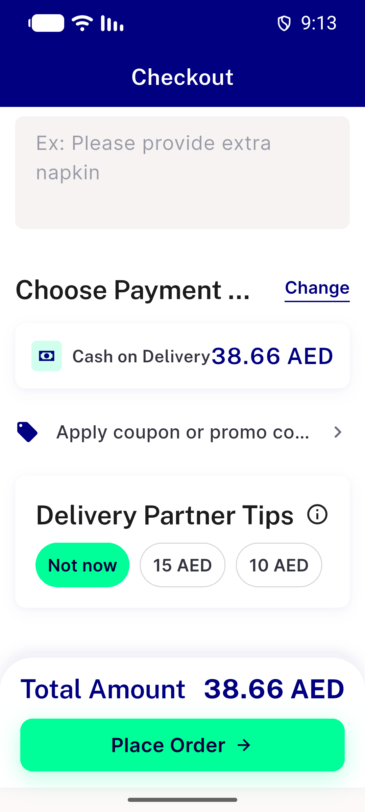</a> bug codcap pending display lag</td>
<td align="center" width="33%"> bug empty method sheet stale zone digital</td>
<td align="center" width="33%"> bug snackbar copy truncated AR 360dp 1.3x</td>
</tr>
<tr>
<td align="center" width="33%"><a href="c1-01-online-preferred-sheet-online-only-stale-zone-EN-360dp.png">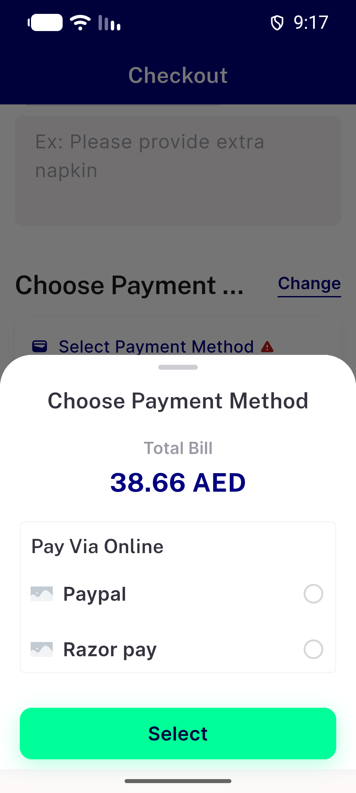</a> c1 01 online preferred sheet online only stale zone EN 360dp</td>
<td align="center" width="33%"><a href="c1-02-toast-cash-refused-at-place-EN-360dp-1.3x-t0.9-3.6-6.2s.png">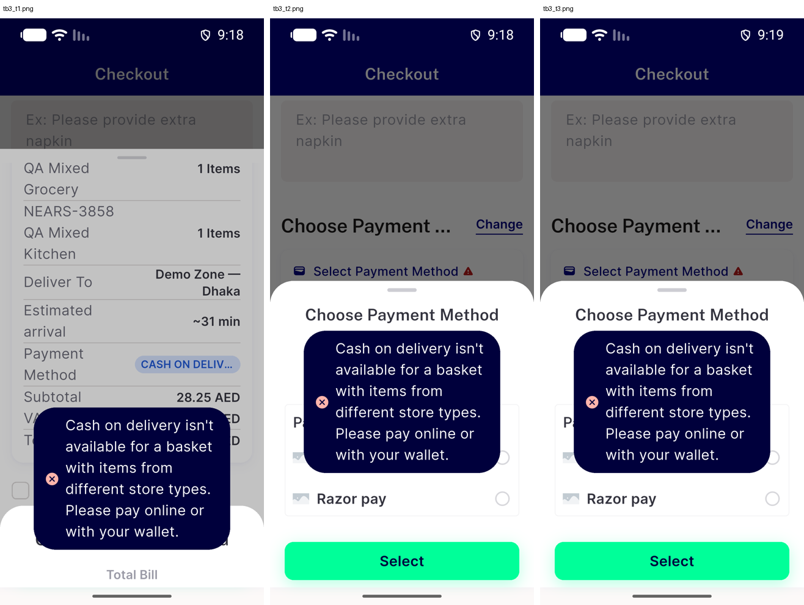</a> c1 02 toast cash refused at place EN 360dp 1.3x t0.9 3.6 6.2s</td>
<td align="center" width="33%"><a href="c1-03-RB5-dialog-states-and-switch-refused-toast-EN-360dp-1.3x.png">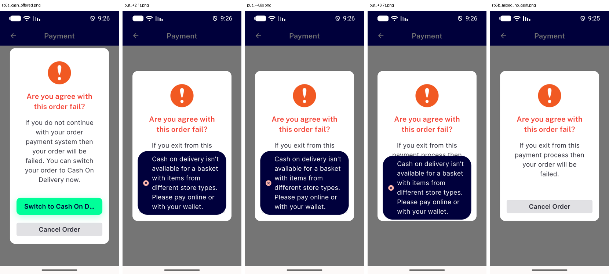</a> c1 03 RB5 dialog states and switch refused toast EN 360dp 1.3x</td>
</tr>
<tr>
<td align="center" width="33%"><a href="c1-04-toast-asap-only-EN-360dp-1.3x.png">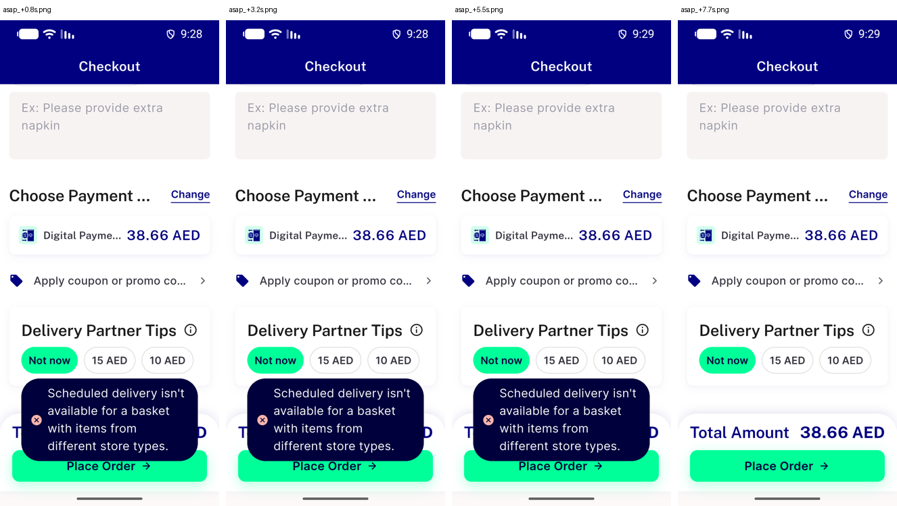</a> c1 04 toast asap only EN 360dp 1.3x</td>
<td align="center" width="33%"><a href="c1-05-toast-cash-refused-at-place-AR-360dp-1.3x-partial-both.png">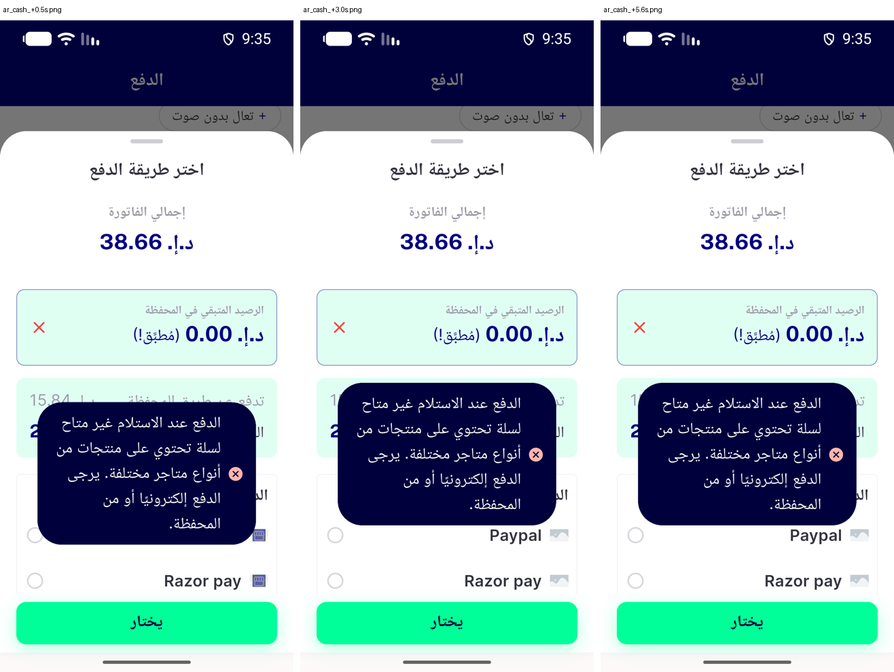</a> c1 05 toast cash refused at place AR 360dp 1.3x partial both</td>
<td align="center" width="33%"><a href="c1-06-AR-asap-toast-RB5-switch-refused-toast-and-ordinary-toast-regression-360dp-1.3x.png">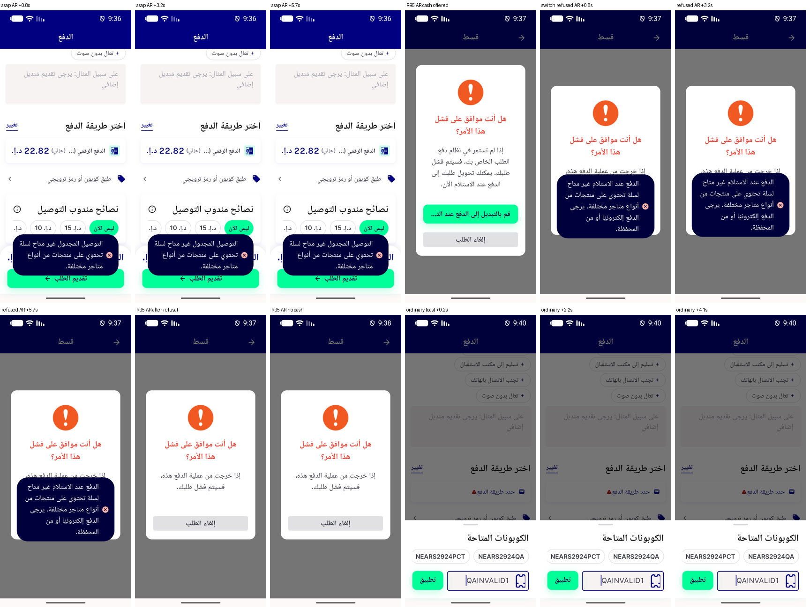</a> c1 06 AR asap toast RB5 switch refused toast and ordinary toast regression 360dp 1.3x</td>
</tr>
<tr>
<td align="center" width="33%"><a href="c1-07-ordinary-toast-regression-3line-cap-default-duration-AR-360dp-1.3x.png">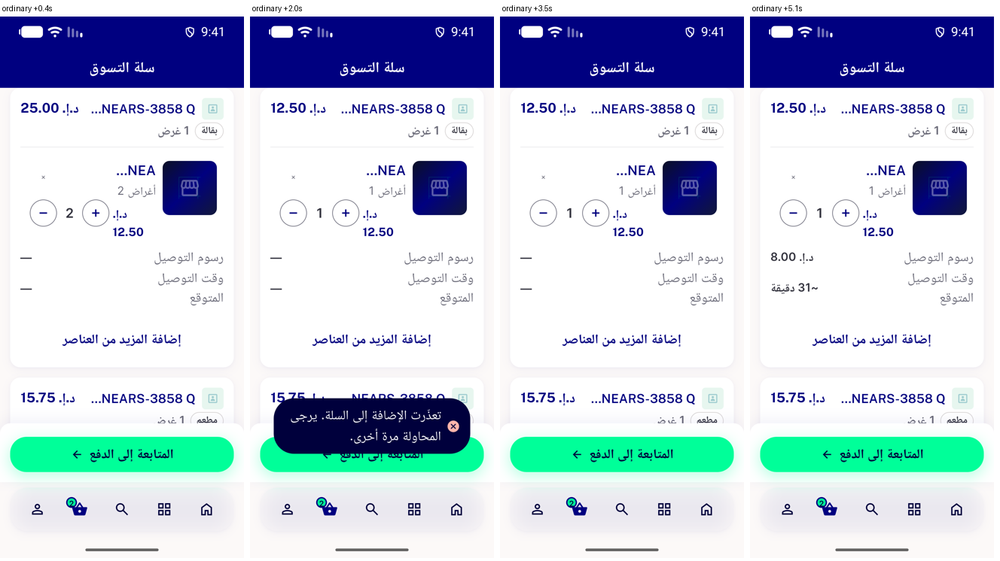</a> c1 07 ordinary toast regression 3line cap default duration AR 360dp 1.3x</td>
<td align="center" width="33%"><a href="c1-08-ordinary-toast-server-long-message-3line-cap-AR-360dp-1.3x.png">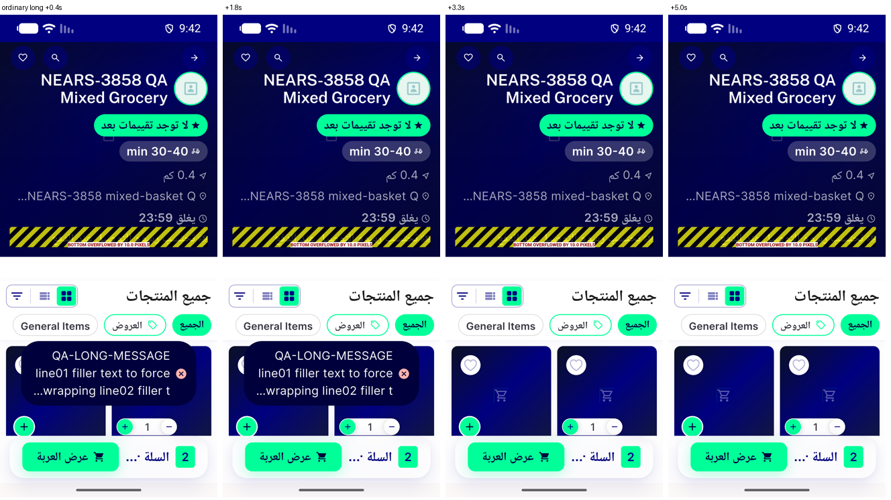</a> c1 08 ordinary toast server long message 3line cap AR 360dp 1.3x</td>
<td align="center" width="33%"><a href="c1-confirm-b-wallet-cod-remainder-no-method-EN.png">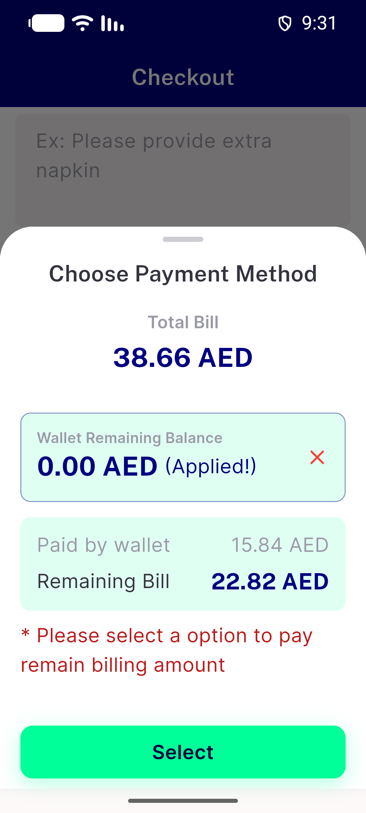</a> c1 confirm b wallet cod remainder no method EN</td>
</tr>
<tr>
<td align="center" width="33%"><a href="c2-A-all-digital-on-one-digital-probe-sheet-online-only-EN-360dp.png">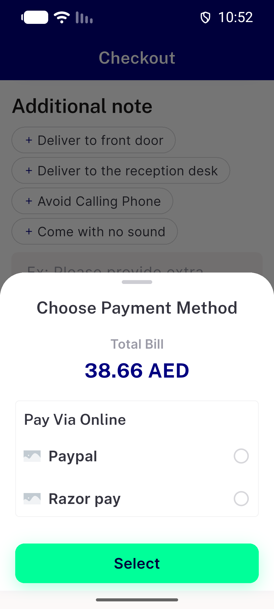</a> c2 A all digital on one digital probe sheet online only EN 360dp</td>
<td align="center" width="33%"><a href="c2-AC6-AC13-toast-cash-refused-at-place-over-reopened-sheet-EN-360dp-1.3x-t3.2s.png">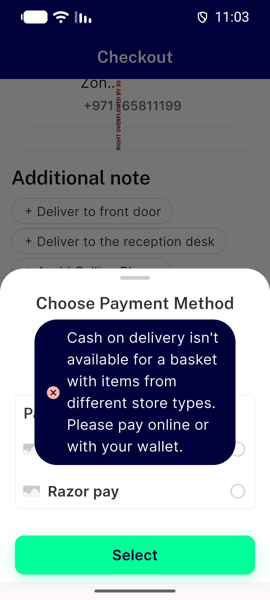</a> c2 AC6 AC13 toast cash refused at place over reopened sheet EN 360dp 1.3x t3.2s</td>
<td align="center" width="33%"><a href="c2-B1-zone-digital-off-stale-rows-digital-then-cash-probe-sheet-cash-offline-EN-360dp.png">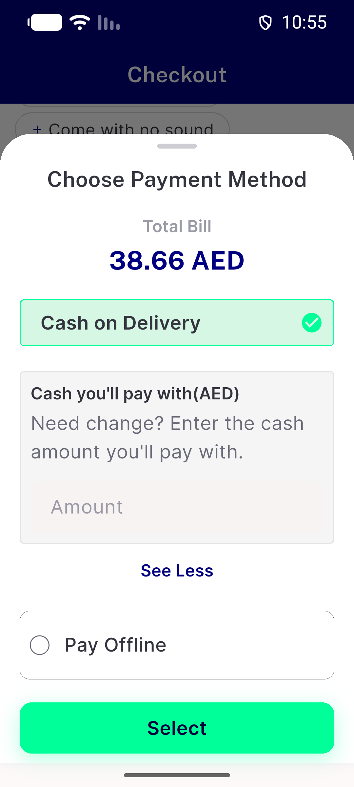</a> c2 B1 zone digital off stale rows digital then cash probe sheet cash offline EN 360dp</td>
</tr>
<tr>
<td align="center" width="33%"><a href="c2-D1-no-method-passes-empty-method-sheet-EN-360dp.png">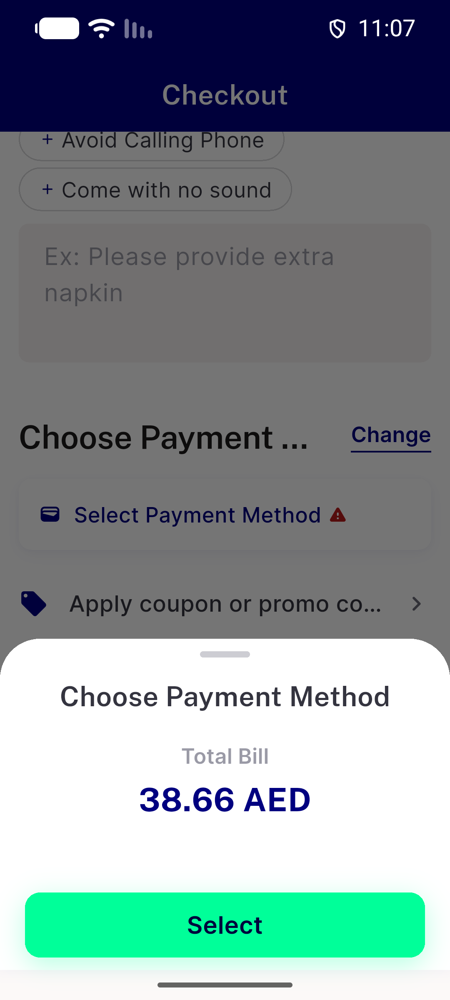</a> c2 D1 no method passes empty method sheet EN 360dp</td>
</tr>
</table>

### Other artifacts
- [`bug-3912-offline-group-basket-reasonless-403.log`](bug-3912-offline-group-basket-reasonless-403.log)
- [`bug-codcap-pending-display-lag.log`](bug-codcap-pending-display-lag.log)
- [`bug-codcap-stale-cash-selection.log`](bug-codcap-stale-cash-selection.log)
- [`bug-empty-method-sheet-stale-zone-digital.log`](bug-empty-method-sheet-stale-zone-digital.log)
- [`bug-no-method-state-not-said-visibly.log`](bug-no-method-state-not-said-visibly.log)
- [`bug-preexisting-group-partial-wallet-never-split.log`](bug-preexisting-group-partial-wallet-never-split.log)
- [`bug-preexisting-guest-multistore-checkout-blocked.log`](bug-preexisting-guest-multistore-checkout-blocked.log)
- [`bug-preexisting-overflows-360dp-1.3x.log`](bug-preexisting-overflows-360dp-1.3x.log)
- [`bug-preexisting-renderflex-overflows.log`](bug-preexisting-renderflex-overflows.log)
- [`bug-preexisting-weekly-surge-json-type.log`](bug-preexisting-weekly-surge-json-type.log)
- [`bug-search-semantics-assertion-rendertable.log`](bug-search-semantics-assertion-rendertable.log)
- [`bug-tb4-payfailed-screen-header-module.log`](bug-tb4-payfailed-screen-header-module.log)
- [`bug-toast-covers-first-gateway-row-6s.log`](bug-toast-covers-first-gateway-row-6s.log)
- [`progress.md`](progress.md)

---
*From `nears/docs/qa-evidence/NEARS-3846/` · public-repo scrub policy (no live secrets; verified clean).*
