# QA Evidence — NEARS-3846

**NEARS-3846 QA cycle 0 — FAIL (AC2 cod_cap stale cash selection, AC13 AR snackbar truncation; AC10/12/K3 blocked by pre-existing guest defect)**

**22 screenshot(s).** Click any thumbnail for full resolution.

<table>
<tr>
<td align="center" width="33%"><a href="01-fee-breakdown-mixed-2store-surge-EN-411dp.png">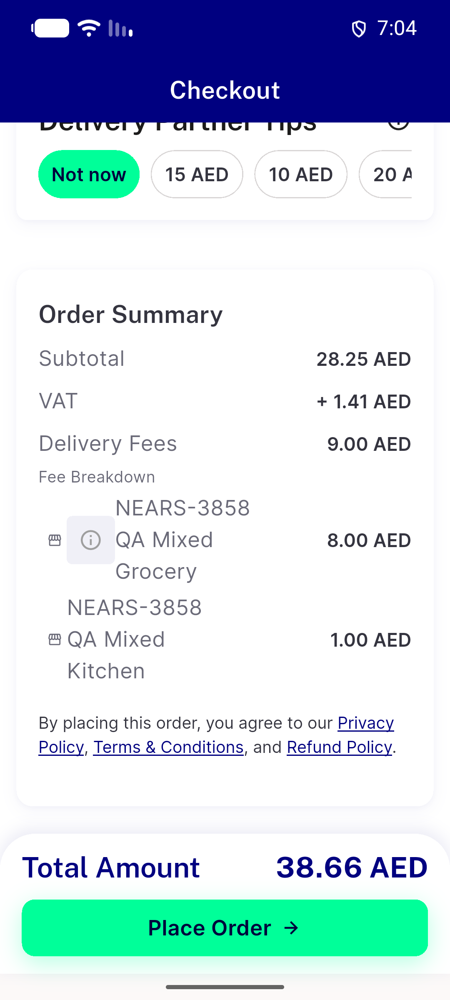</a> fee breakdown mixed 2store surge EN 411dp</td>
<td align="center" width="33%"><a href="02a-fee-breakdown-AR-360dp-1.3x-longname.png">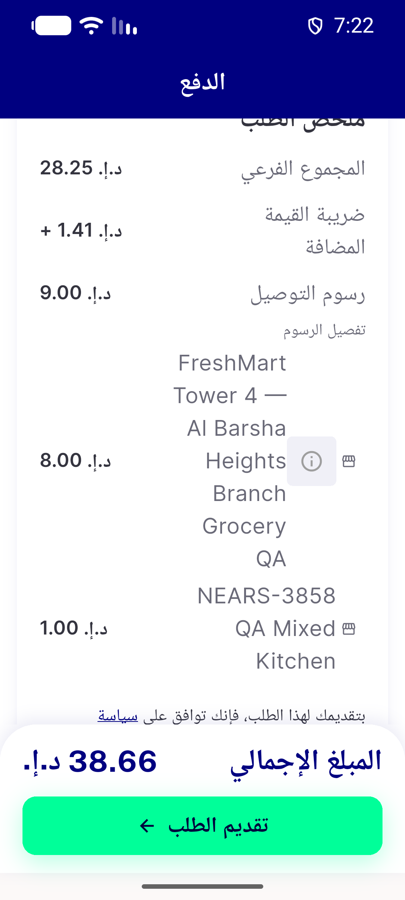</a> 02a fee breakdown AR 360dp 1.3x longname</td>
<td align="center" width="33%"><a href="02b-fee-breakdown-AR-360dp-1.3x-tooltip-open.png">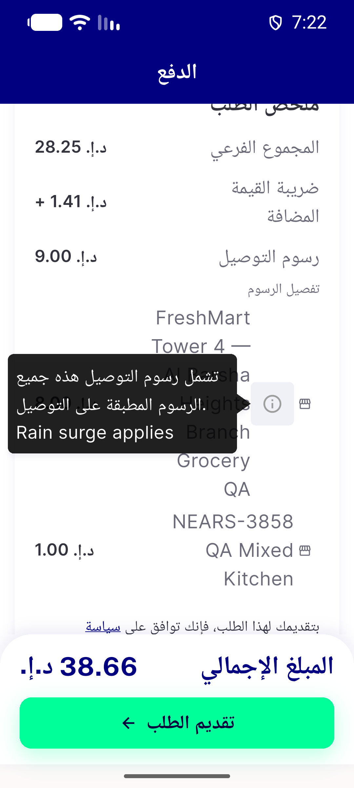</a> 02b fee breakdown AR 360dp 1.3x tooltip open</td>
</tr>
<tr>
<td align="center" width="33%"><a href="04a-payment-section-cod-cap-warning-EN.png">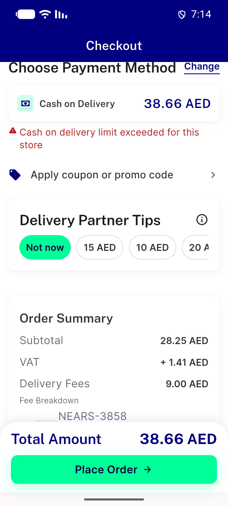</a> 04a payment section cod cap warning EN</td>
<td align="center" width="33%"><a href="04b-payment-section-cod-cap-warning-AR-360dp-1.3x.png">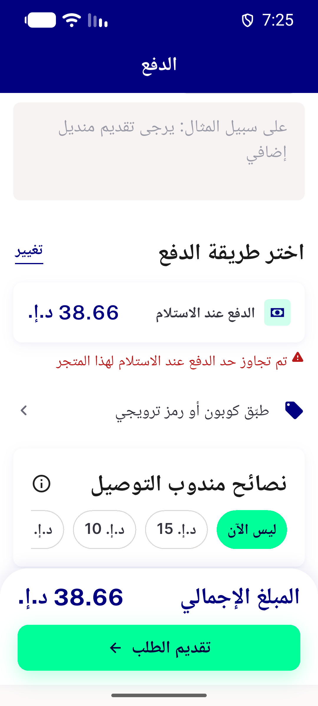</a> 04b payment section cod cap warning AR 360dp 1.3x</td>
<td align="center" width="33%"><a href="05a-payment-sheet-removed-online-preferred-EN.png">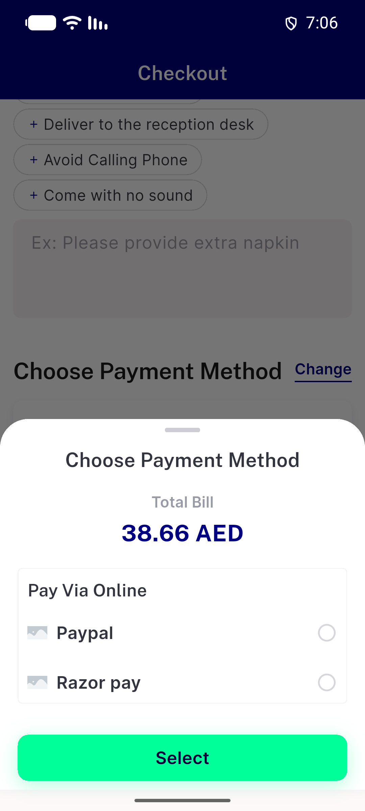</a> 05a payment sheet removed online preferred EN</td>
</tr>
<tr>
<td align="center" width="33%"><a href="05b-payment-sheet-removed-cod-cap-EN.png">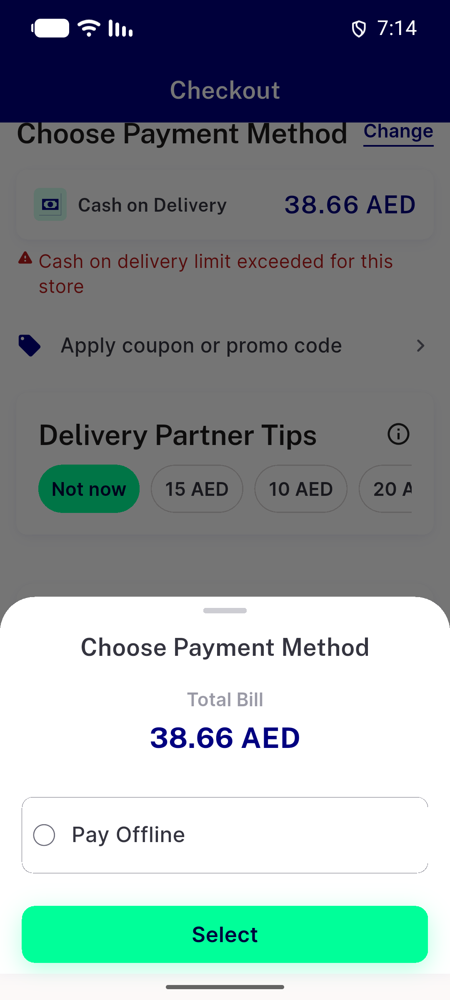</a> 05b payment sheet removed cod cap EN</td>
<td align="center" width="33%"><a href="06a-snackbar-cash-unavailable-at-place-EN.png">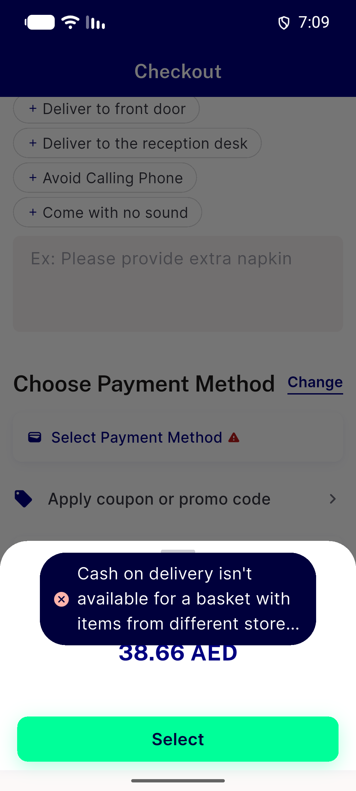</a> 06a snackbar cash unavailable at place EN</td>
<td align="center" width="33%"><a href="06b-snackbar-asap-only-EN.png">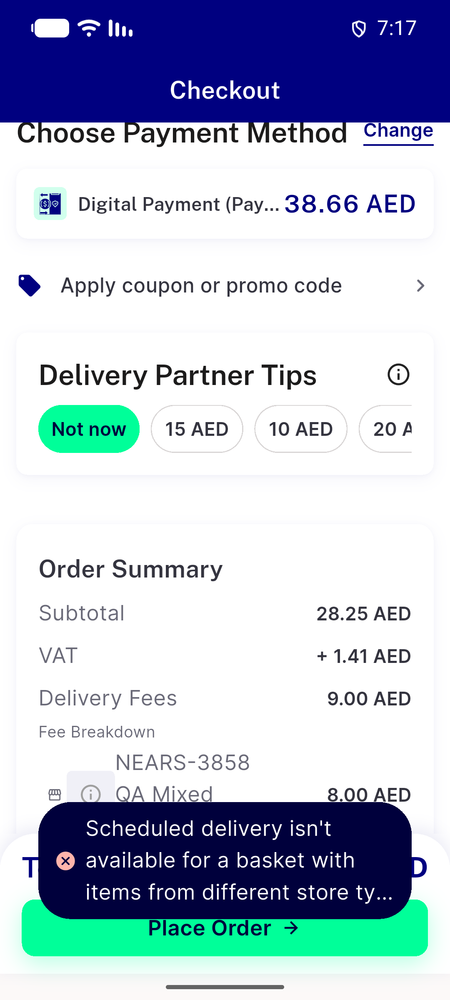</a> 06b snackbar asap only EN</td>
</tr>
<tr>
<td align="center" width="33%"><a href="06c-validator-403-no-reason-generic-path-EN.png">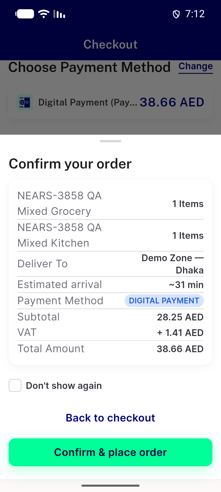</a> 06c validator 403 no reason generic path EN</td>
<td align="center" width="33%"> 06d snackbar cash unavailable AR</td>
<td align="center" width="33%"><a href="06e-snackbar-asap-only-AR.png">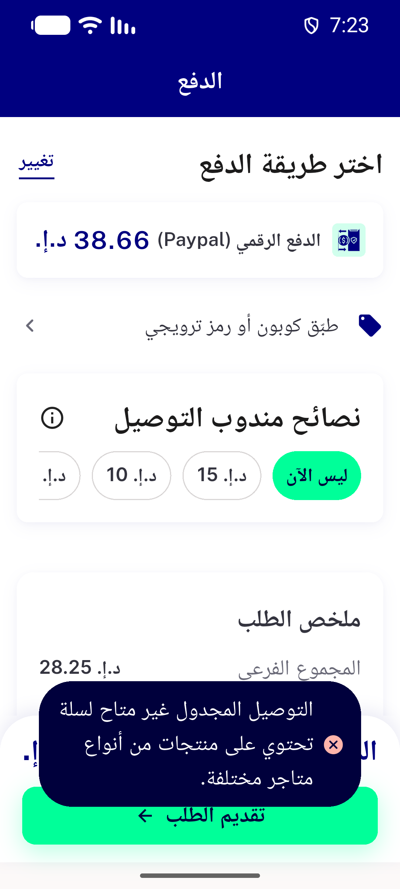</a> 06e snackbar asap only AR</td>
</tr>
<tr>
<td align="center" width="33%"><a href="06f-put-payment-method-403-home-prompt-EN.png">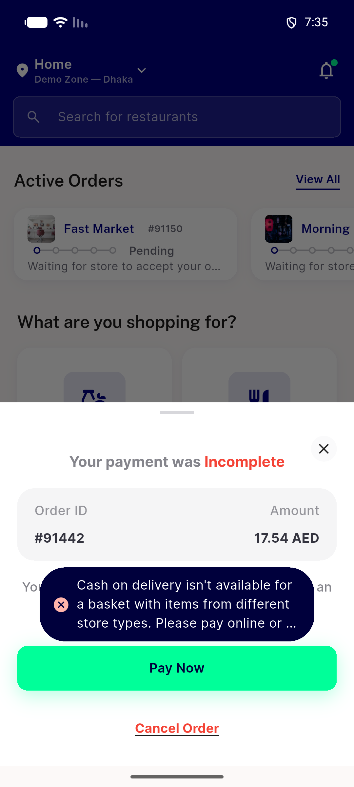</a> 06f put payment method 403 home prompt EN</td>
<td align="center" width="33%"><a href="06g-put-403-digital-payment-failed-screen-EN.png">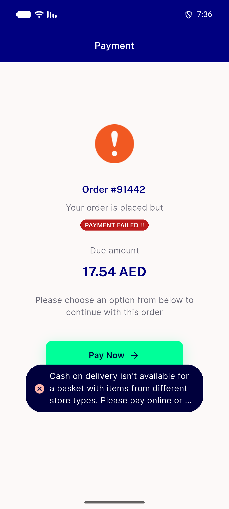</a> 06g put 403 digital payment failed screen EN</td>
<td align="center" width="33%"><a href="07a-payment-failed-dialog-mixed-cash-absent-EN.png">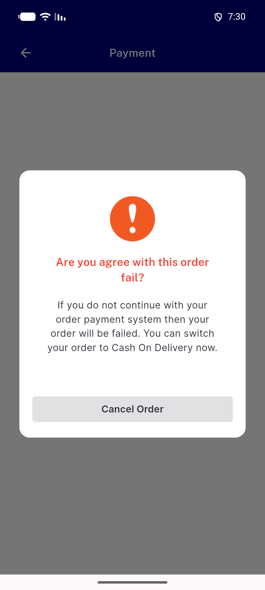</a> 07a payment failed dialog mixed cash absent EN</td>
</tr>
<tr>
<td align="center" width="33%"><a href="07b-payment-failed-dialog-single-store-cash-present-EN.png">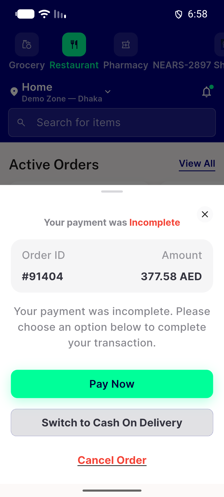</a> 07b payment failed dialog single store cash present EN</td>
<td align="center" width="33%"><a href="07c-home-payment-failed-prompt-mixed-child-no-cash-EN.png">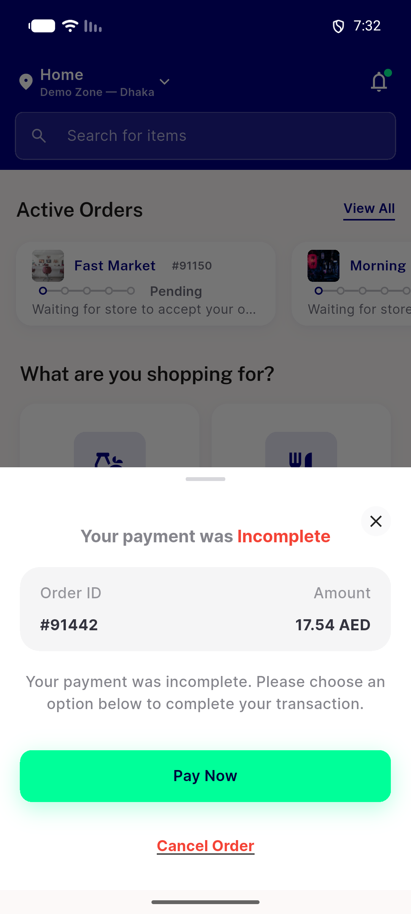</a> 07c home payment failed prompt mixed child no cash EN</td>
<td align="center" width="33%"><a href="07d-digital-payment-failed-screen-mixed-no-cash-EN.png">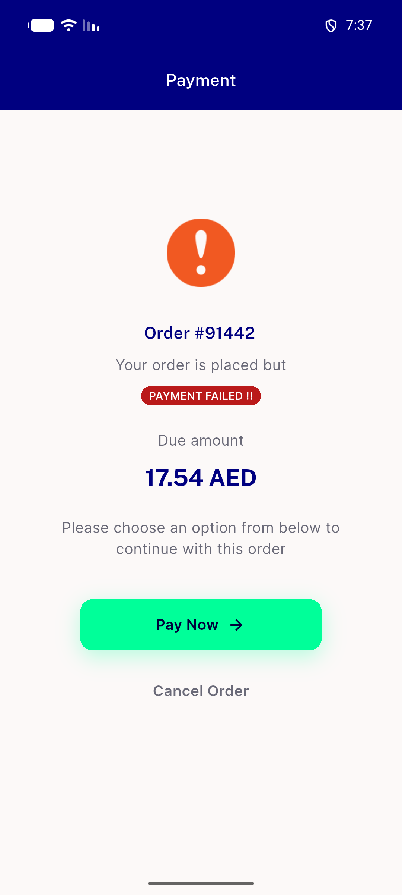</a> 07d digital payment failed screen mixed no cash EN</td>
</tr>
<tr>
<td align="center" width="33%"><a href="08a-CONTROL-base-flagOFF-same-module-2store.png">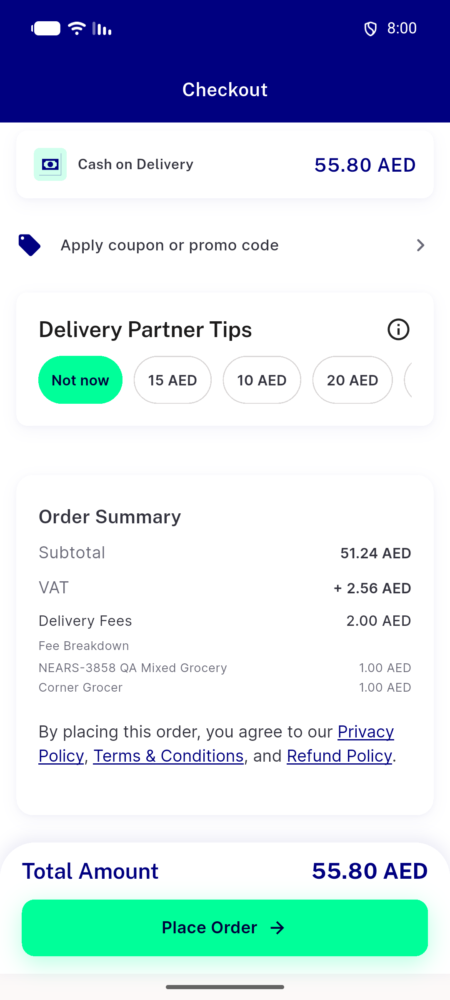</a> 08a CONTROL base flagOFF same module 2store</td>
<td align="center" width="33%"><a href="08b-flagOFF-same-module-2store-NOrderSummaryRow-EN.png">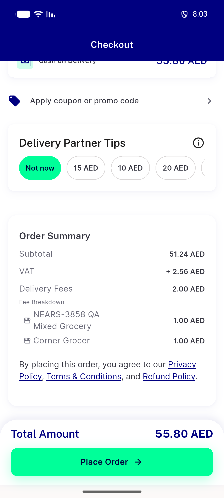</a> 08b flagOFF same module 2store NOrderSummaryRow EN</td>
<td align="center" width="33%"><a href="bug-empty-method-sheet-stale-zone-digital.png">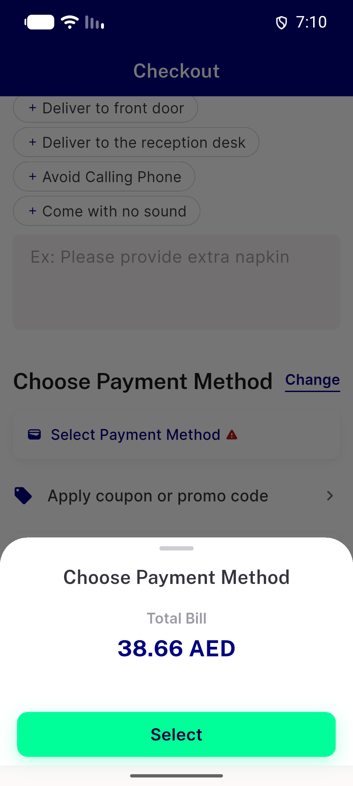</a> bug empty method sheet stale zone digital</td>
</tr>
<tr>
<td align="center" width="33%"><a href="bug-snackbar-copy-truncated-AR-360dp-1.3x.png">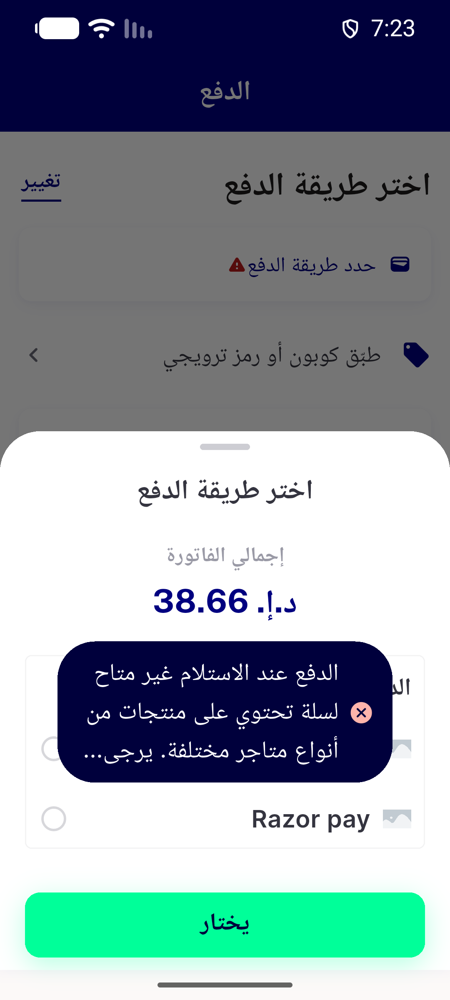</a> bug snackbar copy truncated AR 360dp 1.3x</td>
</tr>
</table>

### Other artifacts
- [`bug-codcap-stale-cash-selection.log`](bug-codcap-stale-cash-selection.log)
- [`bug-empty-method-sheet-stale-zone-digital.log`](bug-empty-method-sheet-stale-zone-digital.log)
- [`bug-preexisting-guest-multistore-checkout-blocked.log`](bug-preexisting-guest-multistore-checkout-blocked.log)
- [`bug-preexisting-renderflex-overflows.log`](bug-preexisting-renderflex-overflows.log)
- [`bug-preexisting-weekly-surge-json-type.log`](bug-preexisting-weekly-surge-json-type.log)
- [`bug-search-semantics-assertion-rendertable.log`](bug-search-semantics-assertion-rendertable.log)
- [`progress.md`](progress.md)

---
*From `nears/docs/qa-evidence/NEARS-3846/` · public-repo scrub policy (no live secrets; verified clean).*
