# QA Evidence — NEARS-3847

**NEARS-3847 Rx label — QA PASS (fix_cycle 0, e34ef91ba)**

**25 screenshot(s).** Click any thumbnail for full resolution.

<table>
<tr>
<td align="center" width="33%"><a href="ac-content-staples-all-rx-ar.png">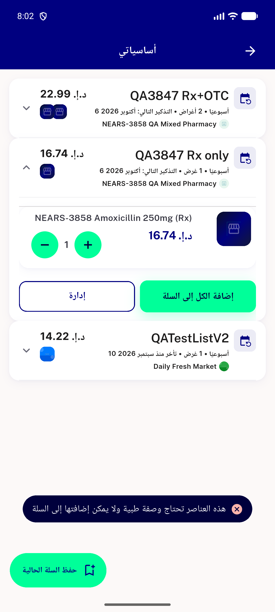</a> ac content staples all rx ar</td>
<td align="center" width="33%"><a href="ac-content-staples-mixed-ar.png">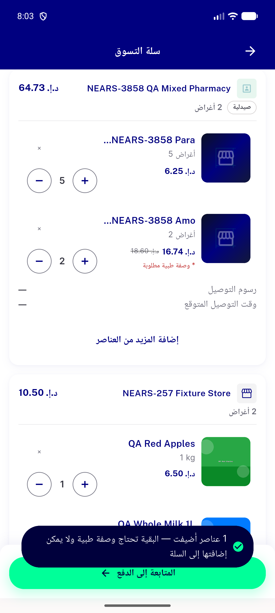</a> ac content staples mixed ar</td>
<td align="center" width="33%"> ac1 flash details en</td>
</tr>
<tr>
<td align="center" width="33%"> ac1 flash details soldout rx en</td>
<td align="center" width="33%"><a href="ac1-flash-rail-en-320dp-1.3x.png">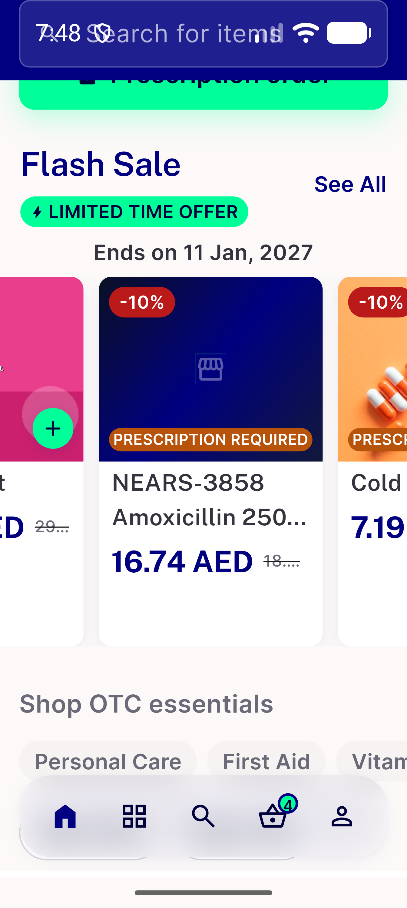</a> ac1 flash rail en 320dp 1.3x</td>
<td align="center" width="33%"><a href="ac1-flash-rail-home-ar.png">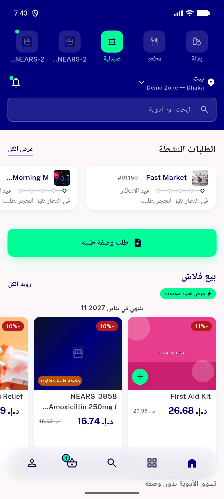</a> ac1 flash rail home ar</td>
</tr>
<tr>
<td align="center" width="33%"><a href="ac1-flash-rail-home-en.png">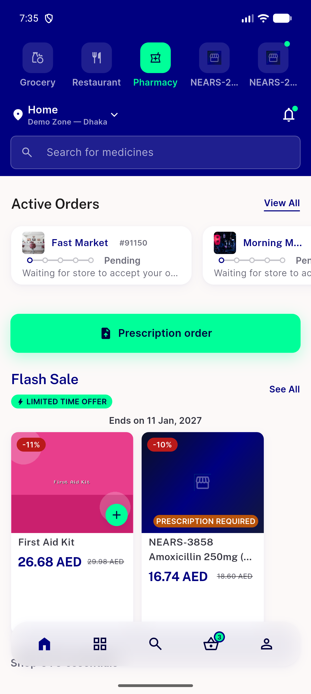</a> ac1 flash rail home en</td>
<td align="center" width="33%"><a href="ac1-flash-rail-soldout-rx-en.png">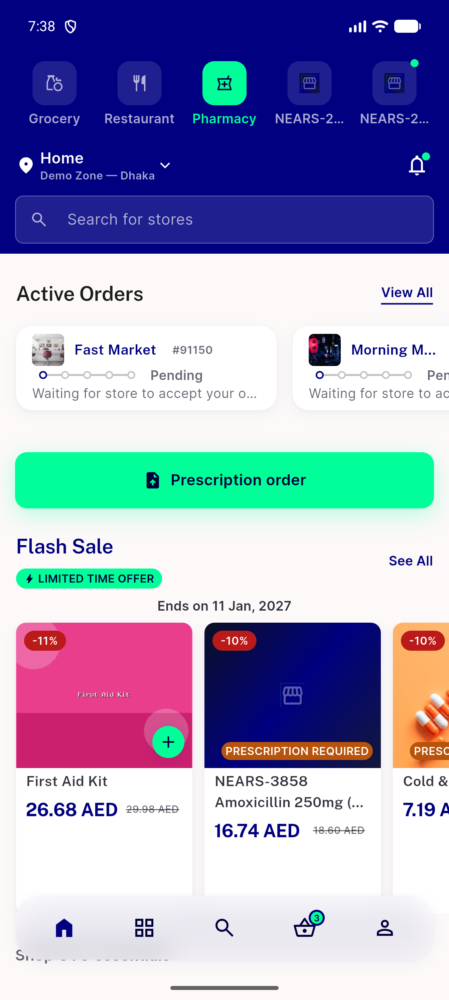</a> ac1 flash rail soldout rx en</td>
<td align="center" width="33%"><a href="ac1-sheet-footer-ar.png">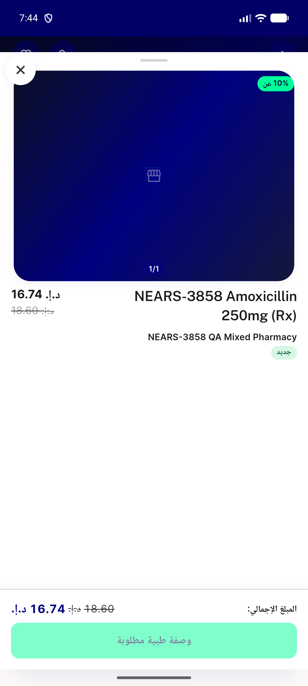</a> ac1 sheet footer ar</td>
</tr>
<tr>
<td align="center" width="33%"><a href="ac1-sheet-footer-en.png">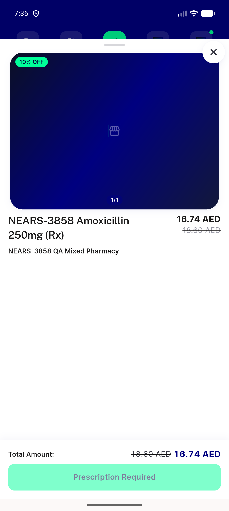</a> ac1 sheet footer en</td>
<td align="center" width="33%"><a href="ac1-store-grid-ar-320dp-1.3x.png">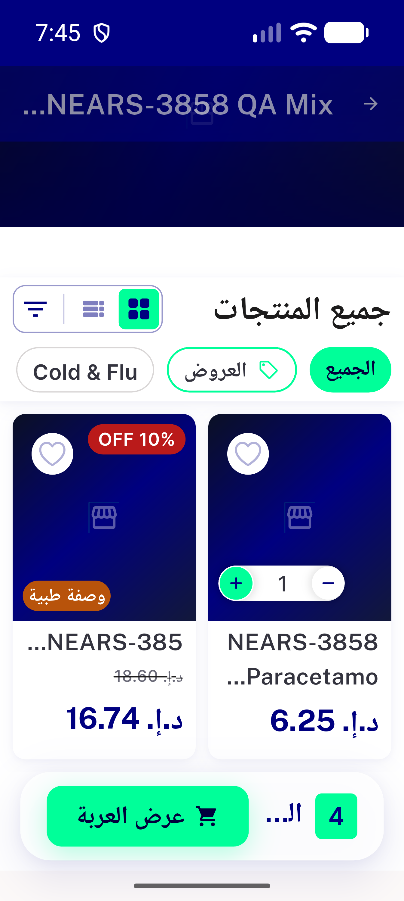</a> ac1 store grid ar 320dp 1.3x</td>
<td align="center" width="33%"><a href="ac1-store-grid-ar.png">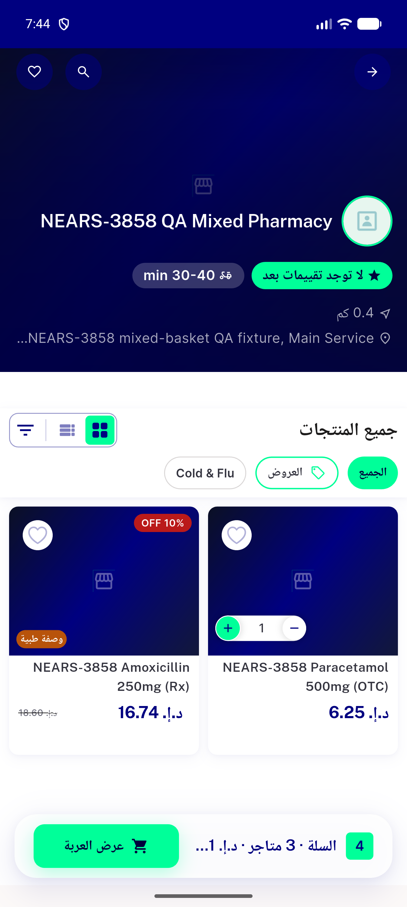</a> ac1 store grid ar</td>
</tr>
<tr>
<td align="center" width="33%"><a href="ac1-store-grid-en.png">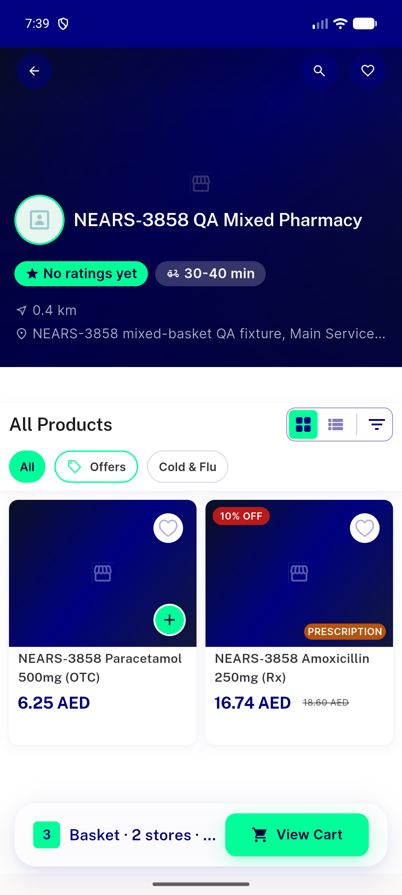</a> ac1 store grid en</td>
<td align="center" width="33%"><a href="ac1-store-row-en-320dp-1.3x.png">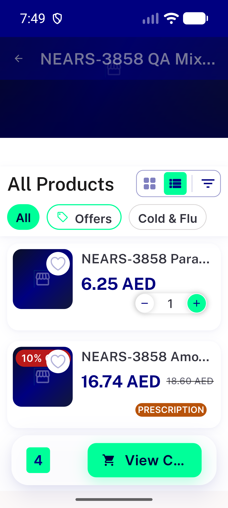</a> ac1 store row en 320dp 1.3x</td>
<td align="center" width="33%"><a href="ac1-store-row-en.png">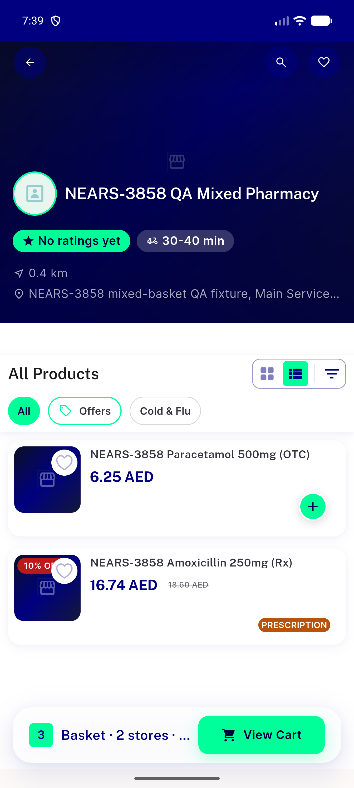</a> ac1 store row en</td>
</tr>
<tr>
<td align="center" width="33%"><a href="ac1-store-search-grid-en.png">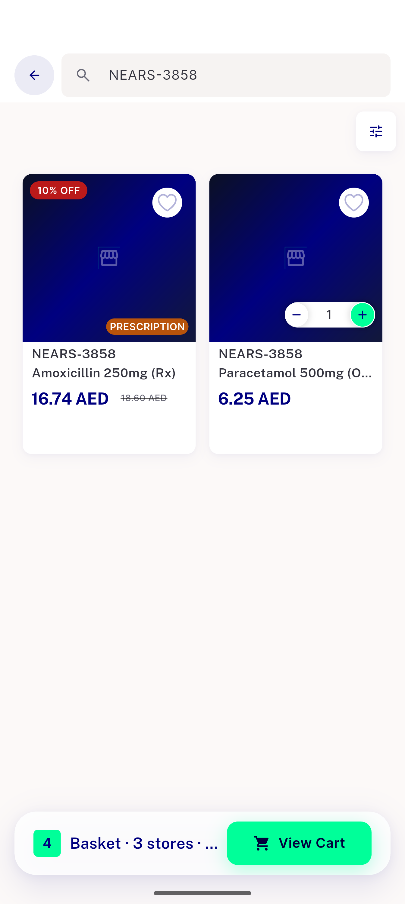</a> ac1 store search grid en</td>
<td align="center" width="33%"><a href="ac3-all-rx-reorder-snackbar-en.png">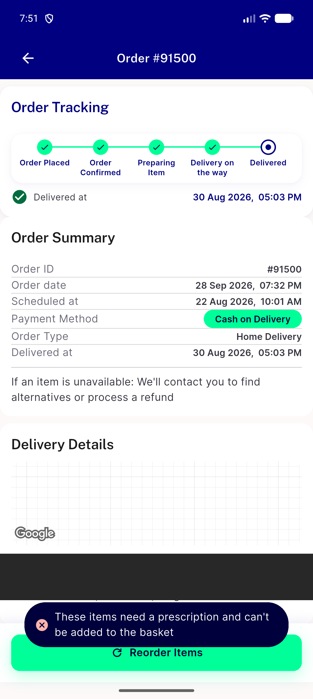</a> ac3 all rx reorder snackbar en</td>
<td align="center" width="33%"> ac3 mixed reorder snackbar en</td>
</tr>
<tr>
<td align="center" width="33%"><a href="ac3-orders-list.png">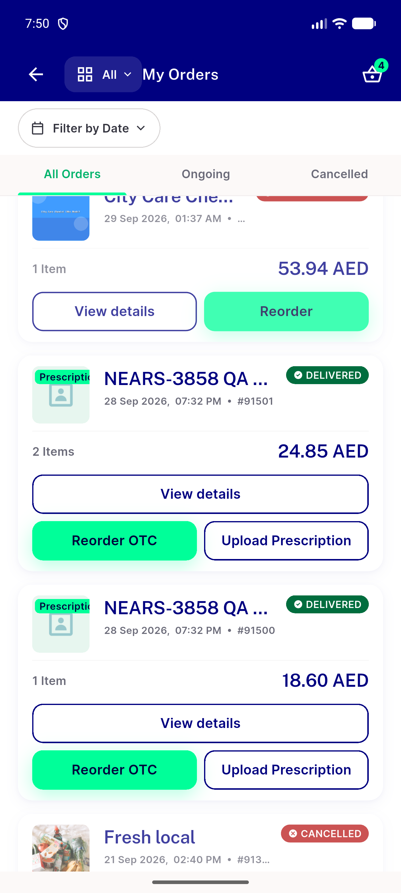</a> ac3 orders list</td>
<td align="center" width="33%"><a href="ac4-staples-all-rx-en.png">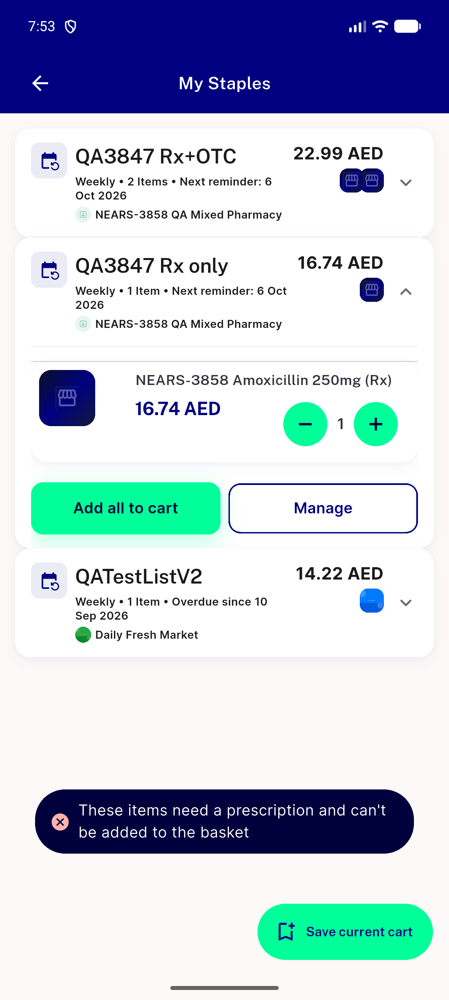</a> ac4 staples all rx en</td>
<td align="center" width="33%"><a href="ac4-staples-mixed-en.png">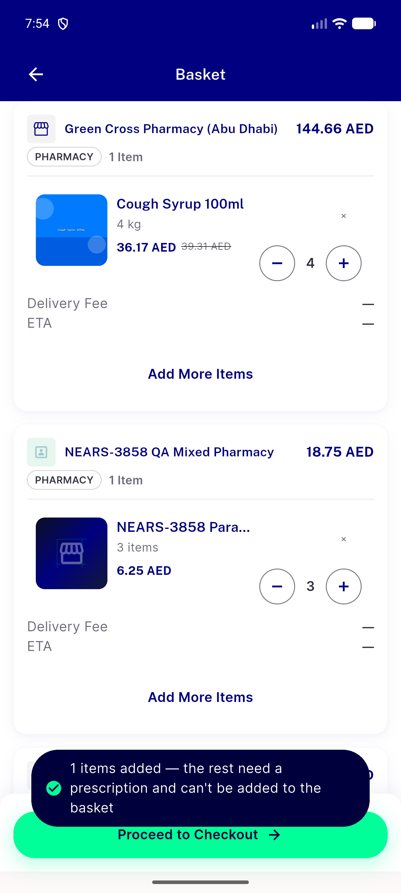</a> ac4 staples mixed en</td>
</tr>
<tr>
<td align="center" width="33%"><a href="acreg-checkout-prescription-upload-flag-off.png">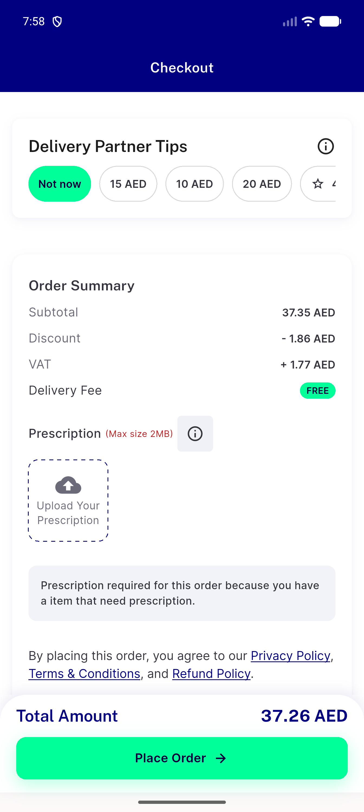</a> acreg checkout prescription upload flag off</td>
<td align="center" width="33%"><a href="acreg-reorder-flag-off.png">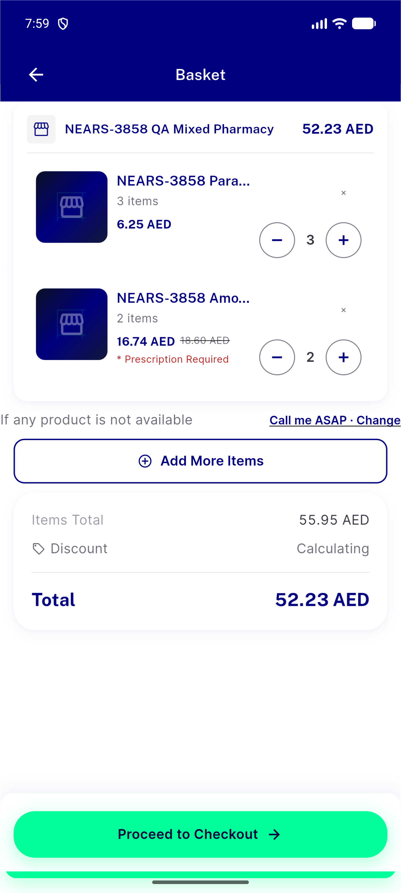</a> acreg reorder flag off</td>
<td align="center" width="33%"><a href="acreg-store-grid-flag-off-en.png">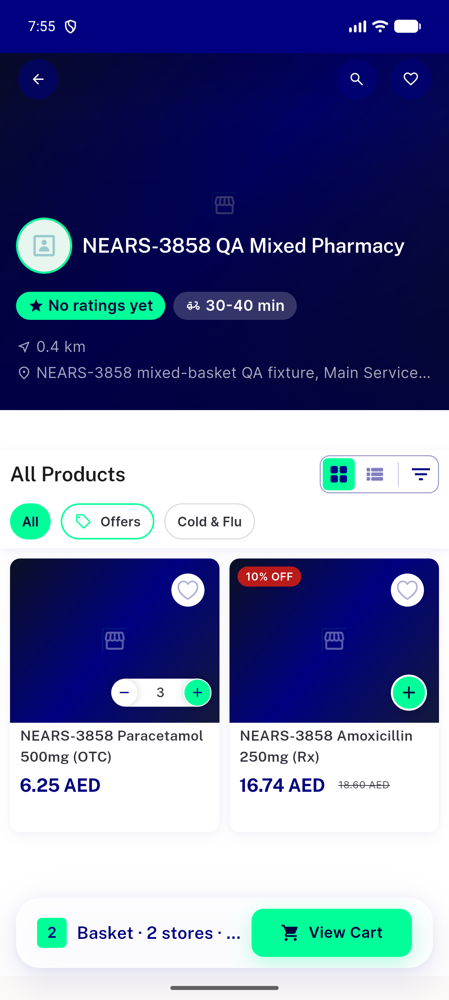</a> acreg store grid flag off en</td>
</tr>
<tr>
<td align="center" width="33%"><a href="legacy-row-flag-on-grid.png">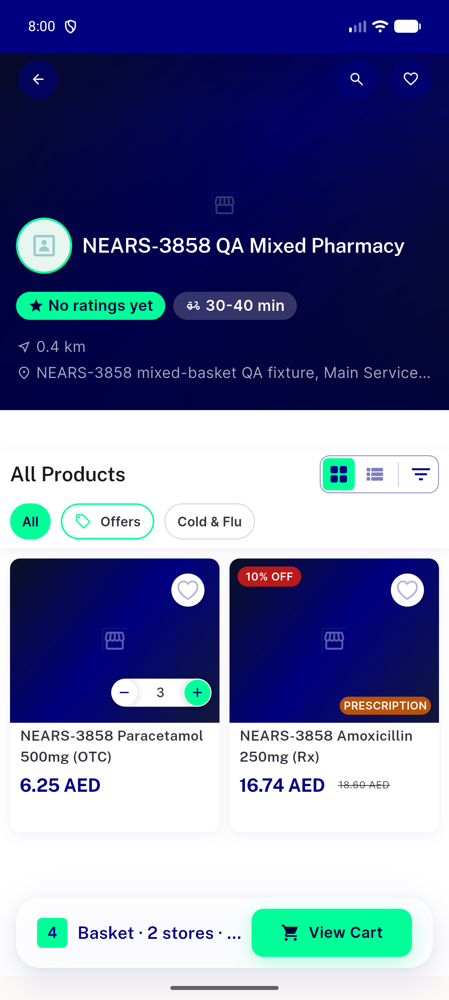</a> legacy row flag on grid</td>
</tr>
</table>

### Other artifacts
- [`a11y-acreg-sheet-flag-off-en.xml`](a11y-acreg-sheet-flag-off-en.xml)
- [`a11y-acreg-store-grid-flag-off-en.xml`](a11y-acreg-store-grid-flag-off-en.xml)
- [`a11y-flash-details-en.xml`](a11y-flash-details-en.xml)
- [`a11y-flash-rail-en-320dp-1.3x.xml`](a11y-flash-rail-en-320dp-1.3x.xml)
- [`a11y-flash-rail-home-ar.xml`](a11y-flash-rail-home-ar.xml)
- [`a11y-flash-rail-home-en.xml`](a11y-flash-rail-home-en.xml)
- [`a11y-flash-rail-soldout-rx-en.xml`](a11y-flash-rail-soldout-rx-en.xml)
- [`a11y-legacy-row-flag-on-grid.xml`](a11y-legacy-row-flag-on-grid.xml)
- [`a11y-sheet-footer-ar.xml`](a11y-sheet-footer-ar.xml)
- [`a11y-sheet-footer-en.xml`](a11y-sheet-footer-en.xml)
- [`a11y-store-grid-ar-320dp-1.3x.xml`](a11y-store-grid-ar-320dp-1.3x.xml)
- [`a11y-store-grid-ar.xml`](a11y-store-grid-ar.xml)
- [`a11y-store-grid-en.xml`](a11y-store-grid-en.xml)
- [`a11y-store-row-en-320dp-1.3x.xml`](a11y-store-row-en-320dp-1.3x.xml)
- [`a11y-store-row-en.xml`](a11y-store-row-en.xml)
- [`a11y-store-search-grid-en.xml`](a11y-store-search-grid-en.xml)
- [`progress.md`](progress.md)

---
*From `nears/docs/qa-evidence/NEARS-3847/` · public-repo scrub policy (no live secrets; verified clean).*
